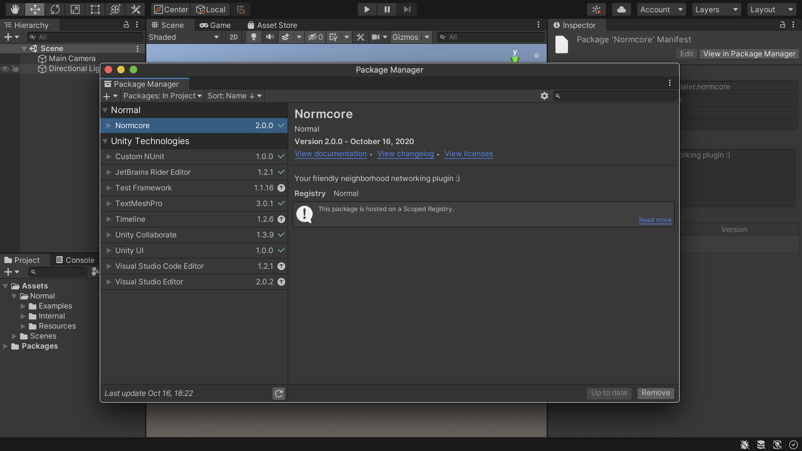
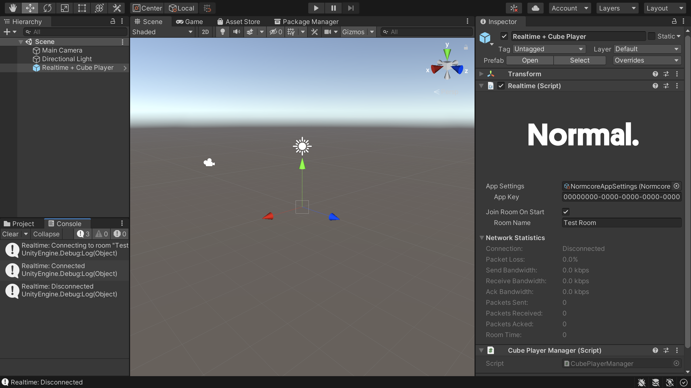
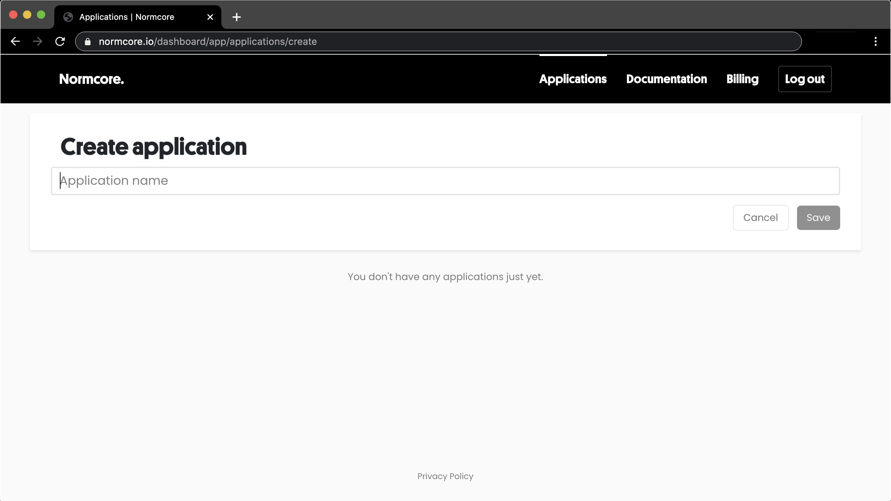
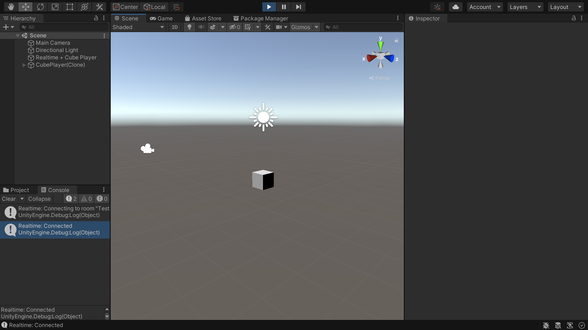

import cubePlayerDemo from './getting-started/cube-player-demo.mp4'

# Getting Started
Welcome to Normcore! This guide is designed to show you how to get set up and running with Normcore in your Unity project.

## Setting up Normcore

First off, you’ll need to grab a copy of the latest Normcore plugin. You can download it [here](https://normcore.io/download) after [signing up for a Normcore account](https://normcore.io/dashboard/signup).

Once you have the plugin imported and Unity has had a chance to recompile successfully, you should see a Normal folder in your project, and Normcore in the Unity Package Manager window:

Let’s add one of the pre-built example prefabs to our scene. Drag a “Realtime + Cube Player” prefab into the scene. On the Realtime game object, you should have an inspector window that looks something like this:

## Creating a Normcore application

You'll notice that in the Realtime inspector, there's a field for an "App key." Before we can hit play, you’ll need one to connect to Normal’s servers. First, register for a Normal account [here](/dashboard/signup). Then, log in to the [Dashboard](/dashboard).

Click on Create a new application, give it a name, and grab your shiny new app key.

Once you’ve got your app key, paste it into the App Key field on the Realtime component, and hit Play. You should see Realtime spinning up a room in the console, followed by a CubePlayer instantiated in the scene:

Use the WASD keys to move it around in space. If the cube isn’t moving, make sure to click on the game window in the Unity editor. So far so good? Let’s test it in multiplayer.

Export a standalone build to run next to the Unity Editor. Open the standalone build, use the A key to move it out of the way a little. Hit Play in the editor and a second cube should appear. Use the WASD keys to move it around; you should see the cube position update in real-time in both builds.

<video width="100%" title="Both CubePlayers are synced automatically to the other client." controls><source src={cubePlayerDemo} /></video>

That’s it! You’re now up and running with Normcore. Now, I know this example isn’t the coolest, however, it only gets better from here. Check out some of our other guides:

- [Creating a player controller](../guides/creating-a-player-controller)
- [XR Avatars and Voice Chat](../guides/xr-avatars-and-voice-chat)
- [Synchronizing Custom Data](../realtime/synchronizing-custom-data)

Until next time  : )