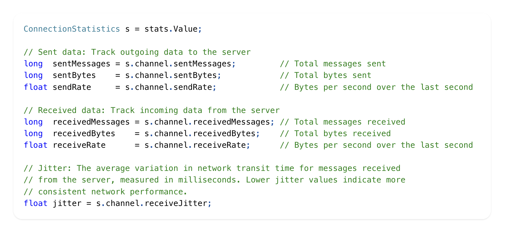
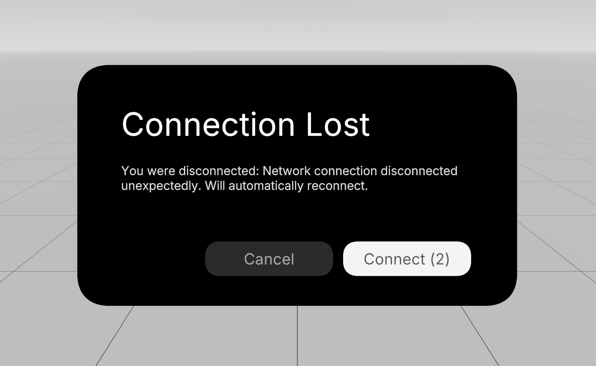
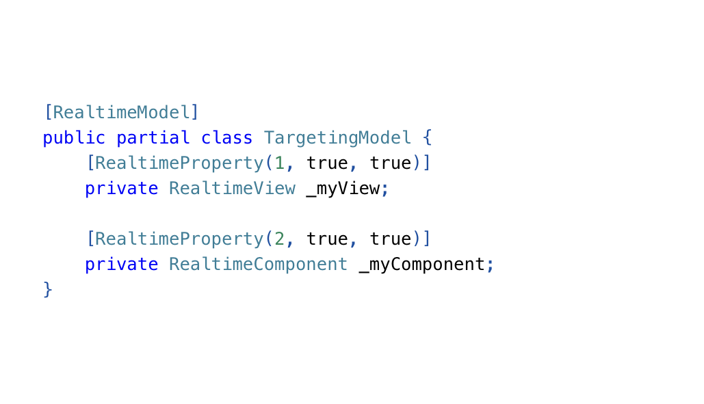

import largeScaleRooms from './whats-new-in-normcore-3/large-scale-rooms.mp4'
import easySync from './whats-new-in-normcore-3/easy-sync.mp4'
import realtimeAnimator from './whats-new-in-normcore-3/realtime-animator.mp4'
import quickmatch from './whats-new-in-normcore-3/quickmatch.mp4'

# Normcore 3
Normcore has hosted over 1,000,000,000+ games. We couldn't be more proud of the titles everyone has created using our product.

Normcore 3 marks the newest release of our industry-leading multiplayer networking plugin. You can now synchronize your scenes without writing any code, automatically scale up to 100+ players in VR or console, automatically matchmake players to available rooms, and more! Best of all, if you're already using Normcore, you can upgrade without having to change any code in your project. Simply update to the latest version and you can immediately start taking advantage of these new features!

This page outlines in detail some of the new features that we're really excited about with Normcore 3

## Large-scale Rooms
<video width="100%" autoPlay playsInline loop muted><source src={largeScaleRooms} /></video>

Normcore 3 includes a brand new packet transport system. Still built on the rock solid WebRTC protocol, Normcore 3 servers can now scale to [100+ players](../room/room-server-options.md) in a single room without reducing the send rate of any objects. And with our upcoming interest management API, you'll be able to push this even further.

## EasySync
<video width="100%" autoPlay playsInline loop muted><source src={easySync} /></video>

[EasySync](../guides/easy-sync.md) is our new no-code feature that lets you synchronize any component in Unity without writing any code. Add an EasySync component to your prefab, and Normcore will show a checkbox on every component that allows you to synchronize those properties. And when you're ready to dive into code, EasySync can be converted to a RealtimeComponent and RealtimeModel in two clicks!

We think EasySync is going to be the perfect tool for prototyping, design, and improving the workflow for things like cosmetics. Now your artsts can create cosmetics and network them without leaving the Unity Editor.

## RealtimeAnimator
<video width="100%" autoPlay playsInline loop muted><source src={realtimeAnimator} /></video>

Normcore now ships a component that automatically synchronizes the state of a Unity Animator component. It supports traditional timeline animations, humanoid animations, and it works with triggers without requiring you to rewrite your code.

[RealtimeAnimator](../realtime/realtimeanimator.md) is the most robust animator synchronization component on the market. We think it's results are flawless and joins RealtimeTransform by outperforming every other solution on the market.

## Quickmatch
<video width="100%" autoPlay playsInline loop muted><source src={quickmatch} /></video>

[Quickmatch](../guides/quickmatch.md) allows you to create social games that automatically match players with the next available room that has capacity. Create your own room groups and automatically join the next available room. And the best part, you don't need to integrate a complex matchmaking API, simply change your `realtime.Connect()` call to a `realtime.QuickmatchConnect()` call and Normcore will automatically connect you to the next available room for that quickmatch group.

With the explosion of social multiplyer games like Among Us, Lethal Company, Content Warning, Chained Together, Peak, and Gorilla Tag, we've seen many titles in this genre start using Normcore. We think this API is going to allow developers to prototype and launch social titles even more quickly. We now provide our own [GorillaTemplate](https://github.com/NormalVR/GorillaTemplate) for quickly making titles like this in VR.

## Preferred Regions

Normcore now lets you specify [preferred regions](../guides/regions.md) when hosting a room server. Query available regions, measure latency, and pick the optimal location for your players to ensure the best possible connection. Our API provides a list of user-facing region names for letting users choose, and all of the metadata needed to build custom matchmaking that can pick the ideal region for a group of players.

## Connection Statistics

Normcore 3 includes a new [Connection Statistics](../room/connection-statistics.md) API. This API can be used to measure ping, jitter, bandwidth, and more in real-time. This API can be used at runtime for matchmaking, to determine if clients have a poor connection, debug connection issues in the field, or report connection stats to analytics.

## AutoReconnect

We now bundle an [AutoReconnect](../realtime/autoreconnect.md) component that can be used to automatically reconnect to a multiplayer room if a player gets disconnected. This component is great for reconnecting after a device goes to sleep. AutoReconnect is intelligent enough to know what types of network errors warrant a reconnect, and it will automatically perform exponential backoff to prevent your application from getting rate limited.

It comes with a full-featured UI component that can be replaced entirely or customized to fit the look and feel of your game.

## Realtime Reference

Normcore 3 now allows you to [store references](../realtime/realtimeref.md) to other RealtimeView and RealtimeComponents directly in your models. These references are synchronized over the network and allow you to make modular components that can work together.

We can't wait to see what you all build with Normcore 3! If you want to try it out, [Sign Up](https://normcore.io/register) and if you're already a Normcore customer, update Normcore in the UPM package manager to take advantage of the new features today!
