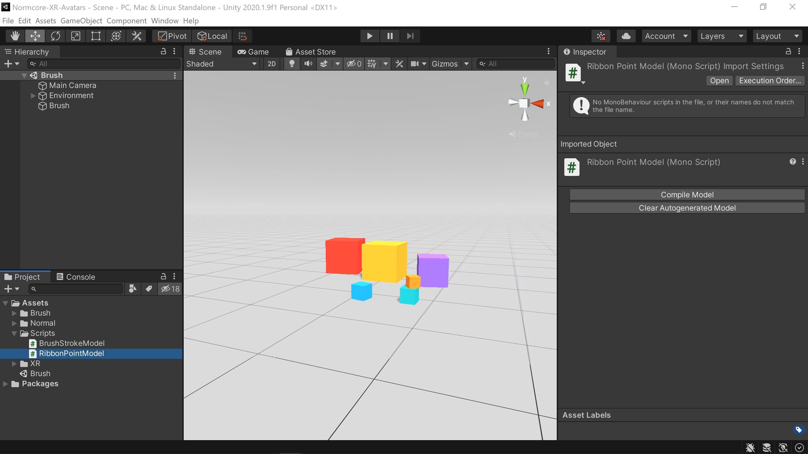

import drawingTogether                   from './creating-a-multiplayer-drawing-app/drawing-together.mp4'
import settingHandAndDrawingABrushStroke from './creating-a-multiplayer-drawing-app/setting-hand-and-drawing-a-brush-stroke.mp4'
import addingBrushStrokeToScene          from './creating-a-multiplayer-drawing-app/adding-brush-stroke-to-scene.mp4'
import shadedWireframeBrush              from './creating-a-multiplayer-drawing-app/shaded-wireframe-brush.mp4'
import addRealtime                       from './creating-a-multiplayer-drawing-app/add-realtime.mp4'
import wireUpRealtimeToBrush             from './creating-a-multiplayer-drawing-app/wire-up-realtime-to-brush.mp4'
import moveBrushStrokeToResources        from './creating-a-multiplayer-drawing-app/move-brush-stroke-to-resources.mp4'
import addRealtimeView                   from './creating-a-multiplayer-drawing-app/add-realtime-view.mp4'
import finalResult                       from './creating-a-multiplayer-drawing-app/final-result.mp4'

# Creating a Multiplayer Drawing App

In this guide I’m going to show you how to make a simple multiplayer drawing app with Normcore.

<video width="100%" title="" controls><source src={drawingTogether} /></video> 

## Singleplayer brush

First, we’ll walk through how the singleplayer brush example works, and then we’ll walk through how to make it multiplayer using Normcore.

To start, download the Multiplayer Drawing Singleplayer project template from the [Normcore Samples repository](https://github.com/NormalVR/Normcore-Samples). This project template implements a basic VR brush in Unity.

Once you have the project open, open up the Brush scene. You should see a Brush object in the scene. First, let’s try it out. Make a note of which hand the Brush script is set to, hit Play, and use the trigger to draw:

<video width="100%" title="Make sure the Brush component on the Brush object is set to the hand you want to draw with." controls><source src={settingHandAndDrawingABrushStroke} /></video> 

The brush is made up of three scripts, so let's walk through what those are and how they work.

### Brush

First up is the Brush component. The Brush component tracks the position of your hand. When the trigger is pressed, it creates a BrushStroke object to represent the brush stroke in the scene.

Each frame that you continue to hold the trigger, the Brush tells the BrushStroke component where the tip of the brush is as you move your hand around.

```csharp
using System.Collections.Generic;
using UnityEngine;
using UnityEngine.XR;

public class Brush : MonoBehaviour {
    // Prefab to instantiate when we draw a new brush stroke
    [SerializeField] private GameObject _brushStrokePrefab;

    // Which hand should this brush instance track?
    private enum Hand { LeftHand, RightHand };
    [SerializeField] private Hand _hand;

    // Used to keep track of the current brush tip position and the actively drawing brush stroke
    private Vector3     _handPosition;
    private Quaternion  _handRotation;
    private BrushStroke _activeBrushStroke;

    private void Update() {
        // Start by figuring out which hand we're tracking
        XRNode node    = _hand == Hand.LeftHand ? XRNode.LeftHand : XRNode.RightHand;
        string trigger = _hand == Hand.LeftHand ? "Left Trigger" : "Right Trigger";

        // Get the position & rotation of the hand
        bool handIsTracking = UpdatePose(node, ref _handPosition, ref _handRotation);

        // Figure out if the trigger is pressed or not
        bool triggerPressed = Input.GetAxisRaw(trigger) > 0.1f;

        // If we lose tracking, stop drawing
        if (!handIsTracking)
            triggerPressed = false;

        // If the trigger is pressed and we haven't created a new brush stroke to draw, create one!
        if (triggerPressed && _activeBrushStroke == null) {
            // Instantiate a copy of the Brush Stroke prefab.
            GameObject brushStrokeGameObject = Instantiate(_brushStrokePrefab);

            // Grab the BrushStroke component from it
            _activeBrushStroke = brushStrokeGameObject.GetComponent<BrushStroke>();

            // Tell the BrushStroke to begin drawing at the current brush position
            _activeBrushStroke.BeginBrushStrokeWithBrushTipPoint(_handPosition, _handRotation);
        }

        // If the trigger is pressed, and we have a brush stroke, move the brush stroke to the new brush tip position
        if (triggerPressed)
            _activeBrushStroke.MoveBrushTipToPoint(_handPosition, _handRotation);

        // If the trigger is no longer pressed, and we still have an active brush stroke, mark it as finished and clear it.
        if (!triggerPressed && _activeBrushStroke != null) {
            _activeBrushStroke.EndBrushStrokeWithBrushTipPoint(_handPosition, _handRotation);
            _activeBrushStroke = null;
        }
    }

    // ...
}
```

### BrushStroke

Next up is the BrushStroke component. If you drag the BrushStroke prefab from the Project into the scene, you’ll see it on the root of the prefab.

<video width="100%" title="Take a look at the BrushStroke prefab. You'll notice it has a BrushStroke component on it." controls><source src={addingBrushStrokeToScene} /></video> 

The `BrushStroke` component takes the current position of the brush tip each frame, and adds a new segment to the ribbon as it moves. It waits for the brush tip to move a specific distance before adding a new segment. This threshold is designed to keep the ribbon smooth while also keeping the mesh simple.

Every time it adds a new ribbon point, it updates the `BrushStrokeMesh`, which creates the geometry needed to render the ribbon.

```csharp
using System.Collections.Generic;
using UnityEngine;

public class BrushStroke : MonoBehaviour {
    [SerializeField]
    private BrushStrokeMesh _mesh;

    // Ribbon State
    struct RibbonPoint {
        public Vector3    position;
        public Quaternion rotation;
    }
    private List<RibbonPoint> _ribbonPoints = new List<RibbonPoint>();

    private Vector3    _brushTipPosition;
    private Quaternion _brushTipRotation;
    private bool       _brushStrokeFinalized;

    // Smoothing
    private Vector3    _ribbonEndPosition;
    private Quaternion _ribbonEndRotation = Quaternion.identity;

    // Mesh
    private Vector3    _previousRibbonPointPosition;
    private Quaternion _previousRibbonPointRotation = Quaternion.identity;

    // Unity Events
    private void Update() {
        // Animate the end of the ribbon towards the brush tip
        AnimateLastRibbonPointTowardsBrushTipPosition();

        // Add a ribbon segment if the end of the ribbon has moved far enough
        AddRibbonPointIfNeeded();
    }

    // Interface
    public void BeginBrushStrokeWithBrushTipPoint(Vector3 position, Quaternion rotation) {
        // Update the model
        _brushTipPosition = position;
        _brushTipRotation = rotation;

        // Update last ribbon point to match brush tip position & rotation
        _ribbonEndPosition = position;
        _ribbonEndRotation = rotation;
        _mesh.UpdateLastRibbonPoint(_ribbonEndPosition, _ribbonEndRotation);
    }

    public void MoveBrushTipToPoint(Vector3 position, Quaternion rotation) {
        _brushTipPosition = position;
        _brushTipRotation = rotation;
    }

    public void EndBrushStrokeWithBrushTipPoint(Vector3 position, Quaternion rotation) {
        // Add a final ribbon point and mark the stroke as finalized
        AddRibbonPoint(position, rotation);
        _brushStrokeFinalized = true;
    }


    // Ribbon drawing
    private void AddRibbonPointIfNeeded() {
        // If the brush stroke is finalized, stop trying to add points to it.
        if (_brushStrokeFinalized)
            return;

        if (Vector3.Distance(_ribbonEndPosition, _previousRibbonPointPosition) >= 0.01f ||
            Quaternion.Angle(_ribbonEndRotation, _previousRibbonPointRotation) >= 10.0f) {

            // Add ribbon point model to ribbon points array. This will fire the RibbonPointAdded event to update the mesh.
            AddRibbonPoint(_ribbonEndPosition, _ribbonEndRotation);

            // Store the ribbon point position & rotation for the next time we do this calculation
            _previousRibbonPointPosition = _ribbonEndPosition;
            _previousRibbonPointRotation = _ribbonEndRotation;
        }
    }

    private void AddRibbonPoint(Vector3 position, Quaternion rotation) {
        // Create the ribbon point
        RibbonPoint ribbonPoint = new RibbonPoint();
        ribbonPoint.position = position;
        ribbonPoint.rotation = rotation;
        _ribbonPoints.Add(ribbonPoint);

        // Update the mesh
        _mesh.InsertRibbonPoint(position, rotation);
    }

    // Brush tip + smoothing
    private void AnimateLastRibbonPointTowardsBrushTipPosition() {
        // If the brush stroke is finalized, skip the brush tip mesh, and stop animating the brush tip.
        if (_brushStrokeFinalized) {
            _mesh.skipLastRibbonPoint = true;
            return;
        }

        Vector3    brushTipPosition = _brushTipPosition;
        Quaternion brushTipRotation = _brushTipRotation;

        // If the end of the ribbon has reached the brush tip position, we can bail early.
        if (Vector3.Distance(_ribbonEndPosition, brushTipPosition) <= 0.0001f &&
            Quaternion.Angle(_ribbonEndRotation, brushTipRotation) <= 0.01f) {
            return;
        }

        // Move the end of the ribbon towards the brush tip position
        _ribbonEndPosition =     Vector3.Lerp(_ribbonEndPosition, brushTipPosition, 25.0f * Time.deltaTime);
        _ribbonEndRotation = Quaternion.Slerp(_ribbonEndRotation, brushTipRotation, 25.0f * Time.deltaTime);

        // Update the end of the ribbon mesh
        _mesh.UpdateLastRibbonPoint(_ribbonEndPosition, _ribbonEndRotation);
    }
}
```

### BrushStrokeMesh

Last up is the `BrushStrokeMesh` component. This component is located on the Mesh game object of the BrushStroke prefab.

As the BrushStrokeMesh component is given new ribbon points by the BrushStroke component, it will create new vertices that correspond to each ribbon point’s position and rotation.

`BrushStrokeMesh` also includes one bonus feature: It allows you to update the position of the last brush stroke in the ribbon. The BrushStroke component uses this to connect the end of the ribbon to the brush tip position to make the brush stroke look like it’s drawing continuously

<video width="100%" title="Here you can see the last point on the brush stroke being updated to match the latest hand position, with new points being created when you pass a certain distance from the previous one." controls><source src={shadedWireframeBrush} /></video> 

```csharp
using System.Collections;
using System.Collections.Generic;
using UnityEngine;

public class BrushStrokeMesh : MonoBehaviour {
    [SerializeField]
    private float _brushStrokeWidth = 0.05f;

    private Mesh _mesh;

    private List<Vector3> _vertices;
    private List<Vector3> _normals;

    private bool _skipLastRibbonPoint;
    public  bool  skipLastRibbonPoint { get { return _skipLastRibbonPoint; } set { if (value == _skipLastRibbonPoint) return; _skipLastRibbonPoint = value; UpdateGeometry(); } }

    private void Awake() {
        MeshFilter filter = gameObject.GetComponent<MeshFilter>();
        _mesh = filter.mesh;

        _vertices = new List<Vector3>();
        _normals  = new List<Vector3>();

        // In addition to clearing the ribbon, this adds a ribbon point that we'll move each frame to match the
        // brush tip position so that the brush stroke appears to paint continuously.
        ClearRibbon();
    }

    // Insert a new ribbon point just before the final ribbon point
    public void InsertRibbonPoint(Vector3 position, Quaternion rotation) {
        // Calculate vertices + normal for ribbon point
        Vector3 p1;
        Vector3 p2;
        Vector3 normal;
        CalculateVerticesAndNormalForRibbonPoint(position, rotation, _brushStrokeWidth, out p1, out p2, out normal);

        // Insert into vertices array
        _vertices.Insert(_vertices.Count-4, p1);
        _vertices.Insert(_vertices.Count-4, p2);
        _vertices.Insert(_vertices.Count-4, p1);
        _vertices.Insert(_vertices.Count-4, p2);

        // Insert into normals array
        _normals.Insert(_normals.Count-4,  normal);
        _normals.Insert(_normals.Count-4,  normal);
        _normals.Insert(_normals.Count-4, -normal);
        _normals.Insert(_normals.Count-4, -normal);

        // Update the mesh
        UpdateGeometry();
    }

    public void UpdateLastRibbonPoint(Vector3 position, Quaternion rotation) {
        // Calculate vertices + normal for ribbon point
        Vector3 p1;
        Vector3 p2;
        Vector3 normal;
        CalculateVerticesAndNormalForRibbonPoint(position, rotation, _brushStrokeWidth, out p1, out p2, out normal);

        int lastIndex = _vertices.Count-4;

        // Update vertices
        _vertices[lastIndex]   = p1;
        _vertices[lastIndex+1] = p2;
        _vertices[lastIndex+2] = p1;
        _vertices[lastIndex+3] = p2;

        // Update normals
        _normals[lastIndex]   =  normal;
        _normals[lastIndex+1] =  normal;
        _normals[lastIndex+2] = -normal;
        _normals[lastIndex+3] = -normal;

        // Update the mesh
        UpdateGeometry();
    }

    public void ClearRibbon() {
        // Clear vertices & normals
        _vertices.Clear();
        _normals.Clear();

        // Create last ribbon point
        _vertices.Add(Vector3.zero);
        _vertices.Add(Vector3.zero);
        _vertices.Add(Vector3.zero);
        _vertices.Add(Vector3.zero);
        _normals.Add(Vector3.zero);
        _normals.Add(Vector3.zero);
        _normals.Add(Vector3.zero);
        _normals.Add(Vector3.zero);

        // Update the mesh
        UpdateGeometry();
    }

    private void CalculateVerticesAndNormalForRibbonPoint(Vector3 position, Quaternion rotation, float width, out Vector3 p1, out Vector3 p2, out Vector3 normal) {
        p1     = position + rotation * new Vector3(-width/2.0f, 0.0f, 0.0f);
        p2     = position + rotation * new Vector3( width/2.0f, 0.0f, 0.0f);
        normal = rotation * Vector3.up;
    }

    private void UpdateGeometry() {
        int numberOfVertices = _vertices.Count;
        if (skipLastRibbonPoint)
            numberOfVertices -= 4;

        if (numberOfVertices < 8) {
            _mesh.vertices  = new Vector3[0];
            _mesh.normals   = new Vector3[0];
            _mesh.triangles = new int[0];

            _mesh.RecalculateBounds();

            return;
        }

        // Would probably make sense to just generate the new triangles rather than regenerating all of them all of the time.

        int numberOfSegments  = numberOfVertices/4 - 1;
        int numberOfTriangles = numberOfSegments * 4; // Two on the front side, two on the back.

        int[] triangles = new int[numberOfTriangles*3];
        for (int i = 0; i < numberOfSegments; i++) {
            // Front
            int p1 = i*4;
            int p2 = i*4+1;
            int p3 = i*4+4;
            int p4 = i*4+5;

            // Back
            int p1b = i*4+2;
            int p2b = i*4+3;
            int p3b = i*4+6;
            int p4b = i*4+7;

            // Front
            triangles[i*12]   = p1;
            triangles[i*12+1] = p2;
            triangles[i*12+2] = p3;
            triangles[i*12+3] = p2;
            triangles[i*12+4] = p4;
            triangles[i*12+5] = p3;

            // Back
            triangles[i*12+6]  = p1b;
            triangles[i*12+7]  = p3b;
            triangles[i*12+8]  = p2b;
            triangles[i*12+9]  = p2b;
            triangles[i*12+10] = p3b;
            triangles[i*12+11] = p4b;
        }

        _mesh.vertices  = _vertices.ToArray();
        _mesh.normals   = _normals.ToArray();
        _mesh.triangles = triangles;

        _mesh.RecalculateBounds();
    }
}
```

## Making it multiplayer

Now that we have a singleplayer brush prototype working nicely. Let’s walk through how to make it multiplayer.

Before we begin, import the latest version of Normcore and make sure you’ve got an App Key.

### Models

Whenever I add multiplayer support to a prototype, I like to think about the state that needs to be shared between clients. In our case we have the following:

1. How many BrushStroke objects exist in the scene
2. The ribbon points in each brush stroke
3. For any brush strokes that are actively being drawn, the position of the brush tip so we can connect the ribbon to their brush tip in real-time

If you’ve used Normcore before, you know that Normcore can keep track of which prefabs you’ve instantiated in the scene. Luckily, that takes care of #1. That means that for each brush stroke, we’ll need a model that contains the array of ribbon points (#2), the current brush tip position, as well as a boolean to signal whether the brush stroke is being actively drawn or not (#3).

That means our `BrushStrokeModel` will look something like this:

```csharp
// BrushStrokeModel
RealtimeArray<RibbonPointModel> ribbonPoints;
Vector3    brushTipPosition;
Quaternion brushTipRotation;
bool       brushStrokeFinalized;
```

Let’s go ahead and make our models. To start, make two new scripts: `BrushStrokeModel`, and `RibbonPointModel`.

We’ll start with `RibbonPointModel`. First off, remove the methods that Unity adds, and remove the `MonoBehaviour` superclass. Next we’ll add a variable for position, and one for rotation:

```csharp {4-5}
using UnityEngine;

public class RibbonPointModel {
    private Vector3    _position;
    private Quaternion _rotation = Quaternion.identity;
}
```

Now, let’s add a `[RealtimeModel]` attribute and `[RealtimeProperty]` attributes for both properties. In this case we’ll want both properties to be reliable, and we don’t need any change events.

```csharp {3,5,8}
using UnityEngine;

[RealtimeModel]
public class RibbonPointModel {
    [RealtimeProperty(1, true)]
    private Vector3    _position;

    [RealtimeProperty(2, true)]
    private Quaternion _rotation = Quaternion.identity;
}
```

Now let’s compile this model. Head back to Unity, wait for it to recompile, and then click “Compile Model” in the inspector for the `RibbonPointModel.cs` script.



The compiled model should look something like this:

```csharp {13-17}
using UnityEngine;
using Normal.Realtime.Serialization;

[RealtimeModel]
public partial class RibbonPointModel {
    [RealtimeProperty(1, true)]
    private Vector3    _position;

    [RealtimeProperty(2, true)]
    private Quaternion _rotation = Quaternion.identity;
}

/* ----- Begin Normal Autogenerated Code ----- */

/* Autogenerated code here. Removed for brevity. */

/* ----- End Normal Autogenerated Code ----- */
```

For the `BrushStrokeModel`, we’re going to create a `RealtimeArray` property to hold our ribbon points. This will also ensure that only the changes we make to the array are sent to the server each time. We’ll also add a property for the brush tip position and rotation, as well as a bool to signal when we’ve finished drawing this brush stroke so remote clients can ignore the brush tip position.

```csharp
using UnityEngine;
using Normal.Realtime.Serialization;

[RealtimeModel]
public partial class BrushStrokeModel {
    [RealtimeProperty(1, true)]
    private RealtimeArray<RibbonPointModel> _ribbonPoints;

    [RealtimeProperty(2, false)]
    private Vector3 _brushTipPosition;

    [RealtimeProperty(3, false)]
    private Quaternion _brushTipRotation;

    [RealtimeProperty(4, true)]
    private bool _brushStrokeFinalized;
}
```

Once you’ve got this in, go back to Unity and hit “Compile Model.” You should end up with something that looks like this:

```csharp {19-23}
using UnityEngine;
using Normal.Realtime.Serialization;

[RealtimeModel]
public partial class BrushStrokeModel {
    [RealtimeProperty(1, true)]
    private RealtimeArray<RibbonPointModel> _ribbonPoints;

    [RealtimeProperty(2, false)]
    private Vector3 _brushTipPosition;

    [RealtimeProperty(3, false)]
    private Quaternion _brushTipRotation;

    [RealtimeProperty(4, true)]
    private bool _brushStrokeFinalized;
}

/* ----- Begin Normal Autogenerated Code ----- */

/* Autogenerated code here. Removed for brevity. */

/* ----- End Normal Autogenerated Code ----- */
```

Wonderful! Now we have two models that we can use to synchronize our brush strokes.

### Brush

We need to modify the Brush component to use Realtime to instantiate all instances of the BrushStroke prefab. That way they’re instantiated on all clients.

Let’s start by making a Realtime instance in the scene. I generally recommend using the “Realtime + Avatars” prefab because it will give us avatars + voice chat out of the box. Drag that prefab into the scene like so:

<video width="100%" title="Adding a 'Realtime + Avatars' prefab to the scene." controls><source src={addRealtime} /></video> 

Now, let’s add a property on Brush so we can get a reference to this. Make sure to add `using Normal.Realtime;` to the top of your file:

```csharp {4,7,8}
using System.Collections.Generic;
using UnityEngine;
using UnityEngine.XR;
using Normal.Realtime;

public class Brush : MonoBehaviour {
    // Reference to Realtime to use to instantiate brush strokes
    [SerializeField] private Realtime _realtime;

    // Prefab to instantiate when we draw a new brush stroke
    [SerializeField] private GameObject _brushStrokePrefab;

    // Which hand should this brush instance track?
    private enum Hand { LeftHand, RightHand };
    [SerializeField] private Hand _hand;

    // Used to keep track of the current brush tip position and the actively drawing brush stroke
    private Vector3     _handPosition;
    private Quaternion  _handRotation;
    private BrushStroke _activeBrushStroke;

    private void Update() {
        // Start by figuring out which hand we're tracking
        XRNode node    = _hand == Hand.LeftHand ? XRNode.LeftHand : XRNode.RightHand;
        string trigger = _hand == Hand.LeftHand ? "Left Trigger" : "Right Trigger";

        // Get the position & rotation of the hand
        bool handIsTracking = UpdatePose(node, ref _handPosition, ref _handRotation);

        // Figure out if the trigger is pressed or not
        bool triggerPressed = Input.GetAxisRaw(trigger) > 0.1f;

        // If we lose tracking, stop drawing
        if (!handIsTracking)
            triggerPressed = false;

        // If the trigger is pressed and we haven't created a new brush stroke to draw, create one!
        if (triggerPressed && _activeBrushStroke == null) {
            // Instantiate a copy of the Brush Stroke prefab.
            GameObject brushStrokeGameObject = Instantiate(_brushStrokePrefab);

            // Grab the BrushStroke component from it
            _activeBrushStroke = brushStrokeGameObject.GetComponent<BrushStroke>();

            // Tell the BrushStroke to begin drawing at the current brush position
            _activeBrushStroke.BeginBrushStrokeWithBrushTipPoint(_handPosition, _handRotation);
        }

        // If the trigger is pressed, and we have a brush stroke, move the brush stroke to the new brush tip position
        if (triggerPressed)
            _activeBrushStroke.MoveBrushTipToPoint(_handPosition, _handRotation);

        // If the trigger is no longer pressed, and we still have an active brush stroke, mark it as finished and clear it.
        if (!triggerPressed && _activeBrushStroke != null) {
            _activeBrushStroke.EndBrushStrokeWithBrushTipPoint(_handPosition, _handRotation);
            _activeBrushStroke = null;
        }
    }

    // ...
}
```

Before we forget, let’s wire up our Realtime instance in the Unity editor:

<video width="100%" title="Drag the instance of Realtime into the Realtime field on the Brush inspector." controls><source src={wireUpRealtimeToBrush} /></video> 

Swap the `Instantiate()` call for `Realtime.Instantiate()`. This will ensure that the prefab is instantiated on everyone’s client.

```csharp {27}
using System.Collections.Generic;
using UnityEngine;
using UnityEngine.XR;
using Normal.Realtime;

public class Brush : MonoBehaviour {
    // ...

    private void Update() {
        // Start by figuring out which hand we're tracking
        XRNode node    = _hand == Hand.LeftHand ? XRNode.LeftHand : XRNode.RightHand;
        string trigger = _hand == Hand.LeftHand ? "Left Trigger" : "Right Trigger";

        // Get the position & rotation of the hand
        bool handIsTracking = UpdatePose(node, ref _handPosition, ref _handRotation);

        // Figure out if the trigger is pressed or not
        bool triggerPressed = Input.GetAxisRaw(trigger) > 0.1f;

        // If we lose tracking, stop drawing
        if (!handIsTracking)
            triggerPressed = false;

        // If the trigger is pressed and we haven't created a new brush stroke to draw, create one!
        if (triggerPressed && _activeBrushStroke == null) {
            // Instantiate a copy of the Brush Stroke prefab, set it to be owned by us.
            GameObject brushStrokeGameObject = Realtime.Instantiate(_brushStrokePrefab.name, ownedByClient: true, useInstance: _realtime);

            // Grab the BrushStroke component from it
            _activeBrushStroke = brushStrokeGameObject.GetComponent<BrushStroke>();

            // Tell the BrushStroke to begin drawing at the current brush position
            _activeBrushStroke.BeginBrushStrokeWithBrushTipPoint(_handPosition, _handRotation);
        }

        // If the trigger is pressed, and we have a brush stroke, move the brush stroke to the new brush tip position
        if (triggerPressed)
            _activeBrushStroke.MoveBrushTipToPoint(_handPosition, _handRotation);

        // If the trigger is no longer pressed, and we still have an active brush stroke, mark it as finished and clear it.
        if (!triggerPressed && _activeBrushStroke != null) {
            _activeBrushStroke.EndBrushStrokeWithBrushTipPoint(_handPosition, _handRotation);
            _activeBrushStroke = null;
        }
    }

    // ...
}
```

We’ll add a quick check at the beginning of Update() to bail early if we’re not connected to the room yet:

```csharp {10-11}
using System.Collections.Generic;
using UnityEngine;
using UnityEngine.XR;
using Normal.Realtime;

public class Brush : MonoBehaviour {
    // ...

    private void Update() {
        if (!_realtime.connected)
            return;

        // Start by figuring out which hand we're tracking
        XRNode node    = _hand == Hand.LeftHand ? XRNode.LeftHand : XRNode.RightHand;
        string trigger = _hand == Hand.LeftHand ? "Left Trigger" : "Right Trigger";

        // Get the position & rotation of the hand
        bool handIsTracking = UpdatePose(node, ref _handPosition, ref _handRotation);

        // Figure out if the trigger is pressed or not
        bool triggerPressed = Input.GetAxisRaw(trigger) > 0.1f;

        // If we lose tracking, stop drawing
        if (!handIsTracking)
            triggerPressed = false;

        // If the trigger is pressed and we haven't created a new brush stroke to draw, create one!
        if (triggerPressed && _activeBrushStroke == null) {
            // Instantiate a copy of the Brush Stroke prefab, set it to be owned by us.
            GameObject brushStrokeGameObject = Realtime.Instantiate(_brushStrokePrefab.name, ownedByClient: true, useInstance: _realtime);

            // Grab the BrushStroke component from it
            _activeBrushStroke = brushStrokeGameObject.GetComponent<BrushStroke>();

            // Tell the BrushStroke to begin drawing at the current brush position
            _activeBrushStroke.BeginBrushStrokeWithBrushTipPoint(_handPosition, _handRotation);
        }

        // If the trigger is pressed, and we have a brush stroke, move the brush stroke to the new brush tip position
        if (triggerPressed)
            _activeBrushStroke.MoveBrushTipToPoint(_handPosition, _handRotation);

        // If the trigger is no longer pressed, and we still have an active brush stroke, mark it as finished and clear it.
        if (!triggerPressed && _activeBrushStroke != null) {
            _activeBrushStroke.EndBrushStrokeWithBrushTipPoint(_handPosition, _handRotation);
            _activeBrushStroke = null;
        }
    }

    // ...
}
```

That’s everything we need to do to the Brush.

### BrushStroke

Let’s turn our focus to the BrushStroke prefab. First, move it to a folder named Resources. This will allow Unity to instantiate it by name, which is required by Normcore.

<video width="100%" title="Adding the BrushStroke prefab to a 'Resources' folder." controls><source src={moveBrushStrokeToResources} /></video> 

Open the `BrushStroke.cs` file. The first thing we’re going to do is make it a `RealtimeComponent<BrushStrokeModel>` subclass instead of `MonoBehaviour`. This will give us some extra properties we can use, and it will also allow `RealtimeView` to auto-detect this component. Make sure to add `using Normal.Realtime;` at the top of the file too.

All that we need to do is add a `RealtimeView` component to the `BrushStroke` prefab. Now that `BrushStroke` inherits from `RealtimeComponent`, it will be auto-detected and added to RealtimeView’s component list:

<video width="100%" title="Adding a Realtime View to the BrushStroke prefab." controls><source src={addRealtimeView} /></video> 

Wonderful. Apply the prefab, and then remove it from the scene.

At this point, we can test it out. Hit Play and draw a brush stroke. Our prefab will be instantiated, and if you had another client connected, they would see the BrushStroke prefab show up in the scene. However, we haven’t wired up the model to BrushStroke, so the actual ribbons won’t be synchronized just yet. Realtime will also complain that BrushStroke doesn’t have a model property. Let’s fix that.

If you look at the top of `BrushStroke.cs`, there’s a section called `RibbonState`. `RealtimeComponent` will expose the instance of our `BrushStrokeModel` via a built-in `model` property, so we can remove that entirely:

```csharp {4}
using UnityEngine;
using Normal.Realtime;

public class BrushStroke : RealtimeComponent<BrushStrokeModel> {
    [SerializeField]
    private BrushStrokeMesh _mesh;

    // Smoothing
    private Vector3    _ribbonEndPosition;
    private Quaternion _ribbonEndRotation = Quaternion.identity;

    // Mesh
    private Vector3    _previousRibbonPointPosition;
    private Quaternion _previousRibbonPointRotation = Quaternion.identity;

    // ...
}
```

Now, let’s go through the brush stroke class and replace each piece of state with a reference to the model.

We’ll start with the public interface. Overall, this one is pretty easy; we can replace each reference to `_brushTipPosition`, `_brushTipRotation`, and `_brushStrokeFinalized` with the variables we have on our `BrushStrokeModel`. In many cases, you can treat your model the same way you could local variables that store state for your application.

```csharp {10-11,20-21,27}
using UnityEngine;
using Normal.Realtime;

public class BrushStroke : RealtimeComponent<BrushStrokeModel> {
    // ...

    // Interface
    public void BeginBrushStrokeWithBrushTipPoint(Vector3 position, Quaternion rotation) {
        // Update the model
        model.brushTipPosition = position;
        model.brushTipRotation = rotation;

        // Update last ribbon point to match brush tip position & rotation
        _ribbonEndPosition = position;
        _ribbonEndRotation = rotation;
        _mesh.UpdateLastRibbonPoint(_ribbonEndPosition, _ribbonEndRotation);
    }

    public void MoveBrushTipToPoint(Vector3 position, Quaternion rotation) {
        model.brushTipPosition = position;
        model.brushTipRotation = rotation;
    }

    public void EndBrushStrokeWithBrushTipPoint(Vector3 position, Quaternion rotation) {
        // Add a final ribbon point and mark the stroke as finalized
        AddRibbonPoint(position, rotation);
        model.brushStrokeFinalized = true;
    }

    // ...
}
```

Now things get a little more interesting. `AddRibbonPointsIfNeeded` is used to measure the distance between the previous ribbon point, and the tip of the brush. If the distance is large enough, it adds a ribbon point. This block of code is currently going to run on everyone’s client that joins the room, and we don’t want everyone adding ribbon points to every brush stroke, we only want the person who is drawing this brush stroke to add ribbon points.

A quick fix for this is to check if `realtimeView.isOwnedLocallySelf` is true. We’re subclassing `RealtimeComponent`, which means we inherit a reference to the `RealtimeView` on our prefab. In addition to this, earlier in `Brush.cs`, when we called `Realtime.Instantiate()`, we passed `ownedByClient: true`, which tells Realtime to set the RealtimeView at the root to be owned by the client that called `Instantiate()`. Therefore, we can use `realtimeView.isOwnedLocallySelf` to determine if this brush stroke is owned by this client or not. We’ll add a quick check at the beginning of `AddRibbonPointsIfNeeded`:

```csharp {10-12,15}
using UnityEngine;
using Normal.Realtime;

public class BrushStroke : RealtimeComponent<BrushStrokeModel> {

    // ...

    // Ribbon drawing
    private void AddRibbonPointIfNeeded() {
        // Only add ribbon points if this brush stroke is being drawn by the local client.
        if (!realtimeView.isOwnedLocallySelf)
            return;

        // If the brush stroke is finalized, stop trying to add points to it.
        if (model.brushStrokeFinalized)
            return;

        if (Vector3.Distance(_ribbonEndPosition, _previousRibbonPointPosition) >= 0.01f ||
            Quaternion.Angle(_ribbonEndRotation, _previousRibbonPointRotation) >= 10.0f) {

            // Add ribbon point model to ribbon points array. This will fire the RibbonPointAdded event to update the mesh.
            AddRibbonPoint(_ribbonEndPosition, _ribbonEndRotation);

            // Store the ribbon point position & rotation for the next time we do this calculation
            _previousRibbonPointPosition = _ribbonEndPosition;
            _previousRibbonPointRotation = _ribbonEndRotation;
        }
    }

    // ...

}
```

Ok, next up, let’s look at AddRibbonPoint:

```csharp
private void AddRibbonPoint(Vector3 position, Quaternion rotation) {
    // Create the ribbon point
    RibbonPoint ribbonPoint = new RibbonPoint();
    ribbonPoint.position = position;
    ribbonPoint.rotation = rotation;
    _ribbonPoints.Add(ribbonPoint);

    // Update the mesh
    _mesh.InsertRibbonPoint(position, rotation);
}
```

This does two things right now: it adds a ribbon point to our array of ribbon points, and it tells the mesh that we’ve added a ribbon point so it can render the point. Updating the first part to use our models is straightforward:


```csharp {10,13}
using UnityEngine;
using Normal.Realtime;

public class BrushStroke : RealtimeComponent<BrushStrokeModel> {

    // ...

    private void AddRibbonPoint(Vector3 position, Quaternion rotation) {
        // Create the ribbon point
        RibbonPointModel ribbonPoint = new RibbonPointModel();
        ribbonPoint.position = position;
        ribbonPoint.rotation = rotation;
        model.ribbonPoints.Add(ribbonPoint);

        // Update the mesh
        _mesh.InsertRibbonPoint(position, rotation);
    }

    // ...

}
```

This will compile and it will even work for the local client, however, on a remote client, their `model.ribbonPoints` array will update, but their `BrushStrokeMesh` won’t be notified of the new ribbon points.

`RealtimeArray` has an event called `modelAdded` that fires whenever a model is added to the array. That event will fire if another client adds a ribbon point, it’s also going to fire when we add one locally. We’re going to use that event to know when to update our mesh.

First, let’s make an event handler and move the `_mesh.InsertRibbonPoint()` line over to it. Make sure to add `using Normal.Realtime.Serialization;` to the top of the file:

```csharp {3,9-12}
using UnityEngine;
using Normal.Realtime;
using Normal.Realtime.Serialization;

public class BrushStroke : RealtimeComponent<BrushStrokeModel> {

    // ...

    private void RibbonPointAdded(RealtimeArray<RibbonPointModel> ribbonPoints, RibbonPointModel ribbonPoint, bool remote) {
        // Add ribbon point to the mesh
        _mesh.InsertRibbonPoint(ribbonPoint.position, ribbonPoint.rotation);
    }

    // ...

}
```

Now, inside of `OnRealtimeModelReplaced()`, we’re going to register for the `modelAdded` event:

```csharp {9-19}
using UnityEngine;
using Normal.Realtime;
using Normal.Realtime.Serialization;

public class BrushStroke : RealtimeComponent<BrushStrokeModel> {

    // ...

    protected override void OnRealtimeModelReplaced(BrushStrokeModel previousModel, BrushStrokeModel currentModel) {
        if (previousModel != null) {
            // Unregister from events
            previousModel.ribbonPoints.modelAdded -= RibbonPointAdded;
        }
        
        if (currentModel != null) {
            // Let us know when a new ribbon point is added to the mesh
            currentModel.ribbonPoints.modelAdded += RibbonPointAdded;
        }
    }

    // ...

}
```

Once both pieces are in, your class should look something like this:

```csharp
using UnityEngine;
using Normal.Realtime;
using Normal.Realtime.Serialization;

public class BrushStroke : RealtimeComponent<BrushStrokeModel> {
    [SerializeField]
    private BrushStrokeMesh _mesh;

    // Smoothing
    private Vector3    _ribbonEndPosition;
    private Quaternion _ribbonEndRotation = Quaternion.identity;

    // Mesh
    private Vector3    _previousRibbonPointPosition;
    private Quaternion _previousRibbonPointRotation = Quaternion.identity;

    // Unity Events
    private void Update() {
        // Animate the end of the ribbon towards the brush tip
        AnimateLastRibbonPointTowardsBrushTipPosition();

        // Add a ribbon segment if the end of the ribbon has moved far enough
        AddRibbonPointIfNeeded();
    }

    // Interface
    public void BeginBrushStrokeWithBrushTipPoint(Vector3 position, Quaternion rotation) {
        // Update the model
        model.brushTipPosition = position;
        model.brushTipRotation = rotation;

        // Update last ribbon point to match brush tip position & rotation
        _ribbonEndPosition = position;
        _ribbonEndRotation = rotation;
        _mesh.UpdateLastRibbonPoint(_ribbonEndPosition, _ribbonEndRotation);
    }

    public void MoveBrushTipToPoint(Vector3 position, Quaternion rotation) {
        model.brushTipPosition = position;
        model.brushTipRotation = rotation;
    }

    public void EndBrushStrokeWithBrushTipPoint(Vector3 position, Quaternion rotation) {
        // Add a final ribbon point and mark the stroke as finalized
        AddRibbonPoint(position, rotation);
       model.brushStrokeFinalized = true;
    }

    protected override void OnRealtimeModelReplaced(BrushStrokeModel previousModel, BrushStrokeModel currentModel) {
        if (previousModel != null) {
            // Unregister from events
            previousModel.ribbonPoints.modelAdded -= RibbonPointAdded;
        }
        
        if (currentModel != null) {
            // Let us know when a new ribbon point is added to the mesh
            currentModel.ribbonPoints.modelAdded += RibbonPointAdded;
        }
    }

    // Ribbon drawing
    private void AddRibbonPointIfNeeded() {
        // Only add ribbon points if this brush stroke is being drawn by the local client.
        if (!realtimeView.isOwnedLocallySelf)
            return;

        // If the brush stroke is finalized, stop trying to add points to it.
        if (model.brushStrokeFinalized)
            return;

        if (Vector3.Distance(_ribbonEndPosition, _previousRibbonPointPosition) >= 0.01f ||
            Quaternion.Angle(_ribbonEndRotation, _previousRibbonPointRotation) >= 10.0f) {

            // Add ribbon point model to ribbon points array. This will fire the RibbonPointAdded event to update the mesh.
            AddRibbonPoint(_ribbonEndPosition, _ribbonEndRotation);

            // Store the ribbon point position & rotation for the next time we do this calculation
            _previousRibbonPointPosition = _ribbonEndPosition;
            _previousRibbonPointRotation = _ribbonEndRotation;
        }
    }

    private void AddRibbonPoint(Vector3 position, Quaternion rotation) {
        // Create the ribbon point
        RibbonPointModel ribbonPoint = new RibbonPointModel();
        ribbonPoint.position = position;
        ribbonPoint.rotation = rotation;
        model.ribbonPoints.Add(ribbonPoint);
    }

    private void RibbonPointAdded(RealtimeArray<RibbonPointModel> ribbonPoints, RibbonPointModel ribbonPoint, bool remote) {
        // Add ribbon point to the mesh
        _mesh.InsertRibbonPoint(ribbonPoint.position, ribbonPoint.rotation);
    }

    // Brush tip + smoothing
    private void AnimateLastRibbonPointTowardsBrushTipPosition() {
        // If the brush stroke is finalized, skip the brush tip mesh, and stop animating the brush tip.
        if (_brushStrokeFinalized) {
            _mesh.skipLastRibbonPoint = true;
            return;
        }

        Vector3    brushTipPosition = _brushTipPosition;
        Quaternion brushTipRotation = _brushTipRotation;

        // If the end of the ribbon has reached the brush tip position, we can bail early.
        if (Vector3.Distance(_ribbonEndPosition, brushTipPosition) <= 0.0001f &&
            Quaternion.Angle(_ribbonEndRotation, brushTipRotation) <= 0.01f) {
            return;
        }

        // Move the end of the ribbon towards the brush tip position
        _ribbonEndPosition =     Vector3.Lerp(_ribbonEndPosition, brushTipPosition, 25.0f * Time.deltaTime);
        _ribbonEndRotation = Quaternion.Slerp(_ribbonEndRotation, brushTipRotation, 25.0f * Time.deltaTime);

        // Update the end of the ribbon mesh
        _mesh.UpdateLastRibbonPoint(_ribbonEndPosition, _ribbonEndRotation);
    }
}
```

We’re getting close. Let’s update `AnimateLastRibbonPointTowardsBrushTipPosition` to reference the model, too:

```csharp {11,16-17}
using UnityEngine;
using Normal.Realtime;
using Normal.Realtime.Serialization;

public class BrushStroke : RealtimeComponent<BrushStrokeModel> {
    // ...

    // Brush tip + smoothing
    private void AnimateLastRibbonPointTowardsBrushTipPosition() {
        // If the brush stroke is finalized, skip the brush tip mesh, and stop animating the brush tip.
        if (model.brushStrokeFinalized) {
            _mesh.skipLastRibbonPoint = true;
            return;
        }

        Vector3    brushTipPosition = model.brushTipPosition;
        Quaternion brushTipRotation = model.brushTipRotation;

        // If the end of the ribbon has reached the brush tip position, we can bail early.
        if (Vector3.Distance(_ribbonEndPosition, brushTipPosition) <= 0.0001f &&
            Quaternion.Angle(_ribbonEndRotation, brushTipRotation) <= 0.01f) {
            return;
        }

        // Move the end of the ribbon towards the brush tip position
        _ribbonEndPosition =     Vector3.Lerp(_ribbonEndPosition, brushTipPosition, 25.0f * Time.deltaTime);
        _ribbonEndRotation = Quaternion.Slerp(_ribbonEndRotation, brushTipRotation, 25.0f * Time.deltaTime);

        // Update the end of the ribbon mesh
        _mesh.UpdateLastRibbonPoint(_ribbonEndPosition, _ribbonEndRotation);
    }
}
```

Ok, now there’s one last thing. If a player joins the room late, their BrushStroke is going to be given a model that already includes ribbon points. In order to render those ribbon points, we’ll add a little bit of code to update the BrushStrokeMesh when the model is set:

```csharp {9-10,18-28}
using UnityEngine;
using Normal.Realtime;
using Normal.Realtime.Serialization;

public class BrushStroke : RealtimeComponent<BrushStrokeModel> {
    // ...

    protected override void OnRealtimeModelReplaced(BrushStrokeModel previousModel, BrushStrokeModel currentModel) {
        // Clear Mesh
        _mesh.ClearRibbon();
        
        if (previousModel != null) {
            // Unregister from events
            previousModel.ribbonPoints.modelAdded -= RibbonPointAdded;
        }
        
        if (currentModel != null) {
            // Replace ribbon mesh
            foreach (RibbonPointModel ribbonPoint in currentModel.ribbonPoints)
                _mesh.InsertRibbonPoint(ribbonPoint.position, ribbonPoint.rotation);

            // Update last ribbon point to match brush tip position & rotation
            _ribbonEndPosition = model.brushTipPosition;
            _ribbonEndRotation = model.brushTipRotation;
            _mesh.UpdateLastRibbonPoint(model.brushTipPosition, model.brushTipRotation);

            // Turn off the last ribbon point if this brush stroke is finalized
            _mesh.skipLastRibbonPoint = model.brushStrokeFinalized;
            
            // Let us know when a new ribbon point is added to the mesh
            currentModel.ribbonPoints.modelAdded += RibbonPointAdded;
        }
    }

}
```

And we’re done! Let’s test it out!

<video width="100%" title="Final result" controls><source src={finalResult} /></video> 

Works like a charm! Export a build and send it to a friend. You’ll both be able to join the same space and draw with each other :)

You can download the complete project from the [Normcore Samples repository](https://github.com/NormalVR/Normcore-Samples).

Fun things to try now:

1. Make a copy of the Brush game object and set it to the other hand so you can draw with two hands at once
2. If you add `destroyWhenOwnerOrLastClientLeaves: false` to the `Realtime.Instantiate` call, the brush strokes will stick around after you leave and come back to the room! Try making a tool that can erase brush strokes by calling `Realtime.Destroy()` on them
3. Check out the [Using AR as a spectator view](./using-ar-as-a-spectator-view.md)
