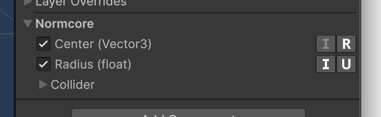

import easySyncHeader from './easy-sync/easy-sync-overview.mp4'
import usingEasySync from './easy-sync/using-easy-sync.mp4'
import convertToRealtimeComponent from './easy-sync/convert-to-realtimecomponent.mp4'

# EasySync

<video width="100%" autoPlay playsInline loop muted><source src={easySyncHeader} /></video>

EasySync is a component that allows you to sync objects in your Unity scene without writing code or leaving the Unity Editor.

EasySync can synchronize public fields and properties, and when you need to drop down to code, it can be converted in-place to a custom C# [RealtimeComponent](./synchronizing-custom-data.md) subclass that you can customize for more advanced use cases.

## Using EasySync

As a quick example, we'll synchronize the color of the player from the [Creating a player controller](./creating-a-player-controller.md) guide:

<video width="100%" controls><source src={usingEasySync} /></video>

1. Open up the "Realtime + Hoverbird Player" scene (or the URP variant if using Unity 6+)
2. Open the "Hoverbird Player" prefab and locate the "birdMesh" game object.
3. Add the EasySync component.
4. Open up the "Bird" material and check the box for "Base Color" and set it to Interpolated.
5. Test it out!

## Settings

EasySync has two settings that you can select for each property, **Reliable**/**Unreliable**, and **Interpolation** On/Off:

### Reliable / Unreliable
If you've used [RealtimeModel](./synchronizing-custom-data.md), you'll be familiar with this concept. This marks whether the property should be synced reliably or unreliably. If you plan to change a property very often (such as animating a color or moving a transform), you should use an unreliable property. Unreliable updates are not resent if they’re dropped in transit because it’s expected that another update is following shortly after.

Reliable properties are good for things that you update once and that should be resent if the packet is dropped in transit. This is great for state such as whether your game has started or not. When you change it, Normcore will ensure that this value is synchronized between all clients and that it is in sync before any newer reliable updates are applied to the datastore.

### Interpolation
By default, Normcore synchronizes model properties at 20 Hz (see [Datastore](../room/datastore.md#delta-updates)). For properties that are updated frequently, EasySync supports enabling Interpolation.

It's worth noting that when Interpolation is enabled, a small interpolation delay will be introduced in order to allow enough data to be received to smoothly interpolate between values.

## Convert to code
EasySync can easily be converted to a [RealtimeComponent](./synchronizing-custom-data.md) script. Open the context menu on EasySync and select "Convert to RealtimeComponent". This will create RealtimeComponent and RealtimeModel scripts that synchronize the same properties and replace this instance of EasySync.

<video width="100%" controls><source src={convertToRealtimeComponent} /></video>

This script functions the exact same way as if you had written a RealtimeComponent and RealtimeModel subclass by hand.

## Supported types
EasySync supports Public fields and properties of Components on the game object. Public and internal component types are supported with the exception of Component types living in precompiled DLLs, where only public fields or properties are supported.

EasySync supports the following types out of the box. If you have a custom type that you would like to synchronize with EasySync, Normcore supports writing a custom type serializer that will allow it to be used by EasySync.
- Primitive types: `bool`, `byte`, `sbyte`, `ushort`, `short`, `uint`, `int`, `ulong`, `long`, `float`, `double`.
- Unity types: `Vector2`, `Vector3`, `Vector4`, `Quaternion`, `Color`.
