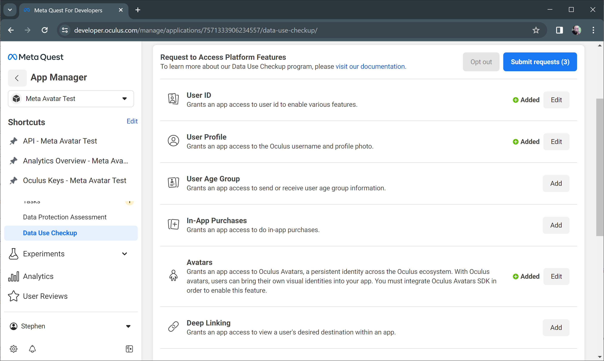

import createApplication from './meta-platform-prerequisites/create-application.mp4'
import oculusIds from './meta-platform-prerequisites/oculus-ids.mp4'
import entitlementCheck from './meta-platform-prerequisites/entitlement-check.mp4'
import emailInvite from './meta-platform-prerequisites/email-invite.mp4'

# Meta Platform Prerequisites

If you've landed on this page, you're most likely using a feature such as Meta Avatars that relies on the Meta / Oculus platform to be configured correctly first. This guide serves as a quick overview on how to set up your project quickly and avoid common pitfalls.

## Summary
To use Oculus platform features like the microphone API, social graph, meta avatars, etc, there are a few things that all need to be completed in order for them to work properly:

1. You need a valid [Meta App](#creating-a-meta-app).
2. You need to explicitly [request permissions](#request-platform-api-access) for services like Meta Avatars in the Meta Dashboard.
3. Your project needs to be [configured with your Meta App ID](#set-up-your-unity-project).
4. The project needs to explicitly [initialize the Oculus Platform C# API](#initialize-the-oculus-platform-at-runtime) at runtime.
5. Anyone who is installing a build of your title needs to be [added to a release channel](#add-users-to-a-release-channel) in the Meta Dashboard.

Make sure you've completed all of these steps! Many Meta APIs will fail silently if these steps aren't completed.

## Creating a Meta App

To create an app on the Oculus dashboard and obtain the App ID for use in a Unity application, follow these steps:

1. Navigate to the [Oculus Developer Dashboard](https://dashboard.oculus.com/).
2. Sign in with your Oculus account. If you don't already have an account, you'll need to create one first.
3. Once logged in, locate and click on the "My Apps" tab on the left sidebar.
4. Click on the "Create New App" button to initiate the application creation process.
5. Fill in the required details for your application. This includes the application name and category.
6. After completing the necessary information, click "Create" to submit your application.
7. Make a note of the App ID in the URL for later. You'll need this when setting up your Unity project.

<video width="100%" controls><source src={createApplication} /></video>

:::tip
If you'd like to test in the Unity Editor, make sure to create a Rift App as well and follow the same steps. Note that Rift and Quest builds will not support cross-play due to the Rift and Quest having different App IDs.
:::

## Request Platform API Access

Platform features like Meta Avatars require additional permissions that you can request in the Meta Quest dashboard.

1. Navigate to your app in the [Oculus Developer Dashboard](https://dashboard.oculus.com/).
2. Open the **Requirements** -> **Data Use Checkup** section.
3. Add **User ID**, **User Profile**, and **Avatars** platform features to your request.
4. Submit your request.

You will need to provide a short justification for each of these, but if you have completed your developer verification everything should be auto-approved fairly quickly.

## Set up your Unity project

1. You'll want to install the Meta SDKs from the Asset Store. These assets will automatically install the Oculus XR Plugin as well as additional components that are useful when building an app for Meta Quest.

The easiest option is to install the [Meta XR All-in-One SDK](https://assetstore.unity.com/packages/tools/integration/meta-xr-all-in-one-sdk-269657), however if you're worried about bloating your project, you can install the [Meta XR Core SDK](https://assetstore.unity.com/packages/tools/integration/meta-xr-core-sdk-269169) and [Meta XR Platform SDK](https://assetstore.unity.com/packages/tools/integration/meta-xr-platform-sdk-262366).

If you're using Meta Avatars, install the [Meta Avatars SDK](https://assetstore.unity.com/packages/tools/integration/meta-avatars-sdk-271958) and [Meta Avatars SDK Sample Assets](https://assetstore.unity.com/packages/tools/integration/meta-avatars-sdk-sample-assets-272863) if needed.

2. Configure your App ID. Open the Oculus Platform Settings window by going to Oculus -> Platform -> Edit Settings. Fill out the App ID from [Creating a Meta app](#creating-a-meta-app).

<video width="100%" controls><source src={oculusIds} /></video> 

3. Fix any remaining project configuration issues. Open the Project Settings window and select the "Meta XR" tab. Address any issues that show up in the list here by hitting the Fix button. If you're unsure, we generally recommend hitting Fix All.

## Initialize the Oculus platform at runtime

Developers often forget to initialize the Oculus platform at runtime which can lead to a host of hard to track down bugs. You can do this in your own components by calling `Oculus.Platform.Core.Initialize()`, however the [Meta XR Platform SDK](https://assetstore.unity.com/packages/tools/integration/meta-xr-platform-sdk-262366) comes with an Entitlement Check sample that you can import using Package Manager. We typically recommend this approach as it will log errors if the platform fails to initialize, and includes the option to quit the application if the user does not have the proper entitlements.

<video width="100%" controls><source src={entitlementCheck} /></video> 

:::danger
If your app quits immediately on launch, it's most likely due to the entitlement check failing! Check your logs and make sure the Meta account used by your Quest has been added to the release channel for your Oculus App ID.
:::

## Add users to a release channel

You'll need to upload a build to your Oculus App in order to add users. We highly recommend using the [Meta Quest Developer Hub](https://developer.oculus.com/meta-quest-developer-hub/) application to do this if you haven't already. It provides a helpful interface for uploading builds and ensuring they pass all of Meta's checks.

Once you have a valid build uploaded, you can assign users to a release channel on the [Oculus Developer Dashboard](https://dashboard.oculus.com/) by navigating to **Distribution -> Release Channels**.

<video width="100%" controls><source src={emailInvite} /></video> 

Once added, you can distribute updated builds via APK, new builds don't need to be uploaded every time while in development, but this step ensures the entitlement check will pass.
