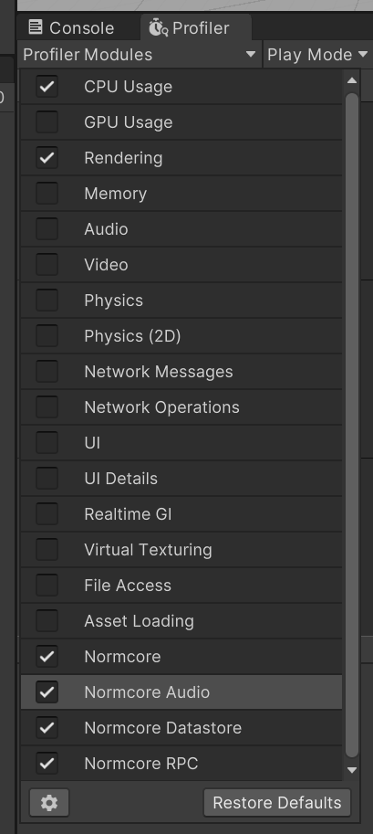
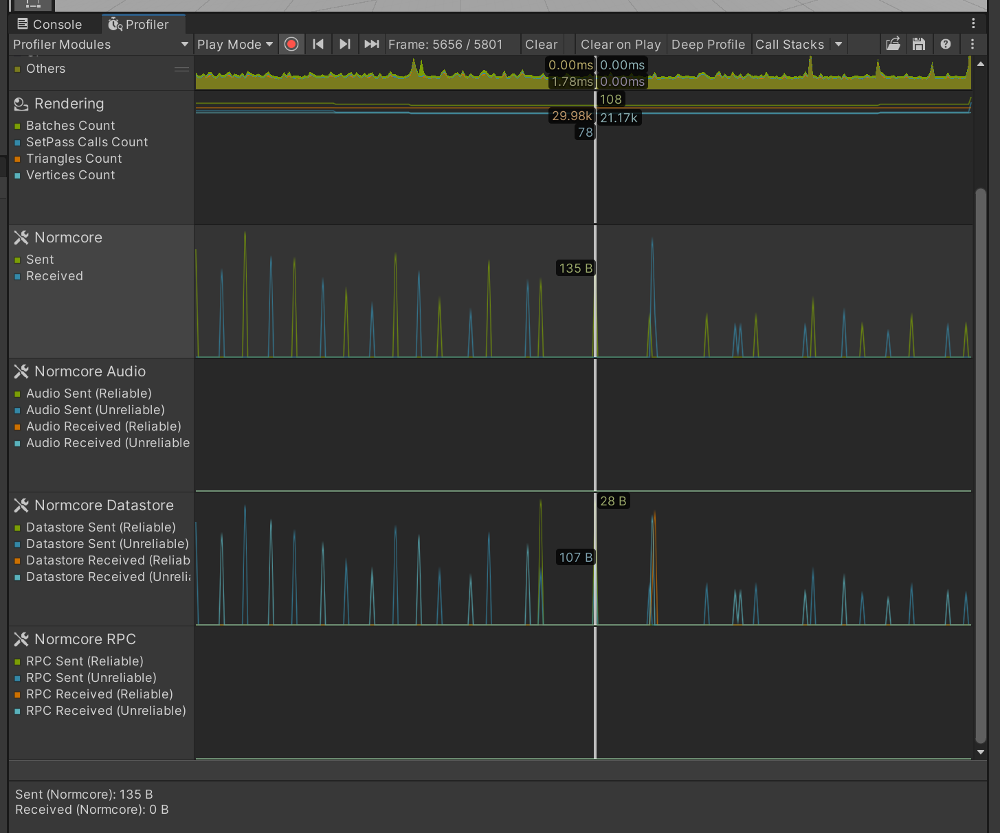

# Network Profiler

In this guide, we will introduce the feature that integrates Normcore with Unity's Profiler window via a custom profiler module. This module displays the size of the data sent and received over time, helping you diagnose network performance issues. A common issue we'll focus on is the stuttering and disconnection problems caused by frequently updated reliable model properties on clients with poor connections.

## The Issue

When developers set a model property to be reliable and update it every frame, clients with poor connections may experience significant stuttering or even disconnection. This happens because reliable packets cannot be dropped; they stack up if they can't be delivered on time. This backlog can grow until it overwhelms the connection, leading to performance degradation and potential disconnection.

## Using the Profiler Module

### Enabling the Profiler Module

1. **Import Normcore SDK**: Ensure you have the latest version of Normcore SDK imported into your Unity project.

2. **Activate the Profiler Module**:
    - Open Unity's Profiler window (`Window > Analysis > Profiler`).
    - In the Profiler window, click on the "Add Profiler" dropdown.
    - Select "Normcore", "Normcore Audio", "Normcore Datastore" or "Normcore RPC" from the list of available profiler modules.



### Understanding the Data

Once the Normcore profiler module is active, you'll see two key metrics in the Profiler window:
- **Sent**: The amount of data being sent from the client over time.
- **Received**: The amount of data being received by the client over time.



These metrics are visualized as graphs, allowing you to track spikes and trends in network traffic.

### Identifying the Issue

1. **Monitor Network Traffic**: Play your game in the Unity Editor with the Profiler window open and recording. Observe the "Sent" and "Received" graphs.
   
2. **Spotting Spikes**: Look for unusual spikes in the data sent graph. Continuous large spikes indicate that a large amount of data is being sent every frame.

3. **Check Reliable Model Properties**: If you notice these spikes, investigate any reliable model properties that might be updated frequently. Reliable properties should not be updated every frame as this can cause the network traffic to surge.

### Debugging and Optimization

1. **Reduce Update Frequency**: Modify your game logic to reduce the frequency of updates for reliable model properties. For instance, instead of updating a property every frame, update it only when a significant change occurs.

2. **Switch to Unreliable Properties**: If real-time accuracy is not critical for the property, consider switching it from reliable to unreliable. Unreliable properties can handle packet loss better and reduce the risk of traffic congestion.

3. **Test on Different Network Conditions**: Use network simulation tools to test how your game performs under various conditions. This can help you identify and fix potential issues before they affect real players.

## Example Scenario

**Problem**: A player's position is being sent as a reliable property and updated every frame.

**Solution**:
1. Change the position update to be less frequent or significant change-based.
2. Alternatively, switch the position property to be unreliable if occasional position inaccuracies are acceptable.

```csharp
// Before: Reliable property updated every frame
normcorePlayerModel.Position = playerTransform.position;

// After: Update only when position changes significantly
if (Vector3.Distance(normcorePlayerModel.Position, playerTransform.position) > threshold)
{
    normcorePlayerModel.Position = playerTransform.position;
}
```

## Conclusion
By utilizing the Normcore profiler module in Unity's Profiler window, you can effectively diagnose and resolve issues related to reliable model properties. Monitoring data traffic and adjusting your networked properties accordingly will enhance the performance and reliability of your multiplayer game, especially for players with poor connections.

Looking to learn more about Normcore? Check out our guides on synchronizing custom data and networked physics:

- [Synchronizing Custom Data](../realtime/synchronizing-custom-data.md)
- [Networked Physics](../realtime/networked-physics.md)
