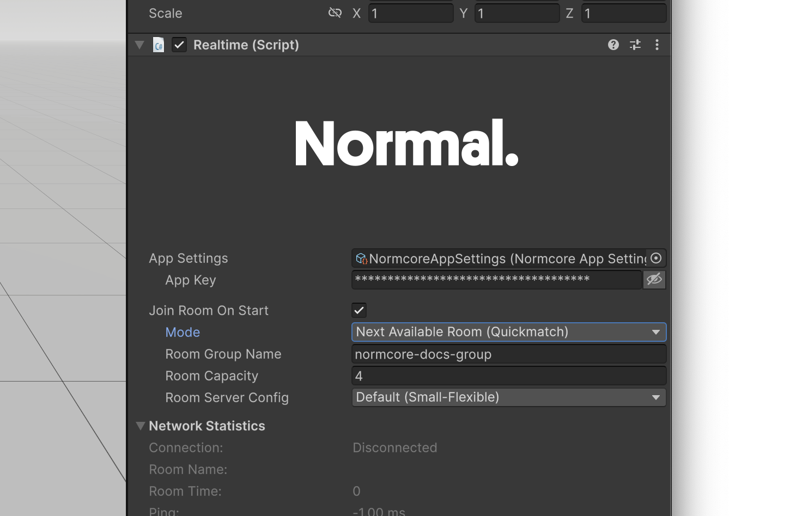

import quickmatchOverview from './quickmatch/quickmatch-overview.mp4'

# Quickmatch

<video width="100%" autoPlay playsInline loop muted><source src={quickmatchOverview} /></video>

Quickmatch lets you automatically connect players to the next available room. Quickmatch scans available rooms and if all rooms are full, it creates a new one.

## How it works

When a player connects using Quickmatch, **Normcore places them in a room with the most players that still has space available.** If all rooms are full (or none exist), Normcore creates a new room.

Quickmatch uses a **room group** to organize rooms. A room group is a named collection of rooms, like "lobby" or "game-2v2". 

Quickmatch prioritizes filling rooms to capacity before creating new ones. When multiple rooms have space, Quickmatch joins the room with the most players. If multiple rooms match, it picks the one that was created most recently. This means your players always encounter lobbies with as many players as possible, rooms fill up efficiently, and older empty rooms cycle out after peak hours.

## Join Room On Start



The Realtime component's "Join Room On Start" setting now includes a **Next Available Room (Quickmatch)** mode:

Configure the **Room Group Name** and **Room Capacity**, and Normcore will automatically send players to the next available room when the scene loads.

## Using the API

### Join Next Available Room

Similar to `Connect()`, **Realtime** now ships with a `ConnectToNextAvailableQuickmatchRoom()` method:

```csharp
using UnityEngine;
using Normal.Realtime;

public class QuickmatchExample : MonoBehaviour {
    [SerializeField] private Realtime _realtime;

    public void JoinSocialLobby() {
        // Join the next available room in the "lobby" room group.
        // If no room is available, create one with a capacity of 8 players.
        _realtime.ConnectToNextAvailableQuickmatchRoom(roomGroupName: "lobby", capacity: 8);
    }
}
```

The `ConnectToNextAvailableQuickmatchRoom` method has two required fields:

- **`roomGroupName`**: The name of the room group. Must be 1-32 characters, start with a letter, and contain only letters, numbers, hyphens, and underscores.
- **`capacity`**: The maximum number of players per room (1-500). Used when creating new rooms.

### Join with Room Code

Quickmatch rooms have a short room code that's easy to share with friends. You can use `ConnectDirectlyToQuickmatchRoom()` to join a room using its room code:

```csharp
// Player B joins directly using the room code shared by Player A
_realtime.ConnectDirectlyToQuickmatchRoom(roomGroupName: "lobby", roomCode: "ABC123");
```

The `ConnectDirectlyToQuickmatchRoom` method has two required fields:

- **`roomGroupName`**: The name of the room group. Must match the room group used when the room was created.
- **`roomCode`**: The short room code to join. This is available via `Room.quickmatchRoomCode` after connecting.

You can also pass `ConnectOptions` as an optional third parameter.

:::note
This method can result in a [`QuickmatchRoomNotFound`](../room/disconnect-events#quickmatchroomnotfound) disconnect event if the room has been cleaned up, or a [`QuickmatchRoomFull`](../room/disconnect-events#quickmatchroomfull) event if the room is at capacity. See [Error Handling](#error-handling) for how to handle these cases.
:::

### Join with Room Name

Quickmatch rooms function as regular Normcore rooms. After connecting, the room name is available via `Realtime.roomName`. Players can share this name with friends, who can join directly using the standard `Connect()` method:

```csharp
// Player A joins via Quickmatch
_realtime.ConnectToNextAvailableQuickmatchRoom(roomGroupName: "lobby", capacity: 8);

// Later, get the room name to share with friends
string roomName = _realtime.roomName;

// Player B joins directly using the room name
_realtime.Connect(roomName);
```

As long as the room has capacity, anyone can join.

:::note
This method can result in a [`QuickmatchRoomNotFound`](../room/disconnect-events#quickmatchroomnotfound) disconnect event if the room has been cleaned up, or a [`QuickmatchRoomFull`](../room/disconnect-events#quickmatchroomfull) event if the room is at capacity. See [Error Handling](#error-handling) for how to handle these cases.
:::

:::note
If you're using [Normcore Private webhooks](../normcore-private/webhooks), all quickmatch connection methods are verified by the webhook before a room slot is reserved. See the [webhooks documentation](../normcore-private/webhooks#quickmatch-webhook-behavior) for details.
:::

### Room Properties

After connecting to a Quickmatch room, you can access the room code and capacity via the `Room` object:

```csharp
_realtime.didConnectToRoom += (realtime) => {
    // Get the room group name
    string roomGroupName = realtime.room.quickmatchRoomGroupName;
    Debug.Log($"Room group: {roomGroupName}");

    // Get the room code to share with friends
    string roomCode = realtime.room.quickmatchRoomCode;
    Debug.Log($"Share this code with friends: {roomCode}");

    // Get the room capacity
    int? capacity = realtime.room.quickmatchRoomCapacity;
    Debug.Log($"Room capacity: {capacity}");
};
```

- **`quickmatchRoomGroupName`**: The name of the room group this room belongs to. Null if not a Quickmatch room.
- **`quickmatchRoomCode`**: A short, shareable code for the room. Players can use this code with `ConnectDirectlyToQuickmatchRoom()` to join. Null if not a Quickmatch room.
- **`quickmatchRoomCapacity`**: The maximum number of players allowed in the room. Null if not a Quickmatch room.

## Error Handling

Quickmatch connections can fail for various reasons. You can handle these using [disconnect events](../room/disconnect-events#quickmatch-events):

```csharp
_realtime.didDisconnectFromRoomWithEvent += (realtime, disconnectEvent) => {
    switch (disconnectEvent) {
        // Room availability errors - join a different room
        case QuickmatchRoomFull:
            Debug.Log("Room is full. Joining a different room.");
            _realtime.ConnectToNextAvailableQuickmatchRoom(roomGroupName: "lobby", capacity: 8);
            break;
        case QuickmatchRoomNotFound roomNotFound:
            Debug.Log($"Room '{roomNotFound.requestedRoomName}' no longer exists. Joining a different room.");
            _realtime.ConnectToNextAvailableQuickmatchRoom(roomGroupName: "lobby", capacity: 8);
            break;

        // Room group name validation errors
        case QuickmatchRoomGroupNameEmpty:
            Debug.Log("Room group name cannot be empty.");
            break;
        case QuickmatchRoomGroupNameInvalidLength invalidLength:
            Debug.Log($"Room group name length {invalidLength.length} is invalid. Must be 1-32 characters.");
            break;
        case QuickmatchRoomGroupNameFormatInvalid formatInvalid:
            Debug.Log($"Room group name format invalid: {formatInvalid.reason}");
            break;

        // Room code validation errors
        case QuickmatchRoomCodeEmpty:
            Debug.Log("Room code cannot be empty.");
            break;
        case QuickmatchRoomCodeInvalidLength codeLength:
            Debug.Log($"Room code length {codeLength.length} is invalid.");
            break;
        case QuickmatchRoomCodeFormatInvalid codeInvalid:
            Debug.Log($"Room code '{codeInvalid.roomCode}' is invalid.");
            break;

        // Capacity validation error
        case QuickmatchCapacityInvalid capacityInvalid:
            Debug.Log($"Capacity {capacityInvalid.capacity} is invalid. Must be 1-500.");
            break;
    }
};
```
