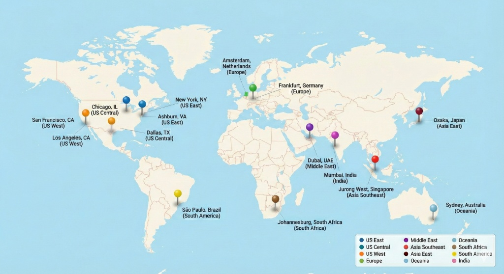

# Regions
Normcore automatically selects the optimal region for the first client that connects to a room by measuring latency to datacenters on our network. However, some applications may want to override this behavior to let users select a region or to select an ideal region for a group of players.

## Available Regions

// TODO: REPLACE THIS IMAGE!!!


Normcore provides a set of high-level regions designed to make sense when displayed to users. Each region is backed by multiple datacenters across multiple cloud providers for redundancy.

| Region | Display Name | Datacenters |
|--------|--------------|-------------|
| `us-east` | US East | New York, NY<br/>Ashburn, VA |
| `us-central` | US Central | Chicago, IL<br/>Dallas, TX |
| `us-west` | US West | San Francisco, CA<br/>Los Angeles, CA |
| `europe-west` | Europe | Amsterdam, Netherlands<br/>Frankfurt, Germany |
| `me-central` | Middle East | Dubai, UAE |
| `asia-southeast` | Asia Southeast | Jurong West, Singapore |
| `asia-east` | Asia East | Osaka, Japan |
| `oceania` | Oceania | Sydney, Australia |
| `africa-south` | South Africa | Johannesburg, South Africa |
| `southamerica-east` | South America | São Paulo, Brazil |
| `asia-south` | India | Mumbai, India |

## Requesting available regions

Use `Realtime.GetRegionsListAsync()` to fetch a list of available server regions along with latency measurements:

```csharp
using UnityEngine;
using Normal.Realtime;

public class RegionsExample : MonoBehaviour {
    [SerializeField] private Realtime _realtime;

    private async void Start() {
        // Send the GetRegionsList request and measure ping to each region.
        var response = await _realtime.GetRegionsListAsync();

        // Normcore will provide the local client's public IP and GeoIP location for matchmaking.
        var client = response.client;
        Debug.Log($"Client: {client.address} ({client.location})");

        // Normcore will ping each region and sort by lowest latency first
        foreach (var region in response.regions) {
            Debug.Log($"{region.displayName}: {region.ping}ms {region.address} ({region.location})");
        }
    }
}
```

The response structure looks like this:

```csharp
GetRegionsListResponse {
    ClientMetadata client {
        string   address        // Client's public IP address
        Location location {     // Client's approximate location
            float latitude
            float longitude
        }
    }
    RegionMetadata[] regions {  // Sorted by ping, lowest first
        string   name           // Region identifier (e.g., "us-east")
        string   displayName    // User-friendly name (e.g., "US East")
        string   address        // IP address for pinging
        Location location {     // Datacenter coordinates
            float latitude
            float longitude
        }
        float?   ping           // Latency in ms, or null if unavailable
    }
}
```

## Requesting a preferred region

When connecting to a room, you can specify a list of preferred regions in order of priority. Normcore will attempt to spin up the room server in each region until one succeeds. If none of the preferred regions are available, Normcore falls back to the default behavior where the client pings a set of available datacenters and selects the lowest-latency location.

```csharp
using UnityEngine;
using Normal.Realtime;

public class RegionsExample : MonoBehaviour {
    [SerializeField] private Realtime _realtime;

    private async void Start() {
        // Send the GetRegionsList request and measure ping to each region.
        var response = await _realtime.GetRegionsListAsync();

        // Normcore will provide the local client's public IP and GeoIP location for matchmaking.
        var client = response.client;
        Debug.Log($"Client: {client.address} ({client.location})");

        // Normcore will ping each region and sort by lowest latency first
        foreach (var region in response.regions) {
            Debug.Log($"{region.displayName}: {region.ping}ms {region.address} ({region.location})");
        }

        // Here you can combine data with other clients to sort your preferred regions list

        // Next we can connect to a room server and pass our list of preferred regions
        var preferredRegions = response.regions;
        _realtime.Connect("Test Room", new Room.ConnectOptions {
            preferredRegions = preferredRegions,
        });
    }
}
```

## Picking the ideal region

To pick the lowest latency region for all clients, have each client send the `name` and `ping` of each region to your matchmaking server, then compute the total latency for each region and sort accordingly:

```csharp
var playerRegionPings = new[] {
    new[] { (name: "us-east", ping: 10f), (name: "us-west", ping: 71f),  (name: "europe-west", ping: 105f), ... },
    new[] { (name: "us-east", ping: 32f), (name: "us-west", ping: 31f),  (name: "europe-west", ping: 121f), ... },
    new[] { (name: "us-east", ping: 27f), (name: "us-west", ping: 76f),  (name: "europe-west", ping: 132f), ... },
    new[] { (name: "us-east", ping: 14f), (name: "us-west", ping: null), (name: "europe-west", ping: 100f), ... },
};

// Add up total ping time per region and sort by lowest total
var sortedRegions = playerRegionPings
    .SelectMany(p => p)                                     // Flatten into a single list of all ping results
    .GroupBy(r => r.name)                                   // Group by region name
    .OrderBy(g => g.Sum(r => r.ping ?? float.MaxValue))     // Sort by total ping (null = unreachable)
    .Select(g => g.Key)                                     // Extract region names
    .ToArray();                                             // Convert to an array of region names, sorted by lowest latency.
```

We recommend providing Normcore with a list of preferred regions in case your first pick is unavailable.

:::note
Unity WebGL does not support pinging regions. We recommend using the provided GeoIP location of each client and region to measure physical distance as a fallback when ping is unavailable. 
:::

## Reading the region of your current room

To check which region you're connected to, use the `region` field:

```csharp
using UnityEngine;
using Normal.Realtime;

public class RegionsExample : MonoBehaviour {
    [SerializeField] private Realtime _realtime;

    private async void Start() {
        _realtime.didConnectToRoom += (realtime) => {
            var region = realtime.room.region;
            Debug.Log($"Connected to {region?.displayName}");
        };
    }
}
```

:::note
Normcore may occasionally spin up a room in a different region than your first choice. This typically happens due to capacity constraints in that region or factors like an active internet backbone outage affecting performance.
:::

This can be useful for server browsers. Clients can report the `address` of the region they're connected to, allowing other clients to ping the region and display latency for each room in the list.
