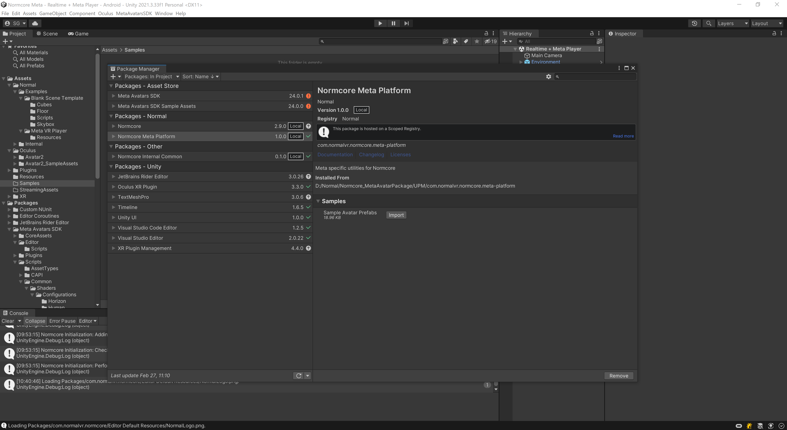
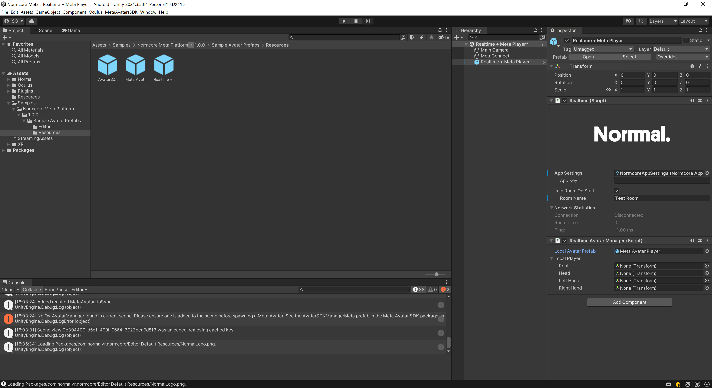

import metaAvatarSetup from './setting-up-a-networked-meta-avatar/meta-avatar-setup.mp4'

# Setting up a Networked Meta Avatar

This guide will demonstrate how to quickly load a Meta Avatar and network it to other machines using Normal.

When you're finished, you'll end up with an application that will let you see and talk to other player's avatars:

## Setting up your Meta Avatar

First ensure you have [setup Normcore](../essentials/getting-started.md) as well as your [Meta environment and VR project](../guides/setup-your-meta-platform.md).

Install the normcore core meta sample prefabs using the package manager in the unity editor menu `Windows->Package Manager`.  You may need to expand the drop down list by clicking on the arrow before the sample files are visible.

If you haven't setup your **Realtime** game object with a **RealtimeAvatarManager**, you can drag and drop the ``Realtime + Meta Player.prefab`` into your project from the sample files and add your app key to it.  If you already have your **Realtime** and **RealtimeAvatarManager** setup, simply drag the ``Meta Avatar Player.prefab`` from the sample files into your **RealtimeAvatarManager**'s ``LocalAvatarPrefab`` field.

For the avatar system to initalize properly, your scene will require a number of components in it (**OvrAvatarManager**, **AvatarLODManager**, **GPUSkinningConfiguraiton** and **OvrAvatarShaderManager**).  To install a sample version of these components either drag and drop the **AvatarSDKManagerMeta** from the sample files into your project, or use the ``MetaAvatarSDK->Normcore->Setup AvatarSDKManager`` editor menu item.  You can also find example copies of these types of **AvatarSDKManager** prefabs in the full Meta Avatar Samples provided by Meta.

And that's all there is to it!  When you run your application, once the scene loads the application will connect to the OVR system and Normal and a Meta Avatar will be spawned for each player connected to your Realtime instance.  And once the base systems have initialized, a Meta Avatar prefab will be spawned for each player displaying the player associated with that user's Meta account.

## Creating a new Meta Avatar From Scratch

This section explains how to setup a new Meta Avatar prefab.

In your scene create a Game Object called Meta Avatar, and add the **MetaAvatar** component to it.

This will automatically add a **RealtimeView** and a **RealtimeAvatar** to the compoent.  Click on the *Setup Avatar* button to fill in the rest of the information.

<video width="100%" controls><source src={metaAvatarSetup} /></video> 

The Meta Avatar setup will move the gameobject to the root postion, add a head and hands for the Realtime Avatar, along with a **RealtimeAvatarVoice** for the head.  It also adds a **MetaAvatarLipSync** that references the **RealtimeAvatarVoice**.

In addition, it will set the Local Avatar and Remote Avatar prefabs for the **MetaAvatar**.  These prefabs are provided for your convience as part of the Realtime Meta package, but if you want to change the settings of these, you can create your own copies, modify them as you see fit and assign them here.

Once the setup is complete, turn the Meta Avatar game object into a prefab by dragging it from the hierarchy into the resources folder of your project.

Remove the existing copy from the root of the scene, and assign the newly created prefab as the Local Avatar Prefab for the **RealtimeAvatarManager** you created earlier. 

Once this is complete, your project should be ready to give your application a go!

## Common Issues

#### The Meta Avatar Body isn't centered on the player
Check that your local avatar prefab is set to (0,0,0).  If it is instantiated away from the camera the user's Meta Avatar will appear to be in another location.

#### Meta Shaders Error on Export
If you enctounter an issue during build with the Meta shaders reporting that **UNITY_INSTANCING_PROCEDURAL_FUNC must be defined**, this seems to be an issue with Meta Avatars version 24 and the URP system.  It shouldn't impact the running of the build, but if it does cause issues for your project you can get around this by using the **AvatarSdkManagerHorizon** prefab instead of the **AvatarSDKManagerMeta** prefab, or you can disable URP in your project by removing it from the package manager.

