# Setting up a Networked Meta Avatar

This guide will demonstrate how to quickly load a Meta Avatar and network it to other machines using Normal.

When you're finished, you'll end up with an application that will let you see and talk to other player's avatars:

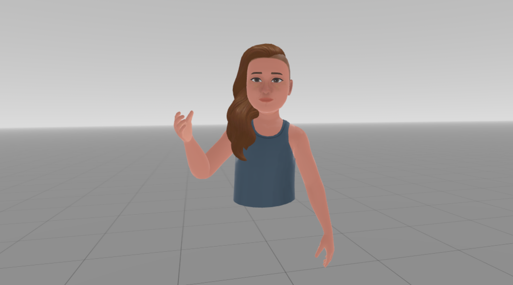

## Setup your App for Meta Avatars

Before your app can load avatar data from Meta's servers, it will need permission to do so.  First we will need to ensure that your app is [configured as required for Meta Avatar usage](https://developer.oculus.com/documentation/unity/meta-avatars-app-config/).  

If you do not have a developer Meta account, [sign up here](https://developer.oculus.com/sign-up/).

Once your account is signed up, you will need to be [verified](https://developer.oculus.com/manage/verify/) before you can create an application.  This will require you to provide Meta with a credit card and some form of two-factor authentication (either via SMS or verification app.)  

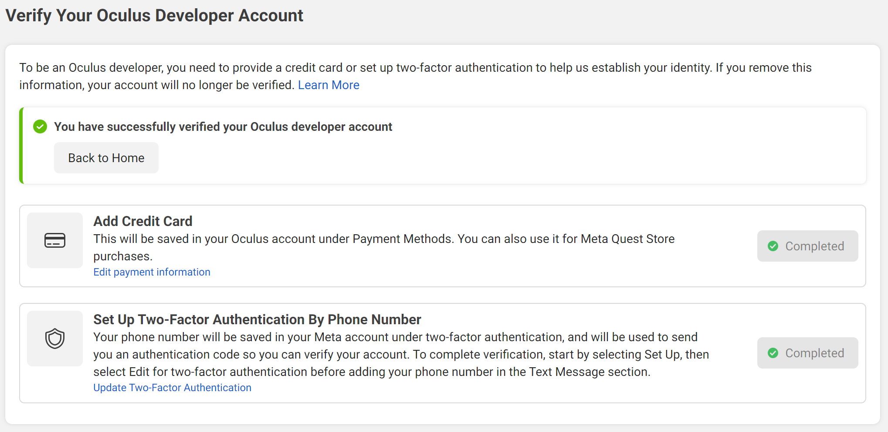 

You will also need to [create](https://developer.oculus.com/manage/organizations/create/) or join an organization that will act as the publisher for your game in the store.  If you are creating a business you may also need to provide identifaction for yourself and/or your business to verify it with Meta.

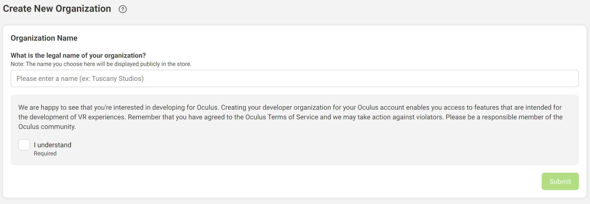 

From there you will need to [create](https://developer.oculus.com/resources/publish-create-app/) an app that will have access to the appriopriate permissions to display the Meta Avatars.  In most cases this will be a Quest app (for release on the oculus store) or Quest Lab App (for personal or small group use), but if you also want to test it in editor or on your desktop you will need a Rift app as well.

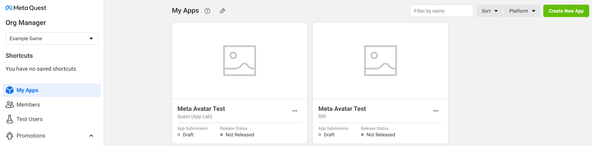 

For each app, open the app and go to the ``Requirements->Data`` Use Checkup section, and request **Use Avatar** permissions for the **User ID**, **User Profile** and **Avatar** Platform features.  You will need to provide a short justification for each of these, but if you have completed your developer verification everything should be auto-approved fairly quickly.

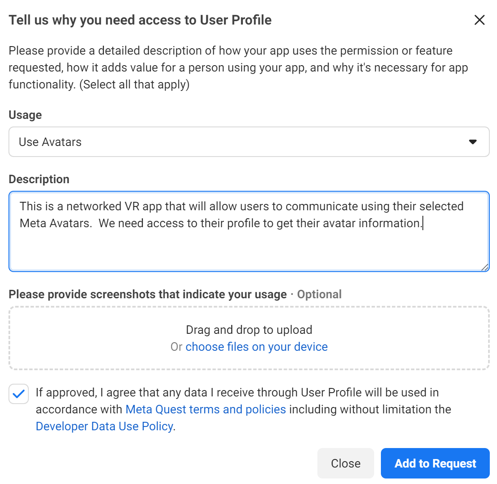 

You will need to record your App ID for later, so you can include it in your occulus settings in unity.  These can be found mid-way down the app's ``API`` page, or in the URL of the application's page after ``https://developer.oculus.com/manage/applications``.

The last thing you will need to do on the Meta Developer pages prior to releasing on quest headset is to an alpha build and add any test accounts to your app, but we will come back to that later...

Finally you will also need a Normcore App Key for your project.  This can be created by going to the [Normcore Application page](https://normcore.io/dashboard/app/applications) and creating a new application there using the ``Add new application`` button.  Once you have selected your new application name, it will show up in the application list along with its key.  Record this value for later.

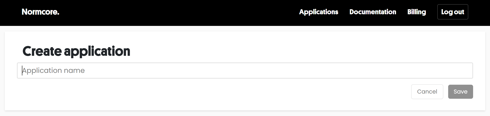 

## Setting up your VR environment

Start by creating a VR Unity project.  The template for this can be found in the Core section of the New Unity Projects in the Unity hub.

Once your project is created you will need to add the [**Normcore** package and **Normcore Meta Platform** package](https://normcore.io/dashboard/app/download) to your project.  Your app will probably restart once or twice, and you may get a pop about install sample avatar files as the **Normecore Meta Platform** package also installs the required **Meta XR All-in-One SDK** and **Meta Avatars SDK** packages.  

Once the oculus platform has been installed on your system, you will need to enter the Meta App IDs for your for your project in your Oculus Settings.  The Oculus Settings scriptable object can be accessed by selecting the ``Oculus->Platform->Edit Settings`` from the Unity editor dropdown menu.  If you have both a Rift App ID and a Quest App ID, enter them both here. 

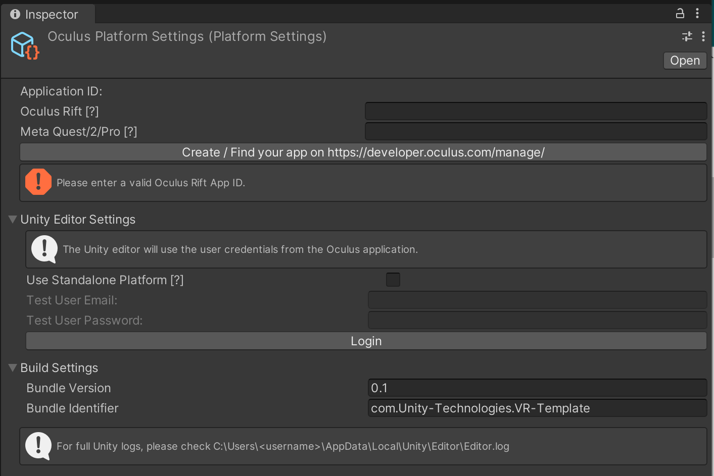 

Once this is setup, go into your Editor's project settings and check the Oculus project settings there.  If there is anything that requires a fix, click on the ``Fix`` button and the system should sort out those issues.  The same goes for any recommended items.

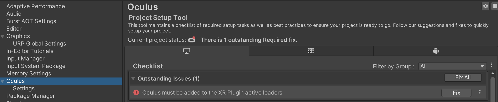 

Note: The first time you change targets from Rift to Quest, other issues may show up here, so be sure to check back here if you are having trouble exporting the apk.

## Setting up your VR scene

Now we are ready to setup our scene.  Create a blank unity VR scene.  This should include a camera game object with the **Tracked Pose Driver** component, so the camera maps to the user's head movements.  Check that your camera's Clipping Near Point is around 0.05 (it sometimes can be larger on the default cameras, and this can make your hands disappear when they get too close to you.)

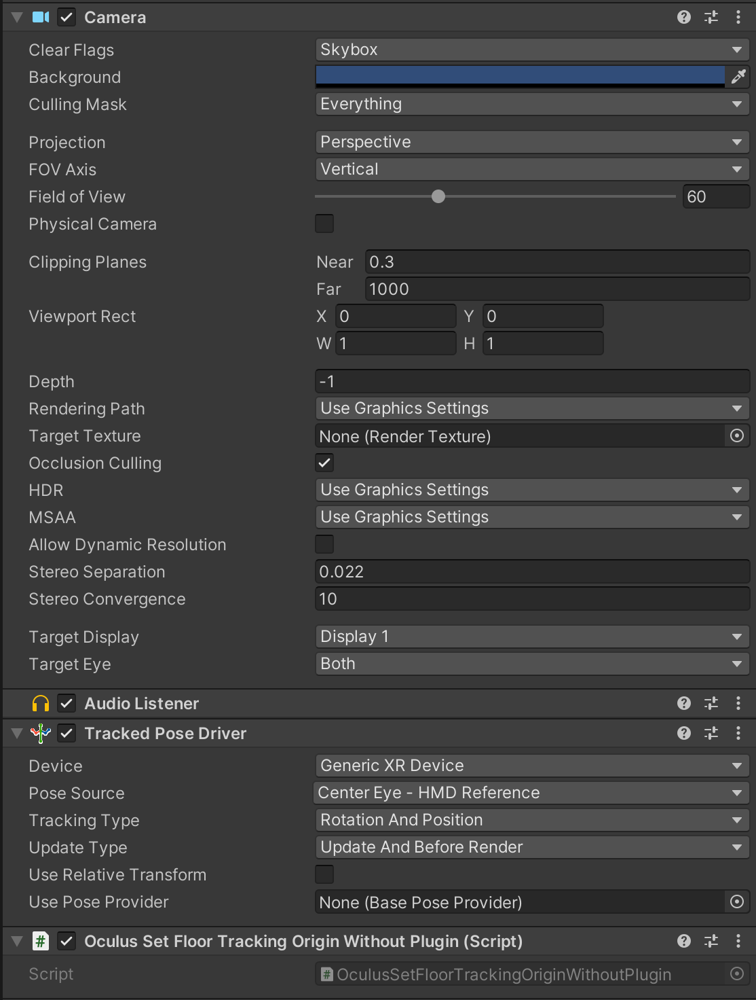 

Create a game object and add a **Realtime** component to it.  Point your **Realtime** component at a **NormcoreAppSettings** scriptable object or add a new one and make sure it includes the Normcore App Key that you created earlier.  Once this done, add a **RealtimeAvatarManager** component to the Realtime game object.

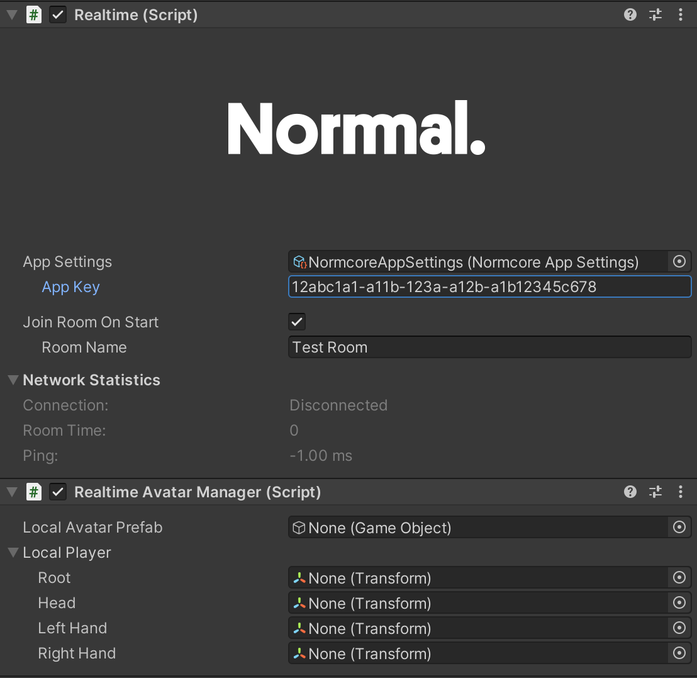

For the avatar system to initalize properly, your scene will require a number of components in it (**OvrAvatarManager**, **AvatarLODManager**, **GPUSkinningConfiguraiton** and **OvrAvatarShaderManager**).  To install a sample version of these components, use the ``MetaAvatarSDK->Normcore->Setup AvatarSDKManager`` editor menu item.  You can also find example copies of these types of prefabs in the full Meta Avatar Samples provided by Meta.

Finally, if you will be running your program on a Quest headset, you will need to initalize the ovr core system prior to the Avatars and Normcore.  This can be done by creating a component that calls the ``OvrPlatformInit.InitializeOvrPlatform()`` (a version has been included int the Normal.Realtime.Shared.OculusMeta package for convience, but it can also be found as part of the Meta Avatar SDK Sample.)

```csharp
using System.Collections;
using UnityEngine;
using Oculus.Platform;
using Normal.Meta;

public class MetaAvatarConnect : MonoBehaviour
{
    private void Awake()
    {
        StartCoroutine(SetupOvrPlatform());
    }

    private IEnumerator SetupOvrPlatform()
    {
        // Ensure OvrPlatform is Initialized
        if (!Core.IsInitialized())
        {
            OvrPlatformInit.InitializeOvrPlatform();
        }

        while (OvrPlatformInit.status != OvrPlatformInitStatus.Succeeded)
        {
            if (OvrPlatformInit.status == OvrPlatformInitStatus.Failed)
            {
                Debug.LogError("Error initializing OvrPlatform");
                yield break;
            }
            yield return null;
        }

    }
}
```

Once you have added that to a game object in your scene, you are ready to create your Meta Avatar!

## Creating your Meta Avatar

Now you will create the prefab that will spawn your Meta Avatar.

In your scene create a Game Object called Meta Avatar, and add the **MetaAvatar** component to it.

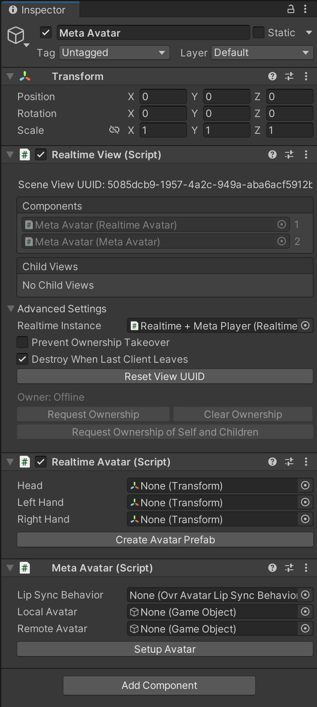

This will automatically add a **RealtimeView** and a **RealtimeAvatar** to the compoent.  Click on the *Setup Avatar* button to fill in the rest of the information.

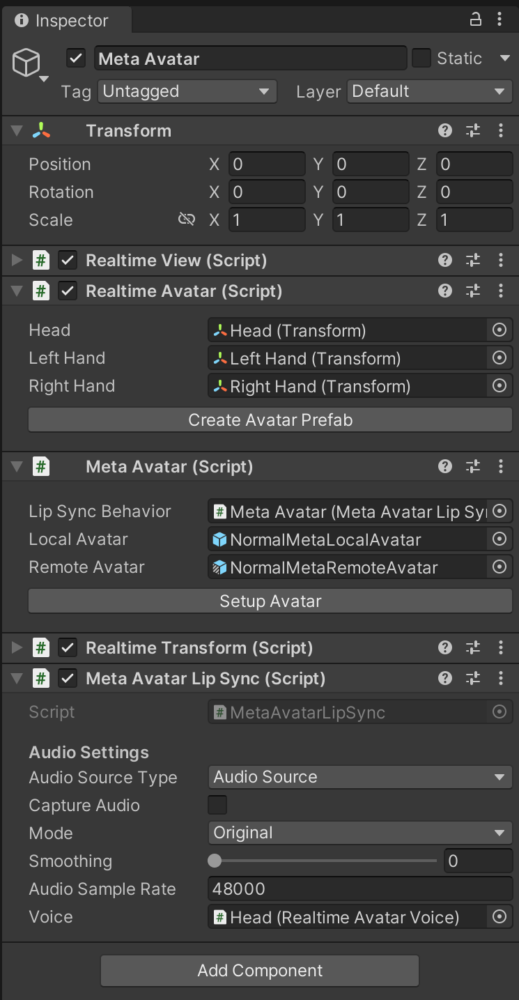

The Meta Avatar setup will add a head and hands for the Realtime Avatar, along with a **RealtimeAvatarVoice** for the head.  It also adds a **MetaAvatarLipSync** that references the **RealtimeAvatarVoice**.

In addition, it will set the Local Avatar and Remote Avatar prefabs for the **MetaAvatar**.  These prefabs are provided for your convience as part of the Realtime Meta package, but if you want to change the settings of these, you can create your own copies, modify them as you see fit and assign them here.

Once the setup is complete, turn the Meta Avatar game object into a prefab by dragging it from the hierarchy into the resources folder of your project.  Note: Make sure the position of your avatar prefab is set to (0,0,0), otherwise the avatar may spawn away from the camera.

Remove the existing copy from the root of the scene, and assign the newly created prefab as the Local Avatar Prefab for the **RealtimeAvatarManager** you created earlier. 

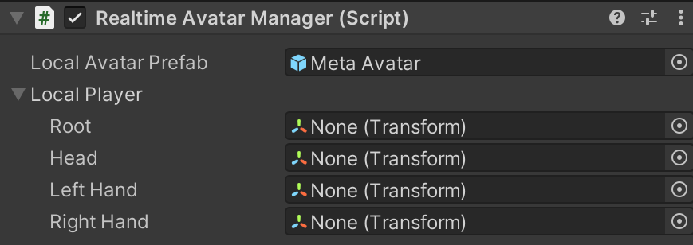

Once this is complete, your project should be ready to give your application a go!

Once the scene loads, the application will connect to the OVR system and Normal and a Meta Avatar will be spawned for each player connected to your Realtime instance.  Once the base systems have initialized, a Meta Avatar prefab will be spawned for each player displaying the player associated with that user's Meta account.

## Exporting your Meta Avatar Application

Before you export your build, ensure that your player settings are in order.  The default Package Name in Player Settings->Publishing may not run on the Quest headset, so change it to something appropriate for your application/company.

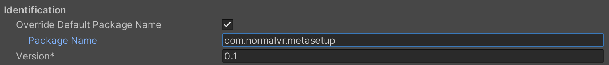

If you enctounter an issue during build with the Meta shaders reporting that **UNITY_INSTANCING_PROCEDURAL_FUNC must be defined**, this seems to be an issue with Meta Avatars version 24 and the URP system.  It shouldn't impact the running of the build, but if it does cause issues for your project you can get around this by using the **AvatarSdkManagerHorizon** prefab instead of the **AvatarSDKManagerMeta** prefab, or you can disable URP in your project by removing it from the package manager.

Prior to your Meta Avatar Application running on a Quest headset, you will need to add upload a build of the application to the Alpha Release channel for that application and add the accounts of any testers who want to try it out.  If you don't do this, your application may fail when trying to access Meta Avatar API.

Once you have built your APK you can upload it to the Alpha Release channel using the [Oculus Platform Utility](https://developer.oculus.com/distribute/publish-reference-platform-command-line-utility/) or the [Meta Quest Developer Hub](https://developer.oculus.com/downloads/package/oculus-developer-hub-win/).

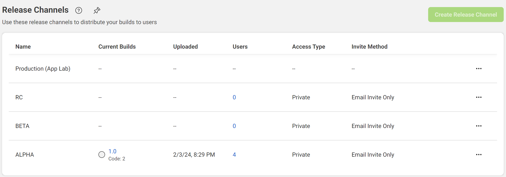

The Oculus Platform Utility is a commandline tool that runs on both Windows and Mac.  An example of the syntax used for uploading can be found by going to your App's page, ``Distribution->Release Channels``, selecting the Alpha Release Channel, and clicking on the ``Upload Build`` button.  The result should look something like this:

```
./ovr-platform-util upload-quest-build --app-id <app-id> --app-secret <app-secret> --apk <path-to-apk> --channel ALPHA // Optional fields: --assets-dir <path-to-DLCs-dir> --obb <path-to-OBB>
```

The **Meta Quest Developer Hub** allows a visual interface to do this, and once you have installed it and signed in, you can upload a build by selecting ``App Distribution``, selecting your App and clicking the ``Upload`` button along side the Alpha Release channel.

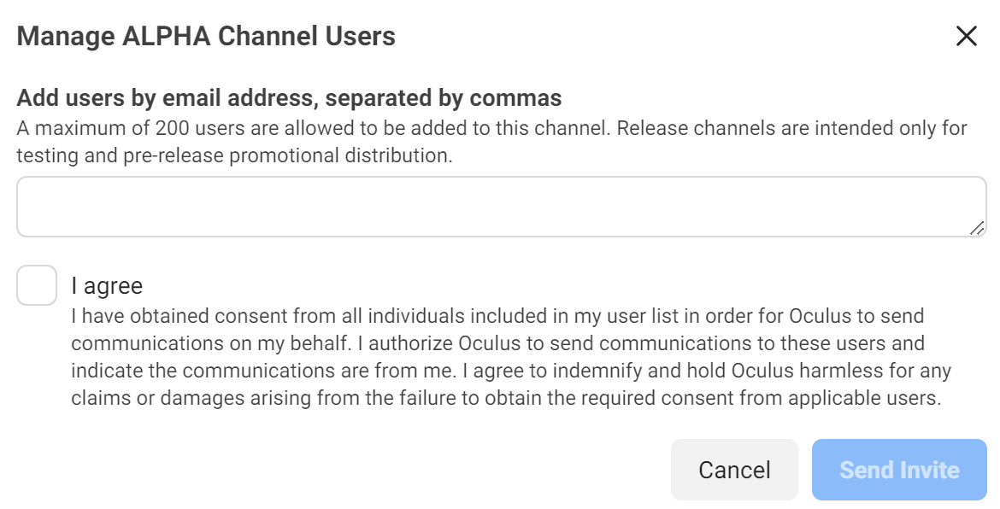

Once the application has been uploaded, you can add testers to the release channel by going to ``Distribution->Release Channels`` on the app's developer page and clicking on the user count for that channel.  That will take you to a page that will let you email testers to invite them to test your appication.  Note that the testers will have to have a valid Oculus/Meta account.

After all that has been setup, you should be free to send a copy of the APK to anyone on that test list and start chatting with them through their avatar in VR!