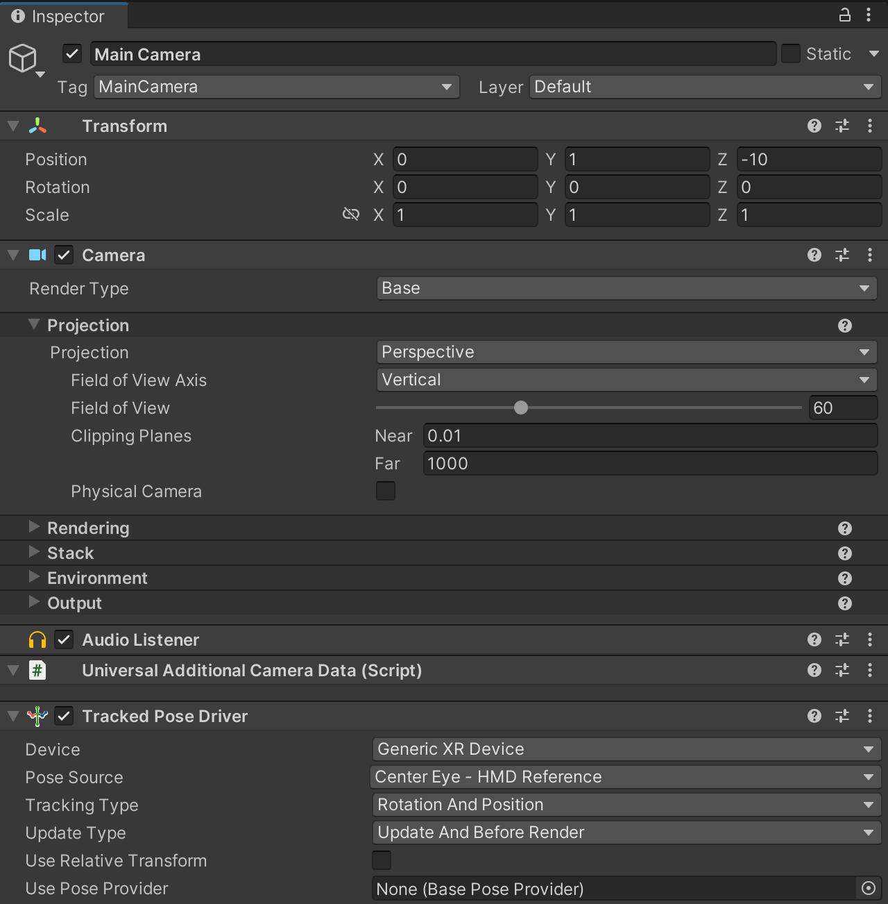

# Setting up a Networked Meta Avatar

This guide will demonstrate how to quickly load a Meta Avatar and network it to other machines using Normal.

When you're finished, you'll end up with an application that will let you see and talk to other player's avatars:

 

## Setup your App for Meta Avatars

Before your app can load avatar data from Meta's servers, it will need permission to do so.  Ensure that your app is [configured as required for Meta Avatar usage](https://developer.oculus.com/documentation/unity/meta-avatars-app-config/), and that you have set your Oculus Platform Settings to point at the right app IDs

## Setting up your VR environment

Start by creating a blank unity VR scene, with the camera properly tracked to the player's head.

 

Create a game object and add a **Realtime** component to it.  Point your **Realtime** component at a **NormcoreAppSettings** scriptable object that has your app id in it.  Then, add a **RealtimeAvatarManager** component.


For the avatar system to initalize properly, your scene will require a number of components in it (**OvrAvatarManager**, **AvatarLODManager**, **GPUSkinningConfiguraiton** and **OvrAvatarShaderManager**).  The easiest way get these is to install the Meta Avatar SDK Sample Scenes, and use one of the prefabs they provide as part of that.

First install the sample scenes through the package manager.  If you don't see the Meta Avatar SDK, you may need to [add the Meta Avatar SDK to your package list manually.](https://developer.oculus.com/downloads/package/meta-avatars-sdk/)


Then add the **AvatarSDKManagerMeta** prefab to your scene.  It can be found in ``Samples->Meta Avatar SDK->Version Number->Sample Scenes->Common->Prefabs->AvatarSDKManager->Recommended``.


Finally, if you will be running your program on a Quest headset, you will need to initalize the ovr core system prior to the Avatars and Normcore.  This can be done by creating a component that calls the ``OvrPlatformInit.InitializeOvrPlatform()`` (a version has been included int the Normal.Realtime.Shared.OculusMeta package for convience, but it can also be found as part of the Meta Avatar SDK Sample.)

```csharp
using System.Collections;
using UnityEngine;
using Oculus.Platform;
using Normal.Realtime.Shared.OculusMeta;

public class MetaAvatarConnect : MonoBehaviour
{
    private void Awake()
    {
        StartCoroutine(SetupOvrPlatform());
    }

    private IEnumerator SetupOvrPlatform()
    {
        // Ensure OvrPlatform is Initialized
        if (!Core.IsInitialized())
        {
            OvrPlatformInit.InitializeOvrPlatform();
        }

        while (OvrPlatformInit.status != OvrPlatformInitStatus.Succeeded)
        {
            if (OvrPlatformInit.status == OvrPlatformInitStatus.Failed)
            {
                Debug.LogError("Error initializing OvrPlatform");
                yield break;
            }
            yield return null;
        }

    }
}
```

Once you have added that to a game object in your scene, you are ready to create your Meta Avatar!

## Creating your Meta Avatar

Now you will create the prefab that will spawn your Meta Avatar.

In your scene create a Game Object called Meta Avatar, and add the **MetaAvatar** component to it.


This will automatically add a **RealtimeView** and a **RealtimeAvatar** to the compoent.  Click on the *Setup Avatar* button to fill in the rest of the information.


The Meta Avatar setup will add a head and hands for the Realtime Avatar, along with a **RealtimeAvatarVoice** for the head.  It also adds a **MetaAvatarLipSync** that references the **RealtimeAvatarVoice**.

In addition, it will set the Local Avatar and Remote Avatar prefabs for the **MetaAvatar**.  These prefabs are provided for your convience as part of the Realtime Meta package, but if you want to change the settings of these, you can create your own copies, modify them as you see fit and assign them here.

Once the setup is complete, turn the Meta Avatar game object into a prefab by dragging it into your project folder.  Then assign it as the Local Avatar Prefab for the **RealtimeAvatarManager** you created earlier.


Once this is complete, your project should be ready to give your application a go!

Once the scene loads, the application will connect to the OVR system and Normal and a Meta Avatar will be spawned for each player connected to your Realtime instance.  Once the base systems have initialized, a Meta Avatar prefab will be spawned for each player displaying the player associated with that user's Meta account.

Once that works you are free to export the project and send it to a friend!