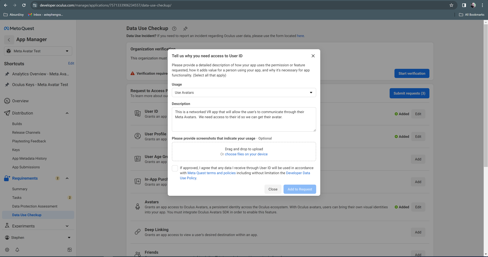
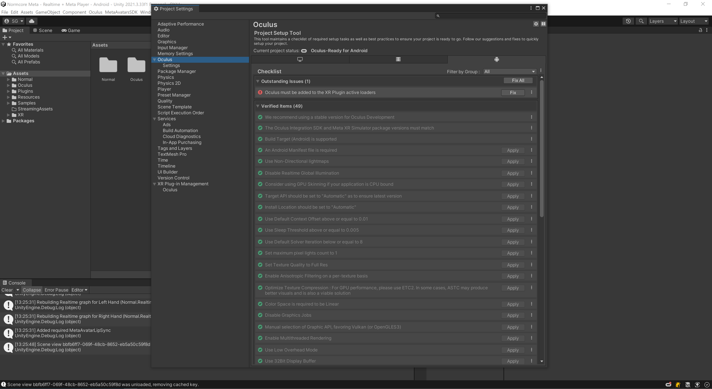
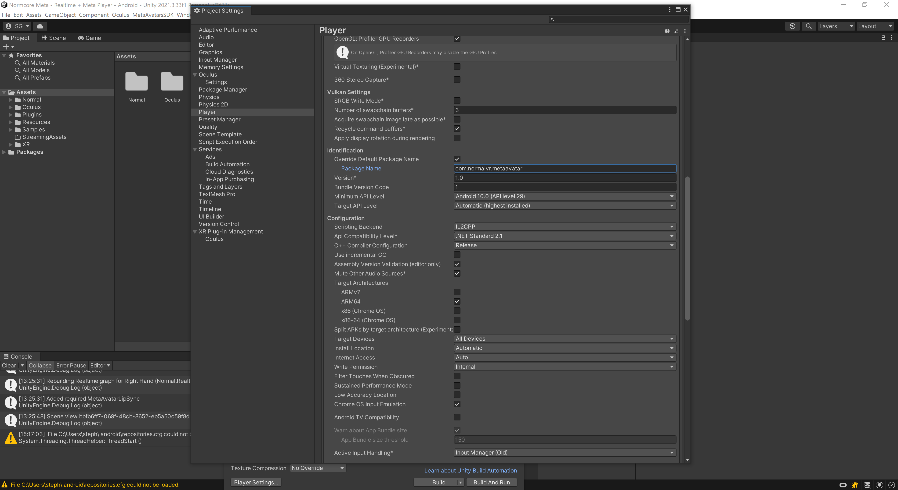

# Setup Your Meta Platform

This guide will provide an overview on how to setup your Meta environment using the [Meta Developer website](https://developer.oculus.com/), so your Meta applications can aquire all the permissions and entitlements they need to run.

## Setup your App

If you do not have a developer Meta account, [sign up here](https://developer.oculus.com/sign-up/).

Once your account is signed up, you will need to be [verified](https://developer.oculus.com/manage/verify/) before you can create an application.  This will require you to provide Meta with a credit card and some form of two-factor authentication (either via SMS or verification app.)  

 

You will also need to [create](https://developer.oculus.com/manage/organizations/create/) or join an organization that will act as the publisher for your game in the store.  If you are creating a business you may also need to provide identifaction for yourself and/or your business to verify it with Meta.

 

From there you will need to [create](https://developer.oculus.com/resources/publish-create-app/) an app that will have access to the appriopriate permissions to display the Meta Avatars.  In most cases this will be a Quest app (for release on the oculus store) or Quest Lab App (for personal or small group use), but if you also want to test it in editor or on your desktop you will need a Rift app as well.

 

You will need to request permissions for whatever services you plan on using.  For example, if you are going to be creating/displaying Meta Avatars you will need to open each app and go to the ``Requirements->Data`` Use Checkup section, and request **Use Avatar** permissions for the **User ID**, **User Profile** and **Avatar** Platform features.  You will need to provide a short justification for each of these, but if you have completed your developer verification everything should be auto-approved fairly quickly.

 

You will also need to record your App ID for later, so you can include it in your occulus settings in unity.  These can be found mid-way down the app's ``API`` page, or in the URL of the application's page after ``https://developer.oculus.com/manage/applications``.

The last thing you will need to do on the Meta Developer pages prior to releasing on quest headset is to an alpha build and add any test accounts to your app, but we will come back to that later...

## Setting up your VR project

Setup a basic VR project.  This can be acomplished by loading up a Basic VR Project from there the Normcore examples and opening the Basic Scene that will have lighting and a camera setup with the **Tracked Pose Driver** component, so the camera maps to the user's head movements.

You can also creating a VR Unity project from the template found in the Core section of the New Unity Projects in the Unity hub.

Once the oculus platform has been installed on your system, you will need to enter the Meta App IDs for your for your project in your Oculus Settings.  The Oculus Settings scriptable object can be accessed by selecting the ``Oculus->Platform->Edit Settings`` from the Unity editor dropdown menu.  If you have both a Rift App ID and a Quest App ID, enter them both here. 

 

Once this is setup, go into your Editor's project settings and check the Oculus project settings there.  If there is anything that requires a fix, click on the ``Fix`` button and the system should sort out those issues.  The same goes for any recommended items.

 

Note: The first time you change targets from Rift to Quest, other issues may show up here, so be sure to check back here if you are having trouble exporting the apk.

## Initializing the OVR environment

For the Oculus VR system to initalize properly, you will need to  initalize the ovr core system prior to Normcore or using any other Meta features.  This can be done by creating a game object in the scene with the MetaConnect component that comes as part of the Normcore Meta UPM.  This calls the ``OvrPlatformInit.InitializeOvrPlatform()``, a version has been included int the Normal.Realtime.Shared.OculusMeta package for convience, but it can also be found as part of the Meta Avatar SDK Sample.

Once you have added that to a game object in your scene, you are ready to create your Meta Applicaiton!

## Exporting your Meta Avatar Application

Once your application is ready for export, you need to ensure that your player settings are in order.  If you started the project using the Unity VR template the default Package Name in Player Settings->Publishing may not run on the Quest headset, so change it to something appropriate for your application/company.




Prior to your Meta Avatar Application running on a Quest headset, you will need to add upload a build of the application to the Alpha Release channel for that application and add the accounts of any testers who want to try it out.  If you don't do this, your application may fail when trying to access Meta Avatar API.

Once you have built your APK you can upload it to the Alpha Release channel using the [Oculus Platform Utility](https://developer.oculus.com/distribute/publish-reference-platform-command-line-utility/) or the [Meta Quest Developer Hub](https://developer.oculus.com/downloads/package/oculus-developer-hub-win/).


The Oculus Platform Utility is a commandline tool that runs on both Windows and Mac.  An example of the syntax used for uploading can be found by going to your App's page, ``Distribution->Release Channels``, selecting the Alpha Release Channel, and clicking on the ``Upload Build`` button.  The result should look something like this:

```
./ovr-platform-util upload-quest-build --app-id <app-id> --app-secret <app-secret> --apk <path-to-apk> --channel ALPHA // Optional fields: --assets-dir <path-to-DLCs-dir> --obb <path-to-OBB>
```

The **Meta Quest Developer Hub** allows a visual interface to do this, and once you have installed it and signed in, you can upload a build by selecting ``App Distribution``, selecting your App and clicking the ``Upload`` button along side the Alpha Release channel.


Once the application has been uploaded, you can add testers to the release channel by going to ``Distribution->Release Channels`` on the app's developer page and clicking on the user count for that channel.  That will take you to a page that will let you email testers to invite them to test your appication.  Note that the testers will have to have a valid Oculus/Meta account.

After all that has been setup, you should be free to send a copy of the APK to anyone on that test list!
