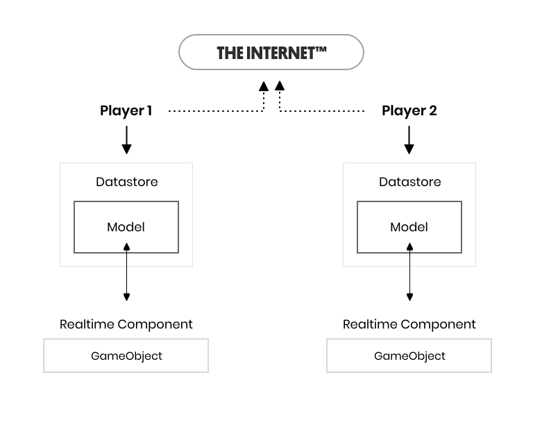
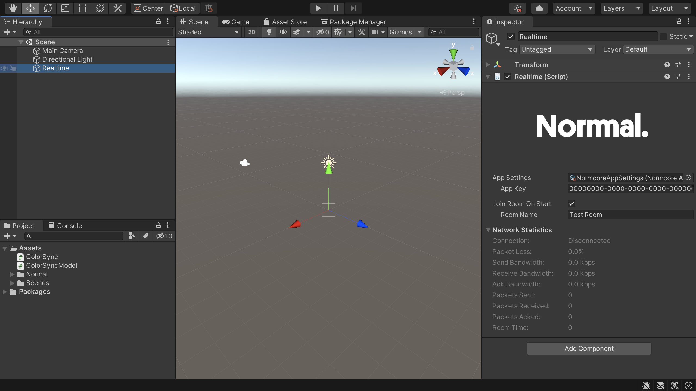

# Synchronizing Custom Data
In this guide, I’m going to walk you through how to synchronize custom data in your Unity application using custom [realtime components](../realtime/realtimecomponent.md).

## RealtimeComponents
import createCubeWithColorSync from './synchronizing-custom-data/create-cube-with-colorsync.mp4'
import changeCubeColor         from './synchronizing-custom-data/change-cube-color.mp4'



[Realtime components](../realtime/realtimecomponent.md) synchronize state between the Unity scene and a model in the Normcore datastore.

TODO: Add a banner about checking out EasySync first!!

## Creating a realtime component

For this example, we're going to make a realtime component that synchronizes the color of an object. We'll need to create two scripts, one for the component and one for the model. We’ll call these `ColorSync.cs` and `ColorSyncModel.cs` respectively.

### Creating a realtime model

First, we’re going to start by writing the model:

```csharp
using UnityEngine;

public partial class ColorSyncModel {
    private Color _color;
}
```

Our model class is an empty class with a private field for each variable we want to synchronize. There are a few important attributes that you need to keep in mind when creating a model:
1. Model classes need to be marked as `partial`.
2. Model classes cannot have a superclass.
3. Model variables need to be marked as `private`.
4. Model variables need to start with `_` (e.g. `private Color _color`).

Normcore will automatically generate public properties for your model variables that include caching, change detection, and delta compression.

Finally, we need to add two attributes to our model to signal to Normcore that this is a model class and that it should be available for model compilation:

```csharp {3,5}
using UnityEngine;

[RealtimeModel]
public partial class ColorSyncModel {
    [RealtimeProperty(1, true, true)]
    private Color _color;
}
```

The `[RealtimeModel]` attribute is used to signal to Normcore that this is a model class and that it should be available for model compilation. The `[RealtimeProperty]` attribute has three fields that determine how the field should be synchronized: **PropertyID**, **Reliable**, and **Change Event**.

#### PropertyID
The first argument is the property ID. This is a unique ID that is used by Normcore to identify this property when sending data to and from the server. The property ID needs to be unique, but only to this model. It does not have to be unique to the whole project.

:::tip
If you need to change the data type of a realtime property, create a new property with a new property ID and deprecate the original. If you would like to delete a property, make sure to retire its property ID. This will prevent data corruption and ensure compatibility between old and new versions of your application.
:::

#### Reliable / Unreliable

This marks whether the property should be synced reliably or unreliably. If you plan to change a property very often (such as animating a color or moving a transform), you should use an unreliable property. Unreliable updates are not resent if they’re dropped in transit because it’s expected that another update is following shortly after.

Reliable properties are good for things that you update once and that should be resent if the packet is dropped in transit. This is great for state such as whether your game has started or not. When you change it, Normcore will ensure that this value is synchronized between all clients and that it is in sync before any newer reliable updates are applied to the datastore.

#### Change Event

The last option is an optional argument that specifies if you would like a change event added to the model. When this is set to true, a C# event is added; it will fire when a property is changed locally or remotely. This is a useful signal to update your scene to match the model.

### Creating a RealtimeComponent subclass

Now that we have a model, let's create a realtime component to synchronize the color of an object.

Open up the `ColorSync.cs` script we created earlier. First, we’re going to change the superclass from `MonoBehaviour` to `RealtimeComponent<ColorSyncModel>`. Be sure to add `using Normal.Realtime;` to the top of your file.

RealtimeComponent will automatically create a property called `model` that will be populated with an instance of our `ColorSyncModel`. We’re also going to add some code to `Awake()` to grab a reference to the Mesh Renderer:

```csharp
using System.Collections;
using System.Collections.Generic;
using UnityEngine;
using Normal.Realtime;

public class ColorSync : RealtimeComponent<ColorSyncModel> {
    private MeshRenderer _meshRenderer;

    private void Awake() {
        // Get a reference to the mesh renderer
        _meshRenderer = GetComponent<MeshRenderer>();
    }
}
```

First up, we’ll write a method that synchronizes the color stored on the model to the mesh renderer:

```csharp {14-17}
using System.Collections;
using System.Collections.Generic;
using UnityEngine;
using Normal.Realtime;

public class ColorSync : RealtimeComponent<ColorSyncModel> {
    private MeshRenderer _meshRenderer;

    private void Awake() {
        // Get a reference to the mesh renderer
        _meshRenderer = GetComponent<MeshRenderer>();
    }

    private void UpdateMeshRendererColor() {
        // Get the color from the model and set it on the mesh renderer.
        _meshRenderer.material.color = model.color;
    }
}
```

When the method is called, it grabs the color on the model and updates the color on the mesh renderer. We could just call this from `Update()` and make sure our renderer matches the model every frame, but among other issues, it’s susceptible to the project's Script Execution Order, which can cause updates to be delayed by a frame.

Instead, we can register for an event from the model that will fire whenever it’s changed locally or by a remote client. We’ll use that to call our `UpdateMeshRendererColor` color method:

```csharp {14-31,33-36}
using System.Collections;
using System.Collections.Generic;
using UnityEngine;
using Normal.Realtime;

public class ColorSync : RealtimeComponent<ColorSyncModel> {
    private MeshRenderer _meshRenderer;

    private void Awake() {
        // Get a reference to the mesh renderer
        _meshRenderer = GetComponent<MeshRenderer>();
    }

    protected override void OnRealtimeModelReplaced(ColorSyncModel previousModel, ColorSyncModel currentModel) {
        if (previousModel != null) {
            // Unregister from events
            previousModel.colorDidChange -= ColorDidChange;
        }
        
        if (currentModel != null) {
            // If this is a model that has no data set on it, populate it with the current mesh renderer color.
            if (currentModel.isFreshModel)
                currentModel.color = _meshRenderer.material.color;
        
            // Update the mesh render to match the new model
            UpdateMeshRendererColor();

            // Register for events so we'll know if the color changes later
            currentModel.colorDidChange += ColorDidChange;
        }
    }

    private void ColorDidChange(ColorSyncModel model, Color value) {
        // Update the mesh renderer
        UpdateMeshRendererColor();
    }

    private void UpdateMeshRendererColor() {
        // Get the color from the model and set it on the mesh renderer.
        _meshRenderer.material.color = model.color;
    }
}
```

When a `RealtimeComponent` is first created, it starts with no model. Normcore populates it once we have successfully connected to the server (or instantly, if we're already connected) and calls `OnRealtimeModelReplaced()` to provide us with a copy of it.

If this `RealtimeComponent` was previously mapped to a different model (e.g., when using prefab pooling), it will provide a reference to the previous model in order to allow your component to unregister from change events.

In this example, when a model is passed to us, we start by checking if it's a fresh model. This tells us whether this is a model for an object that already exists or one that was created fresh. If it's fresh, we populate it with the color of the `MeshRenderer`.

We call `UpdateMeshRendererColor()` to synchronize the color stored on the model to the `MeshRenderer`. If another client created this model, it will be populated with the values they set on their model.

Finally, we register for the `colorDidChange` event that calls the `ColorDidChange` method whenever the model's `color` property changes. That way, if the color changes later, we’ll be notified so we can update our mesh renderer.

We have one final method to implement. Our `ColorSync` component will now properly keep the color of the game object in sync with the model, but we haven’t exposed a method to update the model itself. Let’s add a simple method that does that to our class:

```csharp {43-47}
using System.Collections;
using System.Collections.Generic;
using UnityEngine;
using Normal.Realtime;

public class ColorSync : RealtimeComponent<ColorSyncModel> {
    private MeshRenderer _meshRenderer;

    private void Awake() {
        // Get a reference to the mesh renderer
        _meshRenderer = GetComponent<MeshRenderer>();
    }

    protected override void OnRealtimeModelReplaced(ColorSyncModel previousModel, ColorSyncModel currentModel) {
        if (previousModel != null) {
            // Unregister from events
            previousModel.colorDidChange -= ColorDidChange;
        }
        
        if (currentModel != null) {
            // If this is a model that has no data set on it, populate it with the current mesh renderer color.
            if (currentModel.isFreshModel)
                currentModel.color = _meshRenderer.material.color;

            // Update the mesh render to match the new model
            UpdateMeshRendererColor();

            // Register for events so we'll know if the color changes later
            currentModel.colorDidChange += ColorDidChange;
        }
    }

    private void ColorDidChange(ColorSyncModel model, Color value) {
        // Update the mesh renderer
        UpdateMeshRendererColor();
    }

    private void UpdateMeshRendererColor() {
        // Get the color from the model and set it on the mesh renderer.
        _meshRenderer.material.color = model.color;
    }

    public void SetColor(Color color) {
        // Set the color on the model
        // This will fire the colorChanged event on the model, which will update the renderer for both the local player and all remote players.
        model.color = color;
    }
}
```

We now have everything we need to synchronize the color of an object. Let's test it out.

### Testing it out

Open up a blank scene in Unity and add a game object with a Realtime component to it. Make sure to enter your App Key.



Let’s make a Cube game object that we’ll use to test our new component. We can add a `ColorSync` component to it. Normcore will detect it, automatically add a RealtimeView component and then add the `ColorSync` component to the list of observed components.

<video width="100%" controls><source src={createCubeWithColorSync} /></video>

Last, we’ll make a quick test component that changes the Cube’s color. This component will display a color picker in the inspector, and whenever the color changes, it will update the color using the ColorSync component:

```csharp
using System.Collections;
using System.Collections.Generic;
using UnityEngine;

public class ColorSyncTest : MonoBehaviour {
    [SerializeField]
    private Color _color         = default;
    private Color _previousColor = default;

    private ColorSync _colorSync;

    private void Awake() {
        // Get a reference to the color sync component
        _colorSync = GetComponent<ColorSync>();
    }

    private void Update() {
        // If the color has changed (via the inspector), call SetColor on the color sync component.
        if (_color != _previousColor) {
            _colorSync.SetColor(_color);
            _previousColor = _color;
        }
    }
}
```

Let’s take this new component for a test drive. Hit play and you should see your cube on screen. Try changing the color property on the `ColorSyncTest` component. We can see here the cube color updates! Now let’s test our networking.

<video width="100%" controls><source src={changeCubeColor} /></video>

Export a standalone build and make sure your scene’s camera is pointed at the Cube game object.

Now we can open that standalone build, hit play in the editor, and change the cube color. Go ahead and try it. We’ll see the standalone build’s cube color update in real-time.

Download a finished copy of the project [here](https://github.com/NormalVR/Normcore-Samples/releases/latest/download/Normcore-Synchronizing-Custom-Data.zip).

Check out our other guides on synchronizing custom data:

- [Creating a multiplayer drawing app](../guides/creating-a-multiplayer-drawing-app.md)
- [Smoothly animating model properties using the `[Interpolate]` attribute](../room/realtimemodel.md#interpolate)
- [Server Authority, Ownership, and Lifetime Flags](../room/ownership-and-lifetime-flags.md)

## FAQ
#### Changes to my model properties stutter when I would like them to animate smoothly.
Normcore synchronizes model properties at 20 Hz by default. For properties that are updated frequently and need to animate smoothly, check out the [[Interpolate]](../room/realtimemodel.md#interpolate) attribute.

#### My custom RealtimeComponent isn't syncing and `OnRealtimeModelReplaced` doesn't get called.
You have most likely added your custom component to a game object before it was converted to a **RealtimeComponent** subclass. To verify this, look at the **RealtimeView**'s list of components and make sure you see your custom component in the list. If you don't see it, or a **RealtimeView** has not been created for you automatically, try removing the component and re-adding it to your game object. This will tell Unity to automatically create a **RealtimeView** and add your **RealtimeComponent** subclass to its component list.
