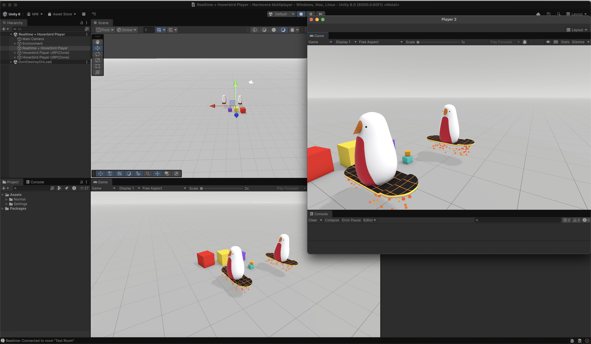
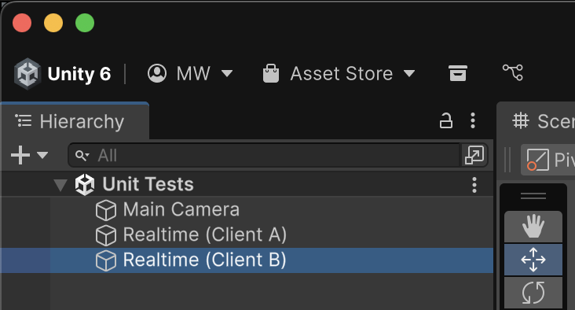

import parrelSync from './testing-multiplayer-locally/parrel-sync.mp4'

# Testing Multiplayer Locally

Testing with multiple people on separate devices is the best way to validate multiplayer functionality, but it's not always practical during development. This guide outlines different testing strategies that our team uses when building multiplayer titles.

## ParrelSync

<video width="100%" autoPlay playsInline loop muted><source src={parrelSync} /></video>

ParrelSync allows you to run two instances of the same Unity project simultaneously. When you press Play in one editor, both instances will synchronize and enter Play mode together.

This is our recommended approach for local multiplayer testing because it provides full access to the project and debugging tools for each player.

To get started, follow the installation instructions here: https://github.com/VeriorPies/ParrelSync. ParrelSync works with Normcore out of the box without any additional configuration.

## Multiplayer Play Mode

Multiplayer Play Mode is Unity's official package for testing multiplayer games within the editor. It allows you to run multiple instances of your game as separate "players" directly in the Unity Editor without creating builds.

To get started, install the Multiplayer Play Mode package from the Unity Package Manager. For detailed setup instructions and configuration options, refer to the [Unity documentation](https://docs-multiplayer.unity3d.com/mppm/current/about/).

## Multiple Realtime Instances

For unit testing or automated testing scenarios, you can add multiple Realtime instances to the same scene. This approach allows you to simulate multiple players in a single scene, making it easier to write scripts that control and verify their behavior programmatically.
