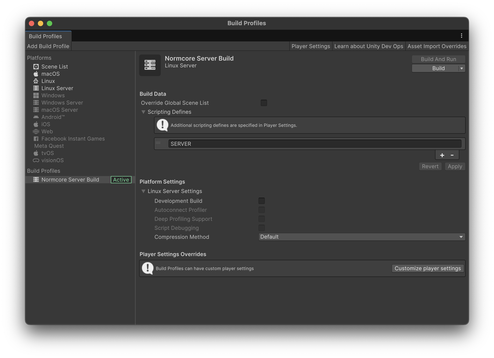
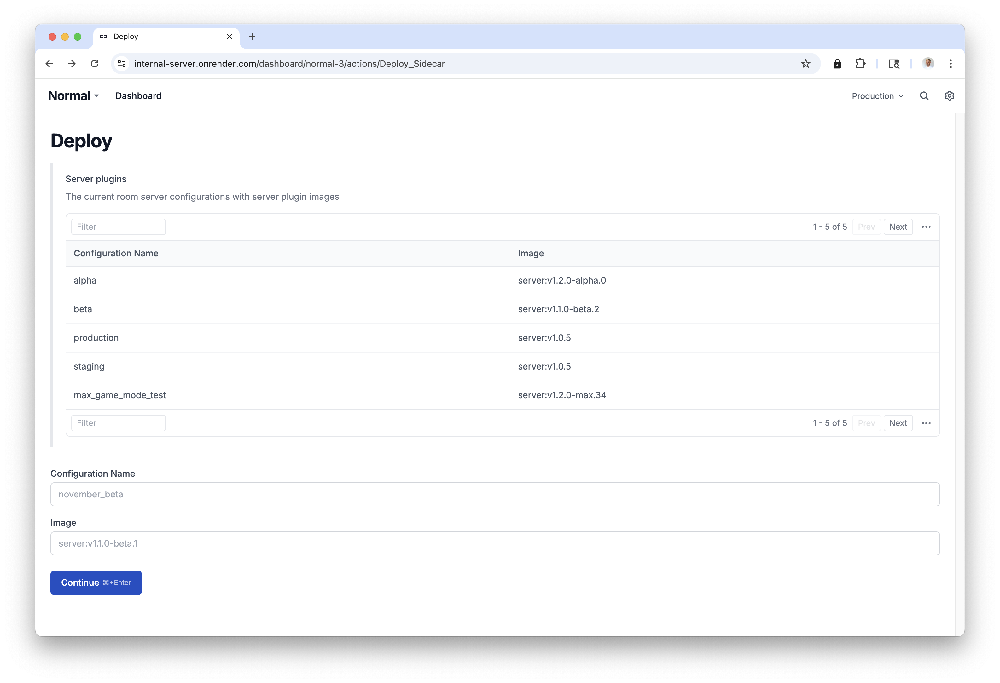

# Server Plugins
For most titles, Normcore's [Ownership + Lifetime Flags](../room/ownership-and-lifetime-flags.md) API is sufficient for enforcing server authority. However, there are cases where you may want to run your own C# logic on the server. Common use cases include physics simulations, in-app purchases, moderation, and more.

## How it works
Normcore's server plugins are implemented using Unity. This means they have full access to all of Unity's APIs, including the ability to simulate Rigidbodies and even an entire game scene.

When a room server starts up, it will boot an instance of Unity to run your plugin alongside it. This instance runs on the same hardware as the room server itself with zero network latency.

## Creating a Server Plugin

There are two approaches we recommend for creating a server plugin:

1. Create a new Unity project, import Normcore, and add only the scripts needed for your server-side logic.
2. Start with your existing Unity project and disable any functionality that doesn't need to run on the server.

### Configuring Normcore
Regardless of which approach you choose, the way you configure Normcore is the same:

```csharp
using System;
using Normal.Realtime;

public class ServerConnection : MonoBehaviour {
    private Realtime _realtime;

    private void Start() {
        _realtime = GetComponent<Realtime>();

        // If the connection fails, try to reconnect.
        _realtime.didDisconnectFromRoom += DidDisconnectFromRoom;

        // Connect to the room server.
        Connect();
    }

    private void Connect() {
        // Get the environment variables that were set by Normcore. ROOM_NAME is not required for the connection, but is made available for your own use.
        string matcherURL = Environment.GetEnvironmentVariable("MATCHER_URL");
        string appKey     = Environment.GetEnvironmentVariable("APP_KEY");
        string roomName   = Environment.GetEnvironmentVariable("ROOM_NAME");
        string sidecarKey = Environment.GetEnvironmentVariable("SIDECAR_KEY");

        // Important: Server plugins use the sidecar key as the room name!
        _realtime.Connect(sidecarKey, new Room.ConnectOptions {
            matcherURL = matcherURL,
            appKey     = appKey,
        });
    }

    private void DidDisconnectFromRoom(Realtime realtime) {
        // Try to reconnect immediately.
        Connect();
    }
}
```

As server plugins run in Unity on the server, they connect to a special matcher URL and room name. This ensures all packets run through the loopback interface and are not routed over the public internet. It also provides the backend the necessary information to provide the server plugin with elevated permissions.

:::warning
It's possible that the first time the server plugin attempts to connect, it is rejected. This can happen if the room server is not ready to accept connections yet. In this case, the server plugin should automatically reconnect until it successfully connects to the server.
:::

## Deploying a server plugin
Once you're ready to deploy your plugin, you'll want to export a Linux Server build from Unity and then package it into a Docker image.

We recommend creating a bespoke Build Profile for your server plugin. This will allow you define custom Scripting Defines that can be used to conditionally compile code for the server plugin:


Once you've exported your build, you'll want to package it into a Docker image. We recommend using the following Dockerfile:

```dockerfile
FROM ubuntu:latest

WORKDIR /usr/src/app

# Normcore requires the ping command to be available.
RUN apt-get update && apt-get install -y inetutils-ping

COPY ["./ServerPlugin/", "./"]

ENTRYPOINT ["./ServerPlugin.x86_64"]
```

You can then create a docker image and push it using the following commands:

```bash
IMAGE=registry.normcore.io/<ORG NAME>/server-plugin:<VERSION>

docker build -f ./Dockerfile --platform linux/amd64 -t "$IMAGE" .

docker push "$IMAGE"
```

Finally, use the Normcore Dashboard to assign the image tag to a configuration name:



Keep track of the configuration name as you'll need it to use the server plugin in your app.

## Using your server plugin

Once your server plugin is deployed, you can use the [Room Server Options](../room/room-server-options.md) API to connect to a room server with your server plugin installed.

```csharp
class ConnectionManager {
    [SerializeField]
    private Realtime _realtime;

    private void Start() {

        // Connect to "My Room" and request a room server with the "max_game_mode_test" server plugin.
        _realtime.Connect("My Room", new Room.ConnectOptions {
            roomServerOptions = new Room.RoomServerOptions {
                configuration = "production"
            }
        });

    }
}
```

The code above instructs Normcore to spin up a room server using the "production" configuration name from the Deploy dashboard. When you're ready to update your plugin, all you need to do is point this configuration name to your new image in the dashboard. No client-side changes are needed.

Now, when the room server starts up, Normcore will spin up a copy of Unity with your plugin alongside the room server.
