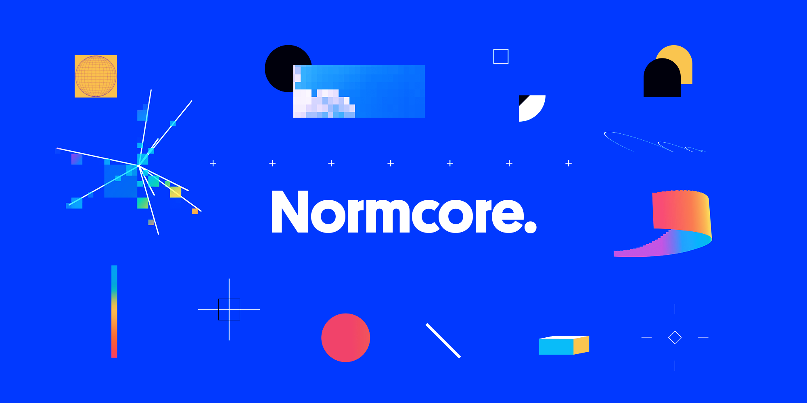
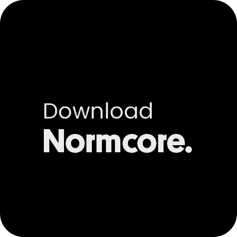
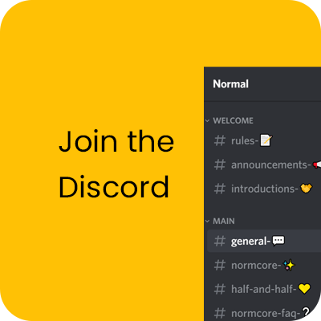

# Documentation

Normcore is a complete networking solution for Unity. It's easy to use and scales to millions of users.

If you're new to Normcore, we recommend starting with the [Getting Started](./essentials/getting-started.md) guide. It's a great place to get familiar with setting up Normcore in a fresh project.

We're always working to improve Normcore as much as we can. If you have any questions or feedback, hop over to our [Discord](https://normcore.io/discord)<!--- or the [forum](https://forum.normcore.io/)---> and let us know.

<!------>

