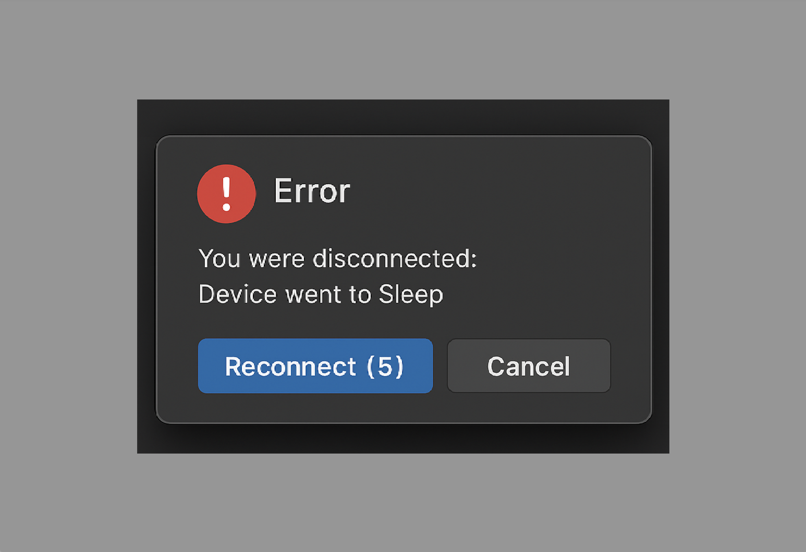
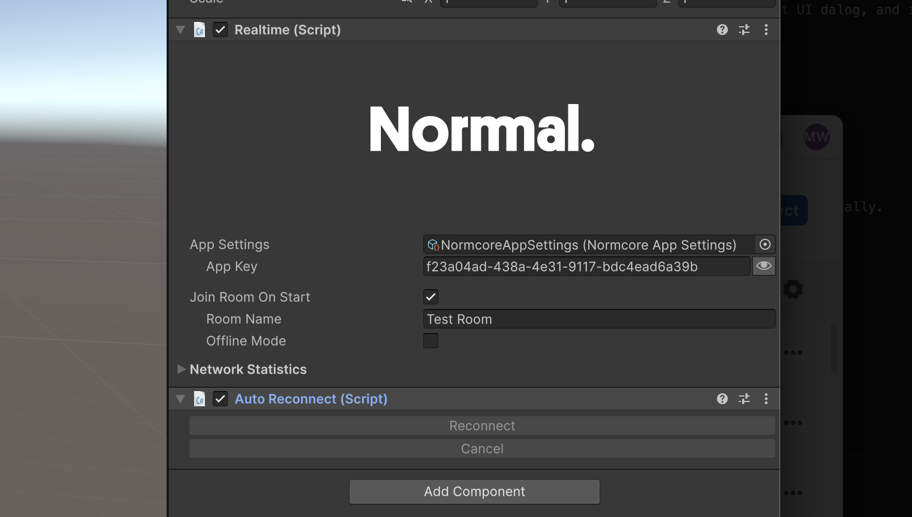

# Autoreconnect



**Autoreconnect** automatically reconnects to the last room after network disruptions like a device going to sleep. It provides events for building reconnect UI and implements exponential backoff with jitter to prevent your application from being rate-limited.

Normcore includes an optional Reconnect UI prefab (pictured above) that integrates with Autoreconnect.

### Usage
Add the **Autoreconnect** component next to the **Realtime** component that you would like it to operate on. It will automatically connect to Realtime and reconnect for you.



Most developers will want to display a dialog to users allowing them to cancel the reconnect or to reconnect instantly without waiting for the delay. Normcore includes a Reconnect UI prefab that integrates the Autoreconnect API as a UPM Sample.


Once imported, drag a reference to Autoreconnect into the AutoreconnectUI's Autoreconnect slot. If you hit Play and disconnect from wifi, you'll see that the dialog is displayed automatically, allowing the user to reconnect immediately or cancel the reconnect operation.

### How does Autoreconnect work?
**Autoreconnect** is designed to handle temporary network disruptions that are outside of your user's control. It automatically attempts to reconnect when:

- **The connection fails due to a network error:** If the connection is lost due to network issues (such as switching wifi networks, losing cellular signal, or temporary internet outages), Autoreconnect will handle reconnection automatically.
- **The device goes to sleep or becomes idle:** When a user's device enters sleep mode and wakes up later, Autoreconnect will automatically attempt to reconnect to the room.

**Autoreconnect** will **not** attempt to reconnect for disconnects that are intentional or permanent, such as:
- When you explicitly call `Realtime.Disconnect()`
- When the user is kicked from a room
- When there are authentication or permission issues
- When the request is invalid (e.g., an empty room name is provided)

#### Exponential backoff
**Autoreconnect** will attempt to reconnect immediately the first time. However, if repeated attempts fail, it will exponentially back off each retry to prevent your application from being paused by the Normcore rate limiter. After 5 attempts, Autoreconnect will give up.

### Public API
Autoreconnect has two public methods: `Reconnect()` and `CancelReconnect()` that you can use to immediately reconnect or cancel a pending reconnect operation respectively.

Autoreconnect also fires events at each step that are useful for displaying what's happening to your end users:

```csharp
// Event triggered before attempting to reconnect to the room.
public event Action<Autoreconnect, WillConnectArgs> willConnect;

// Event triggered before attempting to reconnect to the room.
// Note: This event is asynchronous and is awaited. It allows for custom logic
//       to be executed before the reconnection attempt, such as updating a room
//       name to connect to a different lobby.
public event Func<Autoreconnect, WillConnectArgs, Task> willConnectAsync;

// Event triggered after a successful connection to the room.
public event Action<Autoreconnect> didConnect;

// Event triggered after being disconnected from the room.
public event Action<Autoreconnect, DidDisconnectArgs> didDisconnect;

// Event triggered when the user cancels the reconnect attempt.
public event Action<Autoreconnect> didCancel;

// Event triggered when the reconnect timer updates, providing the remaining time
// before the next connection attempt in seconds.
public event Action<Autoreconnect, int> reconnectTimerDidUpdate;
```

We recommend looking at the included **Reconnect UI** UPM Sample for an example of how to use these events to display your in-game UI.

### Autoreconnect with room shards
Let's say you have an app that sends players to one of many potential multiplayer social lobbies. If a user puts their device to sleep, that shard may be full or may not exist anymore when they come back online.

We recommend using Autoreconnect's `willConnect` or `willConnectAsync` methods in this case to look up a new shard right before reconnecting:

```csharp
private void Awake() {
    // Get a reference to Autoreconnect
    Autoreconnect autoReconnect = GetComponent<Autoreconnect>();

    // Fetch an available lobby shard before reconnecting to a new room
    autoReconnect.willConnectAsync += async (autoReconnect, args) => {
        // Fetch the shard room name:
        string availableLobbyShardRoomName = await MyMatchmakingAPI.GetNextAvailableLobbyShard();

        // Update the roomName property on autoReconnect.
        autoReconnect.roomName = availableLobbyShardRoomName;
    };
}
```
