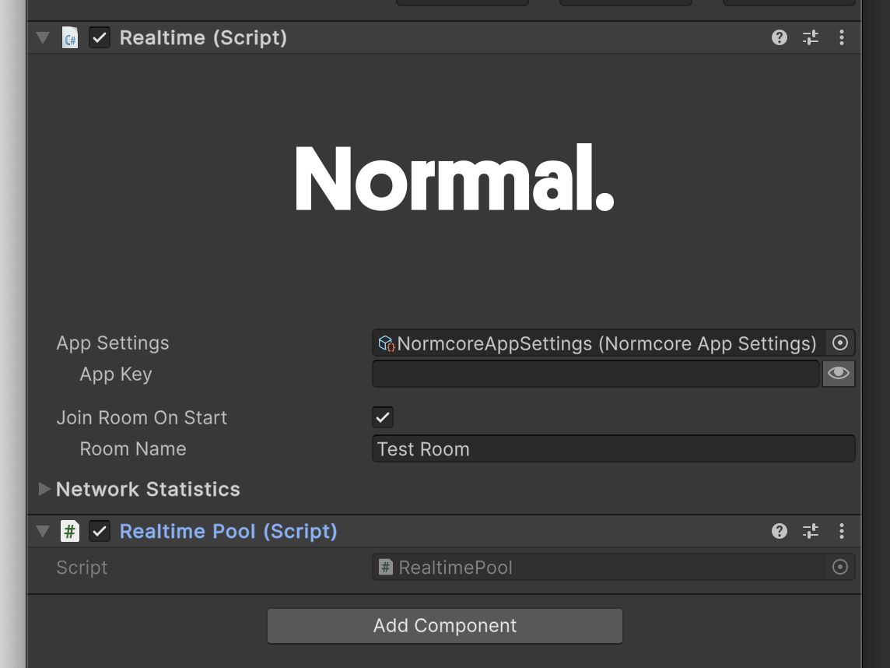

# Prefab Pooling
Prefab pooling is a feature that allows you to reuse prefabs instead of destroying and recreating them each time. This improves performance and avoids frame drops by reducing instantiation and garbage collection costs.

## RealtimePool
The easiest way to use prefab pooling with Normcore is to use the RealtimePool component. You can do this by adding a RealtimePool component on the same GameObject as your Realtime instance:



## How it works
When a realtime prefab is instantiated either by the local or remote client:
1. If available instances exist in the pool: The oldest instance is enabled and reused.
2. If the pool is empty: A new instance is created.

When a realtime prefab is destroyed::
1. The root GameObject is disabled instead of getting destroyed.
2. The instance is returned to its pool for future reuse.

A separate pool is created for each prefab name to ensure reused prefabs match what is being instantiated.

:::warning
Prefabs are never destroyed, which means `OnDestroy()` will not be called on pooled prefab instances. We recommend moving this logic over to `OnEnable()` and `OnDisable()` or the `IRealtimePoolCallbacks` methods (described below) instead.
:::

## Preloading
By default the pool for each prefab is empty. Every time a prefab is instantiated and there are no instances ready for reuse, the pool will grow automatically. This can lead to performance hitches the first time a player connects to a room. We recommend using the preload features of RealtimePool to avoid this.

To preload the pool, use the `PreloadPrefab()` method. This will preload the pool with the specified number of instances:

```csharp
    private void Start() {
        // Preload 10 instances of a prefab using a prefab name
        realtimePool.PreloadPrefab("PlayerPrefab", 10);

        // Preload 10 instances using a prefab reference
        realtimePool.PreloadPrefab(playerPrefab, 10);
    }
```

### Asynchronous preloading
In Unity 6 and later it's possible to preload the pool asynchronously to avoid frame drops during preloading.

```csharp
    private void Start() {
        // Preload 100 basketball instances without blocking the main thread
        var operation = realtimePool.PreloadPrefabAsync(basketballPrefab, 100);

        // Connect to room after preloading completes
        operation.completed += op => {
            Debug.Log("Preloading complete! Connecting to room.");

            realtime.Connect("My Room");
        };
    }
```

### Clearing
When you need to reclaim memory or prepare for different game states, RealtimePool provides a `Clear()` method. This can be used to clear a pool for a specific prefab or all pools.

```csharp
    private void SwitchGameModes() {
        // Clear a specific prefab's pool
        realtimePool.Clear(playerPrefab);

        // Clear all pools
        realtimePool.Clear();
    }
```

## Lifecycle callbacks
One caveat to using prefab pooling is that `OnDestroy()` will never be called. If you have any logic that needs to run when a prefab is reused or returned to the pool, we recommend using the `IRealtimePoolCallbacks` interface instead:

```csharp
public class MyComponent : MonoBehaviour, IRealtimePoolCallbacks {
    public void PrefabWillReuseFromPool() {
        // Called before this object is reused from the pool
    }

    public void PrefabWillReturnToPool() {
        // Called before this object is returned to the pool
    }
}
```

:::warning
The `PrefabWillReuseFromPool()` and `PrefabWillReturnToPool()` methods are only called on components on the root of the prefab for performance.
:::

## Advanced prefab pooling
RealtimePool is implemented using Normcore's [IRealtimePrefabInstantiateDelegate](../reference/classes/Normal.Realtime.IRealtimePrefabInstantiateDelegate.md) interface, which allows for complete control over prefab instantiation and destruction. For more advanced pooling, we recommend forking RealtimePool to use this API directly. All source code for RealtimePool is included in the Normcore package.
