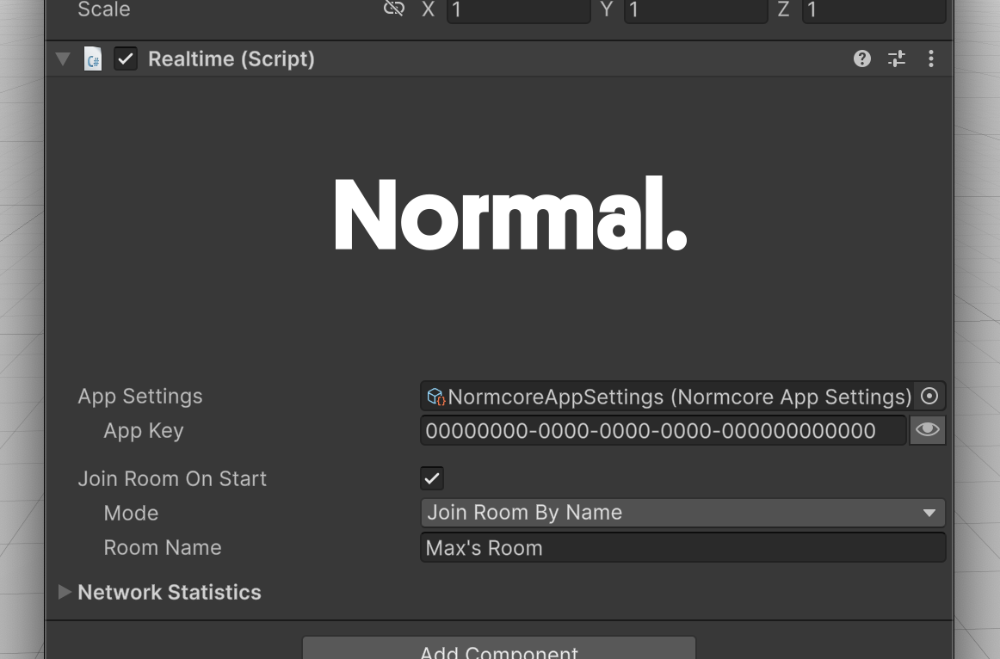

# Realtime

As mentioned in the [Realtime API Overview](./readme.md), Realtime is the component that manages your connection to a [room](../room/room.md) as well as any [RealtimeViews](./realtimeview.md) that should be connected to the room’s datastore. Use the Realtime component to connect to a room, instantiate realtime prefabs, and query any state about the room.

It's generally a good idea to think of a Realtime instance as a connection to a single room. If you would like to use multiple rooms in your multiplayer project, you can do so by creating additional Realtime instances.

## Editor interface

This is what the Realtime component looks like in Unity. 

### App Settings
This points to a [NormcoreAppSettings](../reference/classes/Normal.NormcoreAppSettings.md) asset that stores the relevant metadata needed for your application to connect to Normcore servers.

### App Key
This is a unique key used to track your app's usage. You can create one over on your [account dashboard](https://dashboard.normcore.io/apps). This field will update the asset for all instances that use this NormcoreAppSettings asset.

### Join Room On Start
If you would like Realtime to automatically connect to a room on Start(), check this box and configure the options below.

#### Mode
This determines how a room is selected when connecting:

- **Join Room By Name:** Connect to a specific room by name.
- **Next Available Room (Quickmatch):** Use [Quickmatch](../guides/quickmatch.md) to find a room with remaining capacity, or create a new room if all existing rooms are full.
- **Offline Room:** Connect to an offline room.

:::info
Room names are namespaced to your App Key. Any room name used with a different App Key is considered a different room server by Normcore.
:::

### Network Statistics
This section displays information about the current running connection:

- **Connection:** The current connection state (e.g., Connecting, Connected, Disconnected, Error).
- **Room Name:** The name of the room you are connected to.
- **Room Time:** The current time on the room server.
- **Ping:** The round-trip latency to the server in milliseconds.
- **Client ID:** The client ID assigned for this connection by the room server.

## Programming interface
Most of the time that you spend working with Realtime will be via its programming interface. More information is available on using this API in the [Realtime API Overview](./readme.md), and individual methods are documented on the [Realtime](../reference/classes/Normal.Realtime.Realtime.md) reference page.
