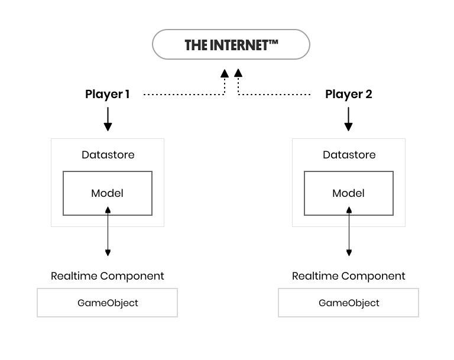

# RealtimeComponent

RealtimeComponent subclasses are the most common way to synchronize data in your application. A RealtimeComponent subclass script is responsible for keeping a specific part of your scene in sync. The most common built-in component is RealtimeTransform, which synchronizes the transform of a GameObject.

The flow of data looks something like this:



A RealtimeComponent subclass keeps a game object in sync with its corresponding RealtimeModel instance in the datastore. When the game object changes, the component updates the model, and when the model changes, the component updates the game object to match. This means that in the diagram above, when Player 1 moves a game object, RealtimeTransform can set the new position on its model in the datastore. When Player 2 gets a notification that the model has changed, it can update the position of the same game object in its scene.

### Model
All RealtimeComponents store the state they need to synchronize in a [RealtimeModel](../room/realtimemodel) subclass. The model is automatically synchronized across all clients by Normcore, so all the RealtimeComponent needs to do is synchronize the scene and the model to match.

When a RealtimeComponent is first created, Realtime will create a fresh model instance in which each RealtimeComponent can store data. If the object already exists on the server, the model will be prepopulated with the current state before it is given to the RealtimeComponent.

### Using views and components in a scene
When using views and components in a scene, they follow this cycle:
1. `Awake()` + `Start()` both run. RealtimeView registers with Realtime.
2. Realtime creates an empty model for every view and component and sets the model on each, triggering an `OnRealtimeModelReplaced()` call.
3. When Realtime connects to a room, if an object in the scene doesn't exist, its model is inserted into the datastore. If the object already exists, Realtime creates a new RealtimeModel, populates it with the state from the server, and replaces the model again, triggering an `OnRealtimeModelReplaced()` call.
4. `Realtime.connected == true` and `Realtime.didConnectToRoom` fires.

### Using views and components on a prefab
When using views and components on a prefab, they follow this cycle:
1. `Realtime.Instantiate()` is called with the name of a prefab.
2. The prefab is instantiated on all clients.
3. `Awake()` is run by Unity.
4. Realtime creates a model, populates it with any state, and sets it, triggering an `OnRealtimeModelReplaced()` call.
5. `Start()` is run by Unity.

### Using a model
Once `OnRealtimeModelReplaced()` is called, your model ready for use! You will be able to synchronize state with the model from within any method on your `RealtimeComponent<TModel>` subclass, like so:

```csharp
public void SetColor(Color color) {
    // Update the model
    model.color = color;
}

private void Update() {
    // Update the scene to match the model
    meshRenderer.material.color = model.color;
}
```

When you're ready to write your own realtime components, check out our [Synchronizing custom data](./synchronizing-custom-data) guide.

#### Setting default values
We recommend that the code that calls `Realtime.Instantiate()` is responsible for setting default values. However, if you would like to synchronize unique default values (such as the initial position of an object), you can set them inside of `OnRealtimeModelReplaced` like so:

```csharp
void OnRealtimeModelReplaced(blah) {
  if (currentModel != null) {
    if (currentModel.isFreshModel) {
      // Set initial values here
      currentModel.startPosition = transform.localPosition;
    }

    // Subscribe to events
  }

  if (previousModel != null) {
    // Unsubscribe from events
  }
}
```
