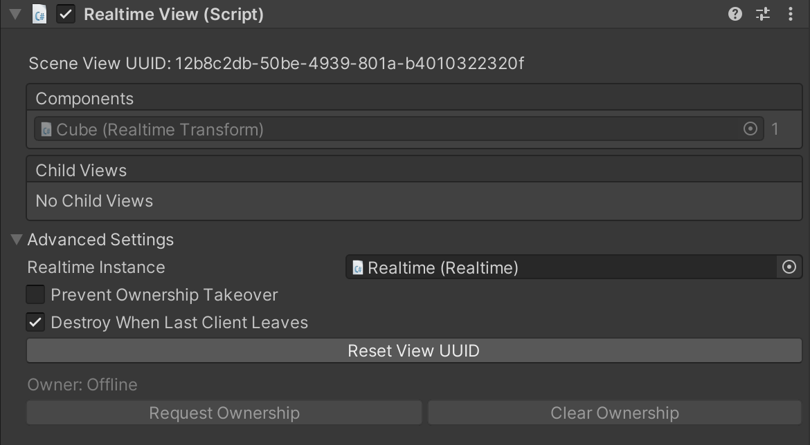

# RealtimeView

A RealtimeView is used to identify a game object and its [RealtimeComponents](./realtimecomponent) across multiple clients. When a prefab is instantiated, RealtimeView creates a model for each RealtimeComponent on the prefab and puts it into the datastore. Then, when the prefab is instantiated on other clients, RealtimeView will connect the model in the datastore with its respective RealtimeComponent on the prefab.

## Editor interface

The Inspector in Unity looks like this:

### Scene View UUID
The Scene View UUID property will only appear on RealtimeViews that are in the scene. This is a globally unique identifier that is used to synchronize this view’s model in the datastore. When two clients first connect to a room, they use this identifier to ensure that both instances of the same RealtimeView share the same model. Once connected, the scene view UUID is never used again. Neither child views nor Realtime prefab views use a UUID.

### Components
The components section lists all [RealtimeComponents](./realtimecomponent) on this game object and their component IDs. If you’ve made a custom model, you’ll recognize that a component ID works like the property ID on a model. Each component is assigned a unique ID by the RealtimeView. That ID is used to identify this component when communicating with other clients. It’s also used when restoring prefabs that have been marked persistent. It’s very important that these IDs are unique to this RealtimeView instance and that they are not reused by different components.

### Children
The child views section works similarly to the Components section. Any children of this RealtimeView will show up here. All data that’s stored in RealtimeComponents on child views will be added to this view when put in the datastore.

In general, you should never need to manually assign unique view IDs. Normcore will automatically assign them, and will deprecate them when you remove a child view. If you move a child view back, it will autodetect and reassign the old ID to prevent bugs that can arise when loading persistent data from the datastore.

### Advanced Settings
#### Realtime Instance

This property references the instance of Realtime that this RealtimeView should use to synchronize its model. Most apps will only have a single instance of Realtime in a scene, and RealtimeView will automatically populate this variable using that instance. However, if you plan to have multiple instances in the same scene, you may manually wire up which instance this RealtimeView should use.

When additively loading a scene, this field can be left blank and it will be filled in automatically at runtime. If you plan to additively load a scene onto another scene with multiple Realtime instances, you'll want to use the `sceneViewWillRegisterWithRealtime` delegate to provide the instance to use.

#### Ownership + Lifetime Flags
The three properties here are only applicable to the RealtimeViews that exist in the scene (as opposed to RealtimeViews instantiated via [`Realtime.Instantiate()`](../reference/classes/Normal.Realtime.Realtime.html).

“Owned by Creating Client”: This is a boolean that specifies whether Realtime should request ownership when this view is created. It can be useful for establishing a main client if needed.

“Prevent Ownership Takeover”: At runtime, clients can call `RequestOwnership()` on the RealtimeView to take over ownership of the model. You can use this checkbox to prevent that. When checked, only models that have no owner can be taken over. This is a setting that you can change at runtime.

“Destroy Last Client Leaves”: This is a boolean that specifies whether to destroy this RealtimeView when the last client leaves. If you have a RealtimeView that manages the state of your multiplayer game, such as whose turn it is and what level you’re on, you can choose to clear the view and its models from the datastore when the last client leaves. It will then be recreated by the first client to join in a new session.

If you leave “Destroy Last Client Leaves” unchecked, all views and components, and their models, will persist between sessions. Let’s say you’re building a collaboration space with a whiteboard. You can leave this unchecked so that the state of your whiteboard is saved between sessions.

If you're using RealtimeView on a prefab, these values can be set via the `InstantiateOptions` struct passed to [`Realtime.Instantiate()`](../reference/classes/Normal.Realtime.Realtime.html).

#### Reset View UUID
This button is only applicable to RealtimeViews that exist in the scene (as opposed to RealtimeViews instantiated via [`Realtime.Instantiate()`](../reference/classes/Normal.Realtime.Realtime.html). 

Normcore is generally good at automatically assigning Scene View UUIDs to each RealtimeView. However, it is possible to end up with a duplicate (for example, if you save a copy of a scene and expect to additively load it at runtime).

If you end up in a scenario in which there is a duplicate Scene View UUID, you can use the “Reset View UUID” button to tell Normcore to reset it.

*Note: Once reset, this view will not be able to communicate with scene views that had the old ID. It will also not be able to retrieve persistent data stored under the previous Scene View UUID. Use this button carefully!*

#### Ownership
Every RealtimeView has an [ownership and permissions model](../room/ownership-and-lifetime-flags) that’s enforced by the server. If this view is owned by a particular client, other clients will be unable to change any permissions on the view, its components, or its child views and their components.

There are two buttons—”Request Ownership” and “Clear Ownership”—that are enabled in play mode. These allow you to call the ownership methods on this view at runtime.

## Programming Interface
See [RealtimeView reference](../reference/classes/Normal.Realtime.RealtimeView.html)
