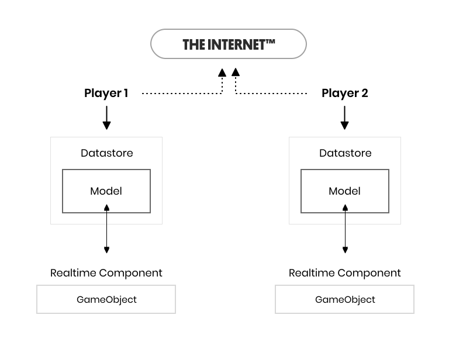
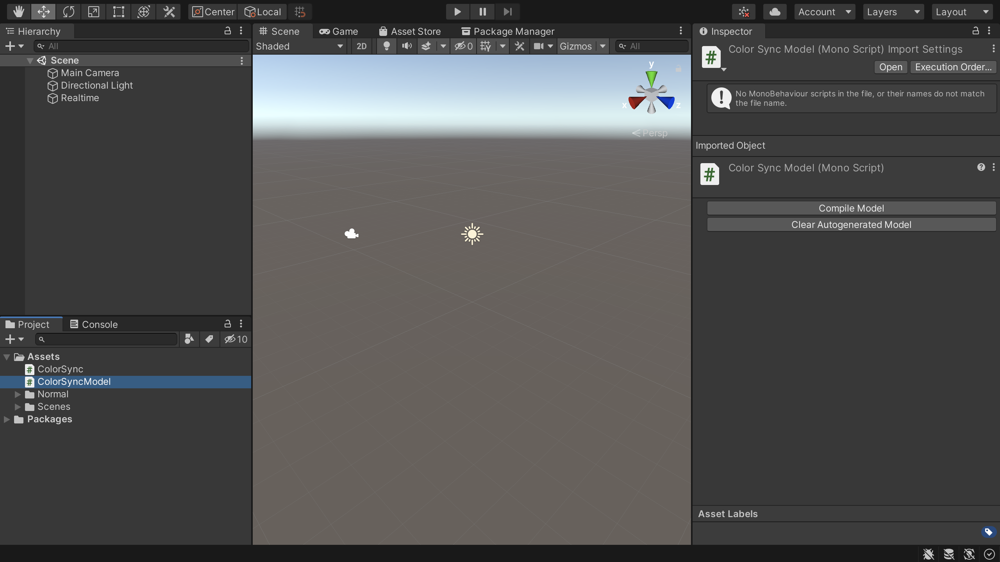
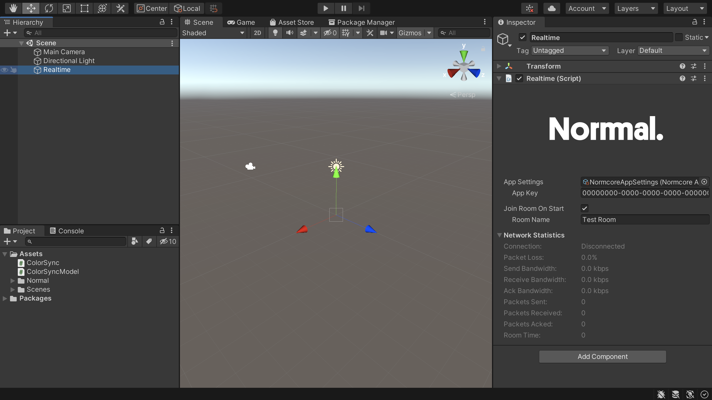

# Synchronizing Custom Data
In this guide, I’m going to walk you through how to synchronize custom data in your Unity application using custom [realtime components](./realtimecomponent).

## RealtimeComponents
import createCubeWithColorSync from './synchronizing-custom-data/create-cube-with-colorsync.mp4'
import changeCubeColor         from './synchronizing-custom-data/change-cube-color.mp4'



[Realtime components](./realtimecomponent) synchronize state between the Unity scene and a model in the Normcore datastore.

## Creating a custom realtime component

For this example, I’m going to make a realtime component that synchronizes the color of an object. In order to create a custom component, you’ll also need to create a model to put in the datastore. Let’s start by making a script for the component, and one for the model. We’ll call these `ColorSync.cs` and `ColorSyncModel.cs` respectively.

### Creating a realtime model

First, we’re going to start by writing the model. Start by removing `MonoBehaviour` from the class definition. Models shouldn't be a subclass of any other class. Models also need to be `partial` classes so that Normcore can supplement the class with the networking code. Next, add a private field to hold our color value. One quick note: variables need to be private and they need to start with an underscore. Once you've added your property, your class should look something like this:

```csharp
using System.Collections;
using System.Collections.Generic;
using UnityEngine;

public partial class ColorSyncModel {
    private Color _color;
}
```

Now, this isn't enough to synchronize our model with the datastore. We need a few methods to expose this property publicly, detect changes to the color, and send any changes to the server. Luckily, Normcore comes with a plugin that will write all of that logic for us and ensure that it's written with correctness and performance in mind. In order to use it, we're going to add a `[RealtimeModel]` attribute to our class and a `[RealtimeProperty]` attribute to the `_color` variable. 
Your class should look something like this:

```csharp {5,7}
using System.Collections;
using System.Collections.Generic;
using UnityEngine;

[RealtimeModel]
public partial class ColorSyncModel {
    [RealtimeProperty(1, true, true)]
    private Color _color;
}
```

Here, I’ve added a `[RealtimeModel]` attribute to signal to Normcore that this is a model class. This will be relevant in the next step. Second, I’ve added a `[RealtimeProperty]` attribute to the color property. RealtimeProperty has three arguments:

#### PropertyID

The first is the property ID. This is a unique ID that is used by Normcore to identify this property among others when sending data to and from the server. The property ID needs to be unique, but only to this model. It does not have to be unique to the whole project. It's generally a good idea to always start at 1 for each model that you create.

If you need to change the type of this property, you'll want to create a new property with a new property ID and deprecate the existing one. This will ensure that newer versions of your application can still communicate with older versions. If you would like to delete this field altogether, make sure to retire its property ID so it is not reused for something else. Comment out the field and leave it in your source code so you can see previously used property IDs.

#### Reliable / unreliable

This marks whether the property should be synced reliably or unreliably. In general, if you plan to change a property very often (such as animating a color or moving a transform), you should use an unreliable property. Unreliable updates are not resent if they’re dropped in transit because it’s expected that another update is following shortly after.

Reliable properties are good for things that you update once and that should be resent if the packet is dropped in transit. This is great for state such as whether your game has started or not. When you change it, Normcore will ensure that this value is synchronized between all clients and that it is in sync before any newer reliable updates to are applied to the datastore.

#### Change Event

The last option is an optional argument that specifies if you would like a change event added to the model. When this is set to true, a C# event is added; it will fire when a property is changed locally or remotely. This is a useful signal to update your scene to match the model.

#### Generating model code in Unity 2021+

If you're using Unity 2021 or newer, Normcore will automatically generate the remaining code needed to use your model. Don't worry if you don't see it in your file; the extra code exists as temporary C# code generated when your project compiles. At this point you can skip ahead to [Creating a RealtimeComponent subclass](#creating-a-realtimecomponent-subclass).

#### Generating model code in Unity 2019/2020

If you're using an older version of Unity, you will need to manually compile the model. Go back to Unity and highlight the `ColorSyncModel.cs` file in your project. The inspector should look something like this:



Now that our class has a `[RealtimeModel]` attribute on it. Normcore will detect it and display the model inspector. If your inspector is not updating correctly, make sure your Unity project has no compile errors. If Unity is unable to compile this class, it will be unable to detect the changes you’ve made to your model.

In order to actually make use of the model, we’ll need to compile it. With the inspector up, click the “Compile Model” button. If we look back at our `ColorSyncModel.cs` class, it should look something like this:

```csharp {13-17}
using System.Collections;
using System.Collections.Generic;
using UnityEngine;
using Normal.Realtime;
using Normal.Realtime.Serialization;

[RealtimeModel]
public partial class ColorSyncModel {
    [RealtimeProperty(1, true, true)]
    private Color _color;
}

/* ----- Begin Normal Autogenerated Code ----- */

/* Your autogenerated model code will appear here. */

/* ----- End Normal Autogenerated Code ----- */
```

You can ignore all of the autogenerated code. Normcore has compiled everything needed to keep this model in sync with the datastore. It has also added a public property called color that we can use to get or set the value on the model. It’s also added a colorChanged event that we can use to detect changes to the model.

Now that our model is ready, let’s implement the `ColorSync` component to synchronize the color of a GameObject.

### Creating a RealtimeComponent subclass

Open up the `ColorSync.cs` script we created earlier. First, we’re going to change the superclass from `MonoBehaviour` to `RealtimeComponent<ColorSyncModel>`. Be sure to add `using Normal.Realtime;` to the top of your file. RealtimeComponent will automatically create a property called model that will be populated with an instance of our `ColorSyncModel`. We’re also going to add some code to `Awake()` to grab a reference to the Mesh Renderer:

```csharp
using System.Collections;
using System.Collections.Generic;
using UnityEngine;
using Normal.Realtime;

public class ColorSync : RealtimeComponent<ColorSyncModel> {
    private MeshRenderer _meshRenderer;

    private void Awake() {
        // Get a reference to the mesh renderer
        _meshRenderer = GetComponent<MeshRenderer>();
    }
}
```

First up, we’ll write a method that synchronizes the color stored on the model to the mesh renderer:

```csharp {14-17}
using System.Collections;
using System.Collections.Generic;
using UnityEngine;
using Normal.Realtime;

public class ColorSync : RealtimeComponent<ColorSyncModel> {
    private MeshRenderer _meshRenderer;

    private void Awake() {
        // Get a reference to the mesh renderer
        _meshRenderer = GetComponent<MeshRenderer>();
    }

    private void UpdateMeshRendererColor() {
        // Get the color from the model and set it on the mesh renderer.
        _meshRenderer.material.color = model.color;
    }
}
```

This is pretty simple, when the method is called, it grabs the color on the model and updates the color on the mesh renderer. Now we could just call this from `Update()` and make sure our renderer matches the model every frame, but personally, I don’t like this approach. Among other issues, it’s susceptible to the project's Script Execution Order which can cause updates to be delayed by a frame. Instead, we can register for an event from the model that will fire whenever it’s changed locally or by a remote client. We’ll use that to call our `UpdateMeshRendererColor` color method:

```csharp {14-31,33-36}
using System.Collections;
using System.Collections.Generic;
using UnityEngine;
using Normal.Realtime;

public class ColorSync : RealtimeComponent<ColorSyncModel> {
    private MeshRenderer _meshRenderer;

    private void Awake() {
        // Get a reference to the mesh renderer
        _meshRenderer = GetComponent<MeshRenderer>();
    }

    protected override void OnRealtimeModelReplaced(ColorSyncModel previousModel, ColorSyncModel currentModel) {
        if (previousModel != null) {
            // Unregister from events
            previousModel.colorDidChange -= ColorDidChange;
        }
        
        if (currentModel != null) {
            // If this is a model that has no data set on it, populate it with the current mesh renderer color.
            if (currentModel.isFreshModel)
                currentModel.color = _meshRenderer.material.color;
        
            // Update the mesh render to match the new model
            UpdateMeshRendererColor();

            // Register for events so we'll know if the color changes later
            currentModel.colorDidChange += ColorDidChange;
        }
    }

    private void ColorDidChange(ColorSyncModel model, Color value) {
        // Update the mesh renderer
        UpdateMeshRendererColor();
    }

    private void UpdateMeshRendererColor() {
        // Get the color from the model and set it on the mesh renderer.
        _meshRenderer.material.color = model.color;
    }
}
```

When a `RealtimeComponent` is first created, it starts with no model. Normcore populates it once we have successfully connected to the server (or instantly, if we're already connected) and calls `OnRealtimeModelReplaced()` to provide us with a copy of it. If this `RealtimeComponent` was previously mapped to a different model (e.g., when switching rooms), it will provide a reference to the previous model in order to allow your component to unregister from events.

In this example, when a model is passed to us, I start by checking if it's a fresh model. This tells us whether this is a model for an object that already exists or one that was created fresh. If it's fresh, I populate it with the color of the `MeshRenderer`.

Next up I call `UpdateMeshRendererColor()` to synchronize the color stored on the model to the `MeshRenderer`. If another client created this model, it will be populated with the values they set.

Finally, I register for the `colorDidChange` event that calls my `ColorDidChange` method whenever the model's `color` property changes. That way, if the color changes later, we’ll be notified so we can update our mesh renderer.

We have one final method to implement. Our `ColorSync` component will now properly keep the color of the game object in sync with the model, but we haven’t exposed a method to update the model itself. Let’s add a simple method that does that to our class:

```csharp {43-47}
using System.Collections;
using System.Collections.Generic;
using UnityEngine;
using Normal.Realtime;

public class ColorSync : RealtimeComponent<ColorSyncModel> {
    private MeshRenderer _meshRenderer;

    private void Awake() {
        // Get a reference to the mesh renderer
        _meshRenderer = GetComponent<MeshRenderer>();
    }

    protected override void OnRealtimeModelReplaced(ColorSyncModel previousModel, ColorSyncModel currentModel) {
        if (previousModel != null) {
            // Unregister from events
            previousModel.colorDidChange -= ColorDidChange;
        }
        
        if (currentModel != null) {
            // If this is a model that has no data set on it, populate it with the current mesh renderer color.
            if (currentModel.isFreshModel)
                currentModel.color = _meshRenderer.material.color;

            // Update the mesh render to match the new model
            UpdateMeshRendererColor();

            // Register for events so we'll know if the color changes later
            currentModel.colorDidChange += ColorDidChange;
        }
    }

    private void ColorDidChange(ColorSyncModel model, Color value) {
        // Update the mesh renderer
        UpdateMeshRendererColor();
    }

    private void UpdateMeshRendererColor() {
        // Get the color from the model and set it on the mesh renderer.
        _meshRenderer.material.color = model.color;
    }

    public void SetColor(Color color) {
        // Set the color on the model
        // This will fire the colorChanged event on the model, which will update the renderer for both the local player and all remote players.
        model.color = color;
    }
}
```

That’s it! Let’s test our component out.

### Testing it out

Open up a blank scene in Unity and add a game object with a Realtime component to it. Make sure to enter your App Key.



Now let’s make a Cube game object that we’ll use to test our new component. We can add a `ColorSync` component to it. Normcore will detect it, automatically add a RealtimeView component and then add the `ColorSync` component to the list of observed components.

<video width="100%" controls><source src={createCubeWithColorSync} /></video>

Last, we’ll make a quick test component that changes the Cube’s color. This component will display a color picker in the inspector, and whenever the color changes, it will update the color using the ColorSync component:

```csharp
using System.Collections;
using System.Collections.Generic;
using UnityEngine;

public class ColorSyncTest : MonoBehaviour {
    [SerializeField]
    private Color _color         = default;
    private Color _previousColor = default;

    private ColorSync _colorSync;

    private void Awake() {
        // Get a reference to the color sync component
        _colorSync = GetComponent<ColorSync>();
    }

    private void Update() {
        // If the color has changed (via the inspector), call SetColor on the color sync component.
        if (_color != _previousColor) {
            _colorSync.SetColor(_color);
            _previousColor = _color;
        }
    }
}
```

Let’s take this new component for a test drive! Hit play and you should see your cube chillin on screen. Try changing the color property on the `ColorSyncTest` component. We can see here the cube color updates! Now let’s test our networking.

<video width="100%" controls><source src={changeCubeColor} /></video>

Export a standalone build and make sure your scene’s camera is pointed at the Cube game object.

Now we can open that standalone build, hit play in the editor, and change the cube color. Go ahead and try it. We’ll see the standalone build’s cube color update in real-time.

Download a finished copy of the project [here](</downloads/Normcore Synchronizing Custom Data.zip>).

Check out our other guides on synchronizing custom data:

- [Creating a multiplayer drawing app](../guides/creating-a-multiplayer-drawing-app)
- [Server Authority, Ownership, and Lifetime Flags](../room/ownership-and-lifetime-flags)

## FAQ
#### My custom RealtimeComponent isn't syncing and `OnRealtimeModelReplaced` doesn't get called.
You have most likely added your custom component to a game object before it was converted to a **RealtimeComponent** subclass. To verify this, look at the **RealtimeView**'s list of components and make sure you see your custom component in the list. If you don't see it, or a **RealtimeView** has not been created for you automatically, try removing the component and re-adding it to your game object. This will tell Unity to automatically create a **RealtimeView** and add your **RealtimeComponent** subclass to its component list.
