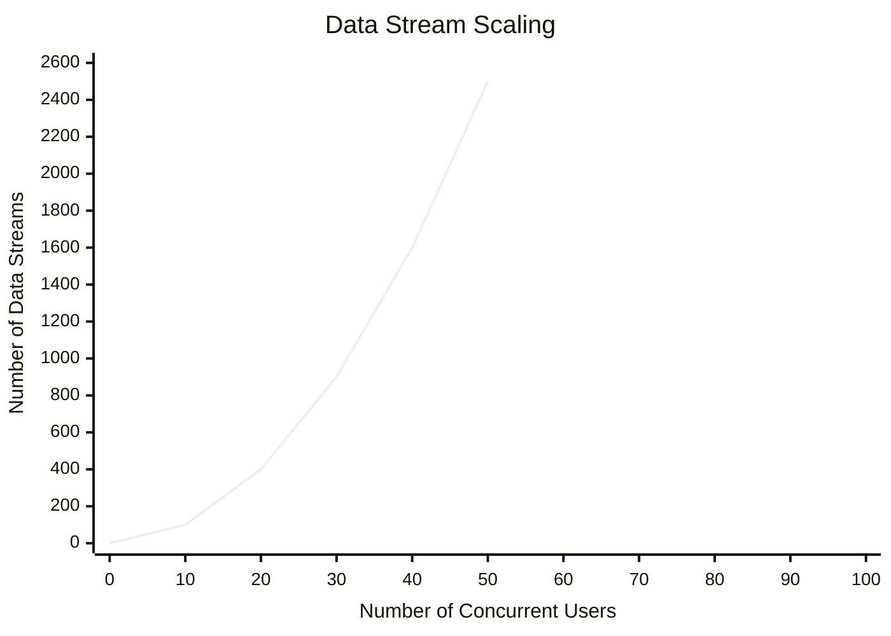

# Room Server Options

:::warning
This API is currently in private beta. If you would like to try it out, shoot us an email to help@normalvr.com with info about your project.
:::


Normcore v2.8.0 introduced the Room Server Options API. This API enables the ability to configure various server-side options, including things like the allocation of CPU and memory resources.

## Using room server options on connect

When you connect to a room server using either `Connect()` on **Realtime** or **Room**, you can pass an optional `ConnectOptions` struct, This struct supports an optional `RoomServerOptions` struct.

For example, if we wanted to connect to a room server with more capacity, we can switch from the default **Small-Flexible** size to a **Medium** instance like so:

```csharp
class ConnectionManager {
    [SerializeField]
    private Realtime _realtime;

    private void Start() {

        // Connect to "My Room" and request a Medium room server configuration.
        _realtime.Connect("My Room", new Room.ConnectOptions {
            roomServerOptions = new Room.RoomServerOptions {
                configuration = "medium"
            }
        });

    }

}
```

This will instruct Realtime to connect to "My Room" and if the room server is not already running, it will spin up a fresh room server using the "medium" configuration.

## Room server configurations

Normcore dynamically provisions room servers on-demand. When a player initiates the first connection to a room server, Normcore instantiates a new server instance, configured according to the player's specified room server configuration setting. The room server configuration is chosen by the first player to connect and cannot be changed for the duration of the room session. After all players have disconnected, and the room server has been idle for 30 seconds, the room server will shut down, and new settings can be applied by the first player to reconnect.

The room server options `configuration` variable allows you to pick a configuration for your room server. The main purpose of this setting is to provide different size room servers, but on Normcore Private, this can be used to configure different authoritative servers, sidecar versions, etc. Just about any setting can be put into a named configuration for clients to select.

**Normcore Public** provides the following room server configuration settings: **default**, **small**, **medium**, **large**, and **X Large**:

| Name                     | Configuration Key | CPU Capacity | Memory        | Room Hours Multiplier |
|--------------------------|-------------------|--------------|---------------|-----------------------|
| Default (Small-Flexible) | default           | 0.5x-2.5x    | 100MB - 250MB | 1x                    |
| Small                    | small             | 1.0x         | 100MB         | 1x                    |
| Medium                   | medium            | 5.0x         | 500MB         | 5x                    |
| Large                    | large             | 10.0x        | 1GB           | 10x                   |
| X Large                  | xlarge            | 20.0x        | 2GB           | 20x                   |

In the **Default** configuration, we ensure a baseline capacity of 0.5x that of a **Small** room server, with the ability to burst up to 2.5x this capacity if resources are available. While the default configuration provides flexibility, it's essential to note that the additional capacity is not guaranteed. For optimal and consistent performance across all room servers, we strongly advise utilizing a non-default configuration for the launch of your title, reserving the default configuration primarily for development purposes.

**Room hours multiplayer:** Larger rooms consume more cloud compute resources, so their billing is scaled by a room hours multiplier. For example, a Large room server, which reserves 10x the CPU of a Small server, will consume room hours at 10x the rate.

### How many players can I fit in a single room?
Normcore regularly hosts rooms of 4 - 250 players. The headcount per room will vary based on how much bandwidth your application uses. For instance, VR applications typically use 5-10 times more bandwidth than a typical FPS or racing game.

However, when using Normcore Public, we generally see the following performance among existing Normcore applications for each room server configuration:

|                       | Default (Small-Flexible)          | Small           | Medium           | Large             | X Large           |
|-----------------------|-----------------------------------|-----------------|------------------|-------------------|-------------------|
| Console Title         | 30 Players (Burst up to 80)       | 50 Players      | 120 Players      | 160 Players       | 260 Players       |
| Spectators            | 500 Spectators (Burst up to 2500) | 1000 Spectators | 5,000 Spectators | 10,000 Spectators | 20,000 Spectators |
| VR Title              | 8 Players (Burst up to 32)        | 16 Players      | 40 Players       | 64 Players        | 100 Players       |
| VR Title + Voice Chat | 4 Players (Burst up to 16)        | 8 Players       | 20 Players       | 32 Players        | 50 Players        |

:::note
Spectators build here refers to a build where spectators do not send any data. Typically the number of data streams for any multiplayer game scales **O(n<sup>2</sup>)**. However, when data is only flowing from a single player to a set of spectators, it scales linearly, allowing far more spectators in the same room server.
:::

For extreme cases—such as MMORPGs, or VR apps with 50+ players—there are still options: you can split large spaces across multiple Normcore [rooms](../architecture/client.md#rooms), or you can use [Normcore Private](https://normcore.io/normcore-private), which supports even larger room servers.


### How room servers scale
A common misconception is that if you can host 20 concurrent users on a **Small** room server, if you upgrade to a **Medium** room server which has 5x the capacity, you'll be able to host 100 concurrent users. Typical game server traffic does not scale linearly, it scales **O(n<sup>2</sup>)** if all players are sending the same data.

In a room with 2 players, the server manages 4 total streams: 2 incoming and 2 outgoing. For a room with 4 players, the number of streams increases to 16 (4 incoming, 12 outgoing). This scaling continues exponentially: a room with 8 players handles 64 streams. Following this pattern, a room accommodating 60 players would use 3600 streams.

To put this into perspective, if a small server instance can support 25 players, which equates to 625 streams, expanding the capacity to host 100 players or 10,000 streams, would require a 16x increase in capacity.



As the number of players in your room server increases, optimizing bandwidth becomes increasingly important. For instance, reducing the data a single player sends by 64 bytes leads to a total bandwidth saving of 1,024 bytes for the entire room server.
