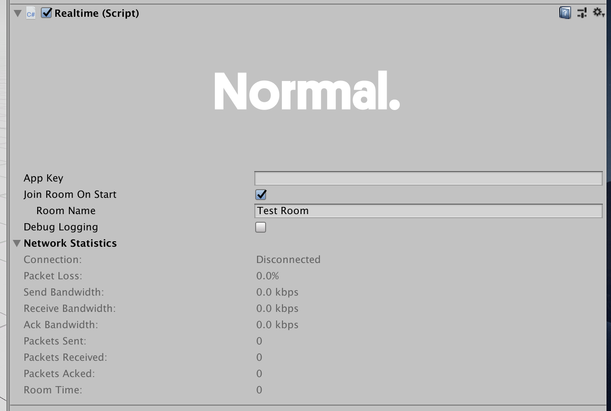

# Realtime

Realtime is a component that manages your connection to a room, as well as any RealtimeViews that should be connected to the room’s datastore.

## Editor Interface

**App Key:** This is a unique key used to track your apps usage. You can create one over on your [account dashboard](https://normcore.io/dashboard).

**Join Room On Start + Room Name:** If you would like Realtime to automatically connect to a room on Start, you can check this box and enter the room name here.

Note: Room names are namespaced to your App Key. Any room name used with a different App Key is considered a different room by the server.

**Debug Logging:** Our native plugin offers a more verbose logging mode. This can be useful when debugging low-level networking bugs. It’s rare that you will need to use this, but if you’re submitting a bug report to the Normal team, leave this turned on so we can properly diagnose the issue.

**Network Statistics:** The network statistics section shows you the current network statistics for the current connection. It includes things like packet loss %, bandwidth measurements, and the current room clock time.
