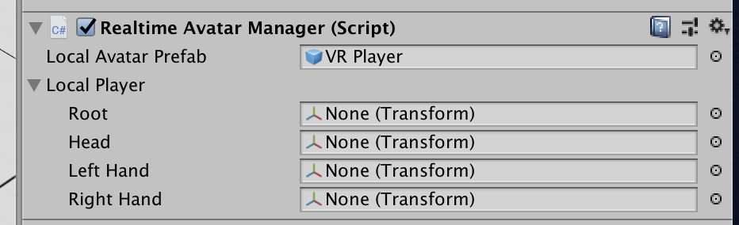

# RealtimeAvatarManager

RealtimeAvatarManager is a component that managers VR & AR avatars. It will automatically spawn a prefab for each player that joins a room. Avatar prefabs will automatically use Unity’s native XR APIs for getting the head & hand positions, however you can also specify your own transforms.

Note: This component must be on the same game object as Realtime.

## Editor Interface

**Local Avatar Prefab:** The prefab to instantiate when the local player successfully connects to a room.

**Local Player:** The transforms to use to position the player prefab at runtime. If you leave any of these blank, the default Unity XR APIs will be used.
