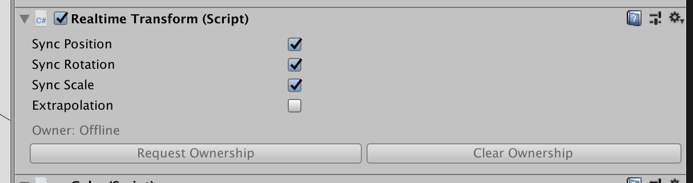

# RealtimeTransform

RealtimeTransform is a built-in RealtimeComponent that can be used to synchronize the transform or rigidbody of a GameObject.

## Editor Interface

**Sync Position, Rotation, and Scale:** Each toggle will determine whether RealtimeTransform should synchronize the position, rotation, and scale of the game object.

Note: When there is no rigidbody present, RealtimeTransform will synchronize the localPosition, localRotation, and localScale properties. However, if a rigidbody is present, it will synchronize the position, and rotation properties of the rigidbody which are in world space.

**Extrapolation:** A boolean that represents whether RealtimeTransform will use extrapolation to make up for latency incurred by the network. This property can be turned on/off at runtime.

### Ownership

If a RealtimeTransform is owned by the local client, it will synchronize the current transform position to the datastore so other clients can update their corresponding game object.

**This means that to move a RealtimeTransform, you need to call RequestOwnership() first! If a RealtimeTransform is not owned by the local client, you will be unable to move it.**

There are two buttons for Requesting and Clearing ownership that will enable in play mode. There is also an API (described below) that allows you to request ownership at runtime.

