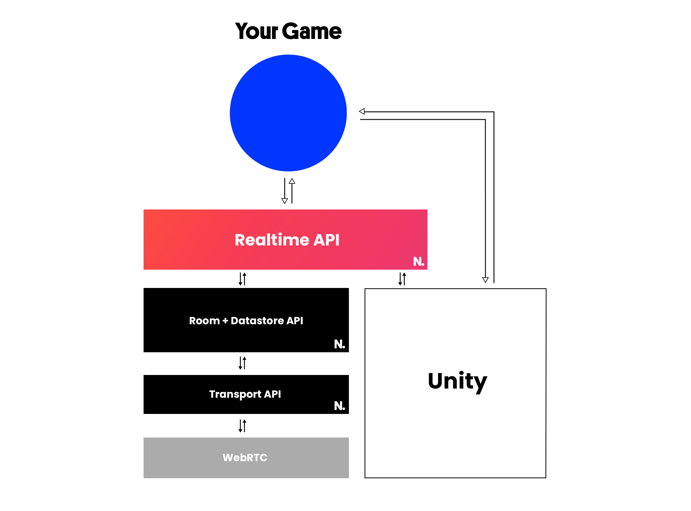
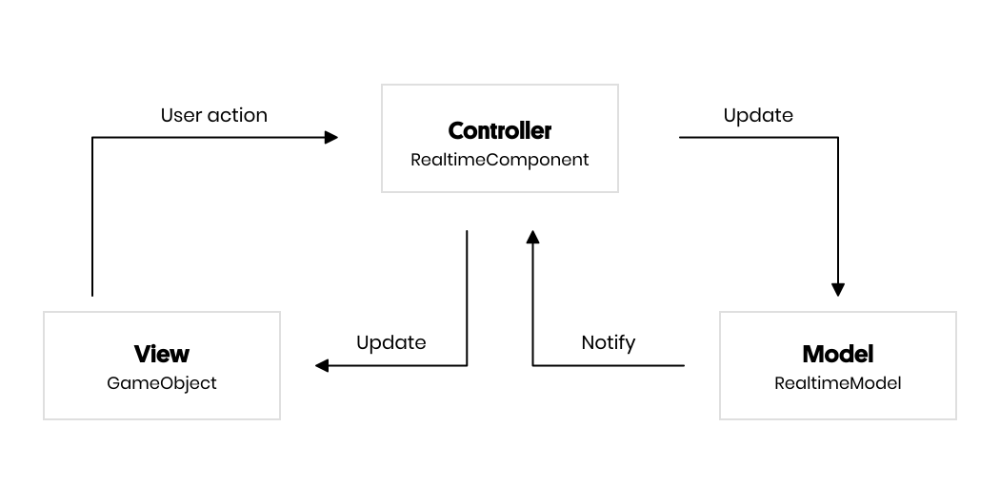

# Unity Client
This document describes the overall architecture of Normcore and how state is synchronized between players.

## Plugin Architecture

Normcore's Unity plugin consists of a series of layers. Each one builds on the layer below to provide an abstraction that is easier to use and lets you focus your time on building your game.

**[Realtime](../realtime/):** This is the API that bridges your scene to Normcore's datastore. Most developers will work exclusively with this API.

**[Room + Datastore API](../room/):** The Room + Datastore API manages your connection to a room server and synchronization of raw state in your application. It is unaware of your Unity scene or any Unity objects.

**[Transport](./transport):** The lowest level is our transport API. It is responsible for getting messages between point A and point B.

## Rooms

Rooms in Normcore are used to separate groups of players. They’re most commonly used to host a single match for a game, or a persistent space for a productivity app. Players who join the same room name will be automatically connected to the same room.

You can create as many rooms as you’d like, and Normcore will automatically determine the ideal region to host the room based on the players who are connecting.

Normcore also supports connecting to multiple rooms at once. This can be especially useful if you need to segment a large open-world into multiple quadrants that players can freely move between.

## Datastore

All state is synchronized using the room's datastore. If you need to move an object in the world, you change its position in the datastore. The datastore will automatically detect any changes and notify all clients who are connected to the room so they can update their world to match.

Traditionally, application state is communicated between clients through events. Players send event messages like “Move Object A to (x, y, z)”. However, if a player joins the match late, one of the existing clients would now responsible for catching up the new client with the state of the room. It becomes pretty easy to spend most of your time trying to engineer ways to keep your clients in sync.

With Normcore’s datastore, there’s no need to manually synchronize clients like this. If you make a change to the datastore, it’s automatically replicated to all connected clients. And when a client joins a room late, the server is able to send them a complete copy of the datastore, without requiring any intervention from the other clients.

To conserve on bandwidth, once the server has sent the initial datastore snapshot, it will only send delta updates for the remainder of the session.

## Model / View / Controller

Normcore uses an MVC (Model, View, Controller) based architecture, in order to help establish a clear separation of concerns for what handles your networking code.

The datastore holds a collection of RealtimeModel objects and ensures that they’re kept in sync between clients. In Unity, each GameObject represents the visual state of your app, so we consider it to be the View. And finally, the RealtimeComponent scripts act as the controller.

