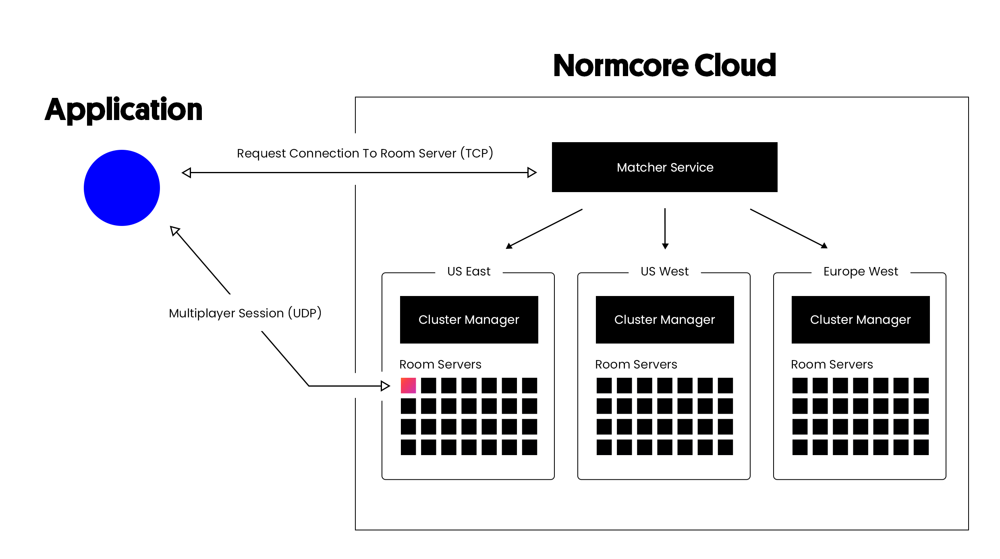

# Cloud Infrastructure
There are three components that make up a Normcore Cloud backend, the **matcher**, **clusters**, and **rooms**.

## Connecting to a room
The best way to understand the Normcore Cloud architecture is to look at the process of connecting to a room.

Before a Normcore application can connect to a multiplayer room server, it first needs to know where the room server is hosted and how to connect to it. In order to get this information, the application first makes a request to the matcher.

### Matcher
The matcher service provides an API for all applications to make requests to the Normcore Cloud backend. The most common form of request is to join a room, but it can also be used to query info about the rooms themselves.

When a client requests to connect to a room, the matcher first checks to see if a room is running in any of the available clusters. If it's not running anywhere, it determines the ideal cluster to host the server and asks the cluster to spin it up.

### Clusters
A cluster manages everything related to the room servers in a single Kubernetes cluster. It handles spinning up room servers, loading and saving persistent stores for room servers, and recording usage metrics for billing and analytics. In a typical Normcore installation, a cluster service exists in all regions where room servers are hosted.

When a request to connect to a room arrives from the matcher, the cluster creates a new room server, sends the room datastore image, and forwards the request to join the room to the room server itself.

## Rooms
A room server represents a single multiplayer Normcore room. All multiplayer traffic (audio, video, and data) are sent directly between the room server and the Normcore application in order to keep latency low.

When a request to join a room comes in from the cluster, the room server will use the Normcore application's credentials to create a new connection slot and return it to the cluster. The cluster will return this to the matcher and finally the application.

With the connection slot credentials in hand, the Normcore application can securely connect directly to the room server.
