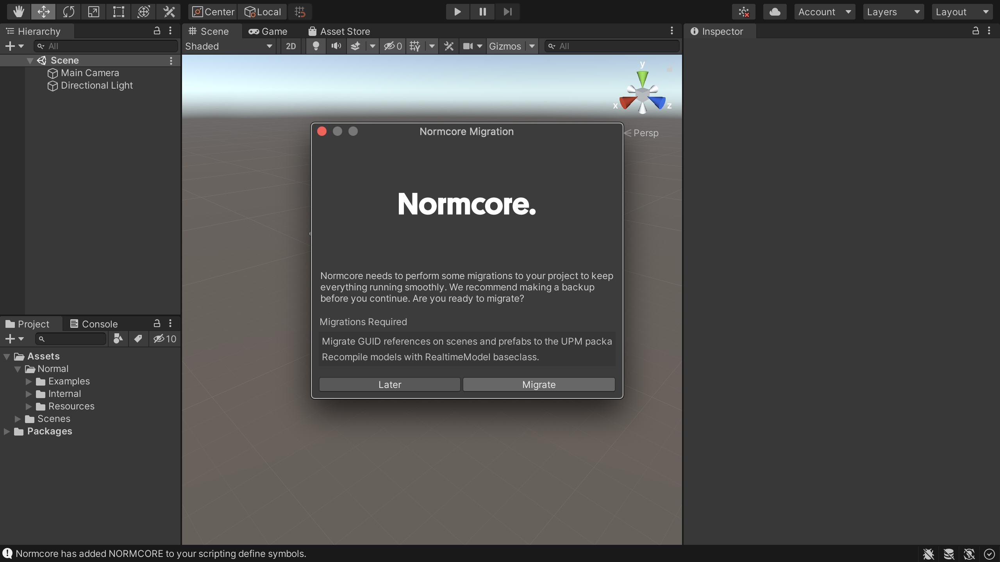

# Upgrading from Normcore 1 to Normcore 2

We disabled the Normcore 1 servers in June 2021. However, we plan to support Normcore 2 servers indefinitely, even as new versions are released.

If you're currently working with Normcore 1, we highly recommend upgrading to Normcore 2. It's designed to be a clean upgrade that requires no changes for most projects. Transform syncing, voice chat, and overall latency have improved significantly in Normcore 2. You'll notice huge improvements across the board in your multiplayer applications.

Before we begin, make sure your project is compiling without any errors and you're on Unity 2019.1 or above. If you have any errors in your project, the upgrade will not work. As always, make sure you have created a backup!

#### 1. Import Normcore 2

Download the latest [Normcore 2](https://normcore.io/download) unitypackage and import it into Unity. Do not delete any Normcore 1 files before doing this step, otherwise your project will have compilation errors before Normcore 2 is imported.

Once Normcore 2 successfully imports, it will add itself as a package in the Unity Package Manager. This is going to result in a bunch of GUID conflict errors and duplicate symbol errors. This is normal, as there are two copies of Normcore in the project right now.

#### 2. Delete Normcore 1

In order to delete Normcore 1 from your project, open up the Normal folder and delete the Realtime folder. You can leave all other folders alone.

#### 3. Restart Unity + Perform Migration

Restarting Unity will reset any files that Unity altered in the Normcore 2 package. Once Unity reopens, you'll see the Normcore Migration window.

Go ahead and click the Migrate button. This will update any references to components that were moved around in Normcore 2. It will also recompile all of your RealtimeModels so they use the new `RealtimeModel` base class.

#### Done!

That's it! Your project should compile without any errors and is ready to go for Normcore 2. Try it out!

If you run into any issues with the upgrade process, feel free to ask us questions on our [discord](https://normcore.io/discord) : )
