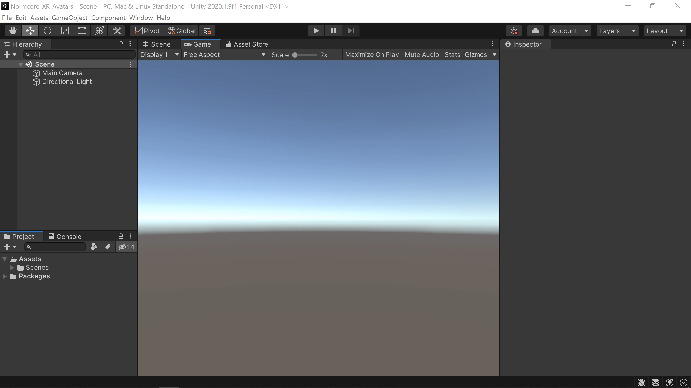

# XR Avatars and Voice Chat

Avatars and voice chat are one of the most important aspects of any multiplayer XR app. If your team works remotely, it can also be [an incredible tool for collaboration](https://www.normalvr.com/blog/working-remotely-in-vr-ar/).

If you haven’t already, follow our [Getting Started](../getting-started.md) guide to get a free App Key to use with Normcore. You’ll need one to connect to a multiplayer room.


## Adding Avatars + Voice Chat
Once you’re ready to go, start by creating a blank Unity project.



Let’s start by configuring our project for XR under XR Plug-in Management.


Next, we’re going to move the camera back to the origin and drag a “Realtime + VR Player" prefab into the scene.


Go ahead and add your App Key to the Realtime component and hit Play. The default VR Player avatar prefab will spawn. It should look something like this:


Booom! That’s all it takes. You can send this build to anyone you’d like and Normcore will automatically connect you to the same room and instantiate an avatar for each person.

## Creating Custom Avatars
We’ll start by making an empty Game Object in the scene with a RealtimeAvatar component on it. Let’s call it “My Custom Avatar”.


RealtimeAvatar includes a button that will create all of the game objects and components we need for a basic avatar. Click “Create Avatar Prefab” on RealtimeAvatar to configure our avatar prefab.


RealtimeAvatar will create the avatar prefab structure for us. There’s a game object for the player, head, and hands. Each component has a RealtimeTransform component on it, and the head has a RealtimeAvatarVoice component on it for voice chat.

Let’s try the avatar out. Drag it into your project to make a prefab. Make sure it’s in a Resources folder so it can be instantiated at runtime. Delete it from the scene and connect the prefab to the RealtimeAvatarManager component under “Local Avatar Prefab”. Then hit Play to test it out.


You should see your cube avatar spawn when Realtime connects to the room. The head game object will scale up/down with voice volume to show the mouth movement of the player.

Now let’s use the assets from the VR Player avatar to create a custom avatar. Delete each of the Geometry game objects that RealtimeAvatar created for us. Then let’s drag the HeadModel, LeftHandModel, and RightHandModel meshes into each of their corresponding game objects on the avatar prefab. Once you’ve got that working, apply the prefab and let’s test again.


It works, but it looks a little funny. Scaling the cube game object made sense when we didn’t have a mouth on our avatar, but it looks odd here. Let’s create a new component that animates the mouth instead of scaling the whole head game object.

Delete the VoiceScale component from the head game object and create a new component called MouthMove that looks like this:

```csharp
using System.Collections;
using System.Collections.Generic;
using UnityEngine;
using Normal.Realtime;

public class MouthMove : MonoBehaviour {
    public Transform mouth;

    private RealtimeAvatarVoice _voice;
    private float _mouthSize;

    void Awake() {
        // Get a reference to the RealtimeAvatarVoice component
        _voice = GetComponent<RealtimeAvatarVoice>();
    }

    void Update() {
        // Use the current voice volume (a value between 0 - 1) 
        // to calculate the target mouth size (between 0.1 and 1.0)
        float targetMouthSize = Mathf.Lerp(0.1f, 1.0f, _voice.voiceVolume);

        // Animate the mouth size towards the target mouth size to keep 
        // the open / close animation smooth
        _mouthSize = Mathf.Lerp(_mouthSize, targetMouthSize, 30.0f * Time.deltaTime);

        // Apply the mouth size to the scale of the mouth geometry
        Vector3 localScale = mouth.localScale;
        localScale.y = _mouthSize;
        mouth.localScale = localScale;
    }
}
```

This script starts by getting a reference to `RealtimeAvatarVoice`. The voice component has a `voiceVolume` property that we can use to animate the mouth. The `voiceVolume` property ranges from 0.0 to 1.0, so we start by converting this to a range of 0.1 to 1.0 as we don’t want to scale the mouth down to nothing when the player isn’t talking.

Next, we take the `targetMouthSize` and animate the current `_mouthSize` towards this value. This smooths out the mouth movement so it doesn’t appear too jittery.

Last, we take the mouth scale and apply it to the mouth transform of the avatar head.

To test this out, make sure the MouthMove component is on the Head game object, wire up the Mouth Pivot transform into the Mouth property of Mouth Move, and hit Apply.


Perfect! The mouth animates nicely now :)

This is still a pretty simple example, but using these tools, you should be able to make any avatar you’d like.

If you’d like to synchronize more than the head and hand positions, check out our guide: [Synchronizing Custom Data](../core-concepts/synchronizing-custom-data).

We’ve also got a few other guides that you might be interested in checking out after this one:

- [Using AR as a spectator view](./using-ar-as-a-spectator-view)
- [Creating a multiplayer drawing app](./creating-a-multiplayer-drawing-app)
