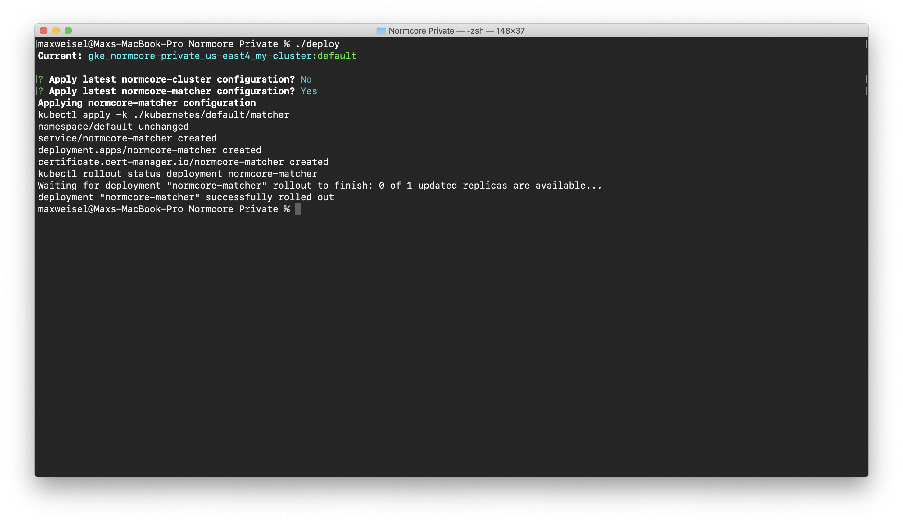
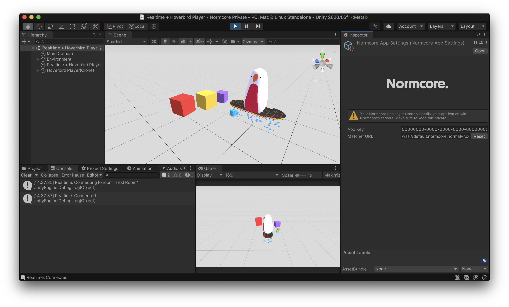

# Google Cloud Installation
This guide will walk through the steps needed to create a Normcore Private On-Premises installation on Google Cloud. An understanding of Google Cloud and Kubernetes is required.

## Prerequisites
Before starting, make sure you have the following installed on your system:

* [Node](https://nodejs.org/en/download/)
* [Google Cloud SDK](https://cloud.google.com/sdk/docs/install)

## Create a working directory
Once your license is activated, you'll receive a Normcore Private package with everything you need to get set up. Unzip it and open it in a terminal. We'll use it as our working directory.


## Create a Google Cloud project
If you haven't already, create a fresh Google Cloud project and open the Kubernetes Engine tab in order to activate GKE for the project.


Switch back to terminal and use `gcloud init `to configure the Google Cloud SDK for your project.


## Create a Kubernetes cluster
If you're creating a development environment, we recommend creating a zonal cluster. If you're creating a production backend that needs to support high availability and autoscaling, use a regional cluster with at least a single instance in each zone.

To create a development zonal cluster, we recommend the following settings:

Make sure to set your preferred region before running. This command will spin up a zonal cluster in us-east4-a (Ashburn, Virginia).
```
gcloud container clusters create my-cluster        \
    --zone us-east4-a                              \
    --release-channel stable                       \
    --num-nodes 1                                  \
    --enable-autoupgrade --enable-autorepair       \
    --machine-type n2-standard-2 --disk-size 50GB  \
    --enable-ip-alias                              \
    --shielded-secure-boot --enable-shielded-nodes
```

If you're creating a production regional cluster, we recommend that you set your preferred region and that you have enough Normcore Private server licenses to cover the maximum number of instances set for autoscaling. The following command sets max-nodes to 3, for a maximum of 3 instances per zone or 9 instances in total.
```
gcloud container clusters create my-cluster                      \
    --region us-east4                                            \
    --release-channel stable                                     \
    --num-nodes 1                                                \
    --enable-autoscaling --max-nodes 3 --min-nodes 1             \
    --enable-autoupgrade --enable-autorepair                     \
    --machine-type n2-standard-2 --disk-size 50GB                \
    --maintenance-window-start 2000-01-01T11:15:00-04:00         \
    --maintenance-window-end 2000-01-01T17:00:00-04:00           \
    --maintenance-window-recurrence 'FREQ=WEEKLY;BYDAY=TU,WE,TH' \
    --enable-ip-alias                                            \
    --shielded-secure-boot --enable-shielded-nodes
```


While we’re waiting for the cluster to spin up, if you do not have the kubectl command installed, install it now by running `gcloud components install kubectl` in another tab.

Once your cluster is up and running, we’ll get the credentials from Google Cloud needed to access it. Make sure to specify the region or zone using the `--region` or `--zone `flags depending on your cluster type.

```
gcloud container clusters get-credentials my-cluster --region us-east4
```

Once that's done, you can test everything out by getting a list of all running pods via kubectl:
```
kubectl get pods --all-namespaces
```


## Setup cert-manager
Normcore encrypts all public connections with TLS and uses cert-manager to create all certificates and ensure they stay updated.

[Install cert-manager](https://cert-manager.io/docs/installation/kubernetes/) and create a [ClusterIssuer](https://docs.cert-manager.io/en/release-0.11/reference/clusterissuers.html). We recommend creating a ClusterIssuer that uses letsencrypt and a dns-01 acme challenge. You can use the template included in the Normcore Private package as a starting point. It's located in `kubernetes/_global/matcher/letsencrypt-clusterissuer.yaml`.

## Create a Cloud Storage bucket
When a room shuts down, Normcore stores each room's datastore in Cloud Storage. When the room spins back up, the datastore is retrieved and given to the room server pod.

Bucket names need to be globally unique, so we recommend using a domain name and the kubernetes namespace in which your installation will be operating. In this case, we're working in the default kubernetes namespace and we plan to host our cloud installation at normcore.normalvr.com so we’ll use `default.normcore.normalvr.com`:

```
# Create the bucket.
gsutil mb -b on gs://<BUCKET NAME>

# Create a service account named 'default-normcore' to access it. Return the service account email.
gcloud iam service-accounts --format='value(email)' create default-normcore

# Give the service account access to the bucket
gsutil iam ch serviceAccount:<SERVICE ACCOUNT EMAIL>:objectAdmin gs://<BUCKET NAME>

# Create keys to access the service account
gcloud iam service-accounts keys create ./secret/normcore-service-account.json --iam-account=<SERVICE ACCOUNT EMAIL>

# Create a kubernetes secret with the service account credentials
kubectl create secret generic google-application-credentials --from-file=service-account.json=./secret/normcore-service-account.json
```

The whole process should look like this when run successfully:


## Configure Kubernetes
Normcore includes a few global kubernetes objects that are used by all namespaces. Run the following command from the working directory in order to create all objects.

```
kubectl apply -k kubernetes/_global/all/
```

Next, we’ll create the normcore-registry secret. This is used by Normcore to pull the matcher, cluster, and room docker containers from the Normcore registry service.

```
kubectl create secret docker-registry normcore-registry                        \
    --docker-server=https://gcr.io                                             \
    --docker-username=_json_key                                                \
    --docker-password="$(cat ./secret/normcore-registry-service-account.json)" \
    --docker-email=normcore-registry@normalvr.com
```

## Create a cluster service
Create the global kubernetes objects for the cluster. This only needs to be run once per Kubernetes cluster. All objects will be shared between all namespaces.
```
kubectl apply -k kubernetes/_global/cluster/
```

Open up `kubernetes/default/cluster/cluster-config.yaml` and set `room-storage-bucket-name` to the name of the bucket created earlier; `default.normcore.normalvr.com` in our case.


Once configured, deploy the normcore-cluster service using the `./deploy `command. A successful deployment will look like this:


## Create the matcher service
Now that we have at least one cluster, let's create a matcher service that can let frontend clients can request rooms.

Each cluster deployment will automatically create a service account for the matcher to use to talk to it. Let’s grab the credentials and store them safely.

Run `kubectl get serviceaccount normcore-cluster-matcher -o yaml` and look at the name of the secret under which the service account credentials are stored. Then print the credentials for the service account by running `kubectl get secret <SECRET NAME> -o yaml`. Make note of the values for certificate and token.

Make a copy of `kubernetes/kubeconfig-template.txt` and put it in `secret/kubeconfig.txt`. We'll use the certificate and token values from the cluster-matcher service account secret to fill it out. The certificate value can be copied directly into the template; however, the token should be base64 decoded.

Store the kubeconfig in a secret called `matcher-config` by running `kubectl create secret generic matcher-config --from-file=clusters=./secret/kubeconfig.txt`


Next we’ll configure the TLS certificate. Open up `kubernetes/default/matcher/certificate.yaml` and configure the domain under which you'll be hosting your installation. This is the domain name that cert-manager will use to issue a TLS certificate for the matcher. In our case, that's `default.normcore.normalvr.com`.

Finally, deploy the normcore-matcher service using the `./deploy` command. A successful deployment will look like this:



This process can take a few minutes. Kubernetes won't be able to spin up the matcher until the certificate is issued by cert-manager. You can check the certificate by running `kubectl describe certificate normcore-matcher` in another window.

Now that the matcher is deployed, let’s reserve the public IP and configure Normcore to bind to it if the service is ever restarted.

```
# Get the IP address that was assigned to the matcher service.
kubectl get service normcore-matcher

# Reserve the IP address.
gcloud compute addresses create normcore-matcher --addresses <EXTERNAL IP> --region us-east4
```

Edit `kubernetes/default/matcher/service.yaml` and set the `loadBalancerIP` to your newly reserved external IP.

Once that's done, use the `./deploy` command to deploy the matcher again. This will apply the latest changes on top of the already running installation.

The full process should look something like this:


## Configure your firewall

Once our matcher and cluster are up and running, open up UDP ports for our room servers.
```
gcloud compute firewall-rules create normcore-room --allow udp
```

## Configure DNS

Now that everything is set up, the last step is to point your domain at the matcher service. Using your favorite DNS provider, create an A-name record for your domain and point it at the IP address that we reserved for the matcher service.

## Test it out!

All of the hard work is done! Let's test it out. Fire up your favorite Normcore project and set the Custom Matcher URL to your new Normcore Private installation. The format should be `wss://<DOMAIN NAME>:3000/`, or in our case, `wss://default.normcore.normalvr.com:3000/`.


