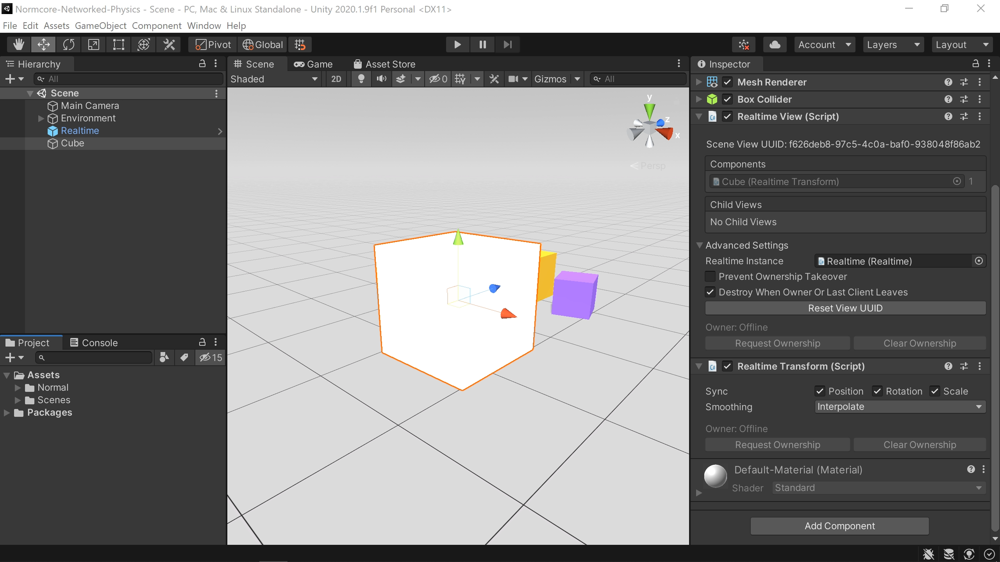
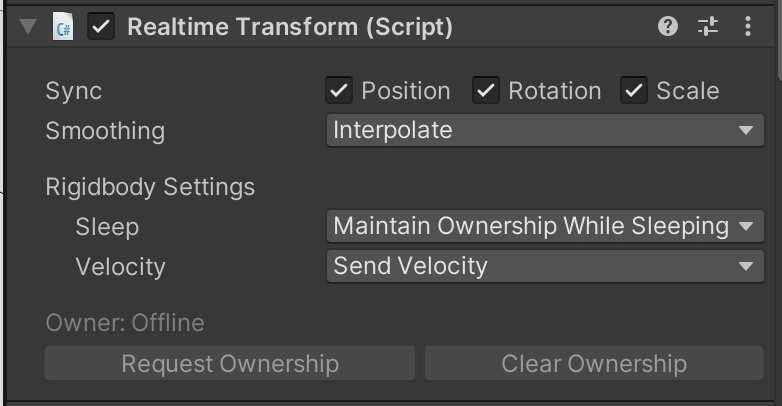

# Networked Physics
What's uuuuuuuuuuuuup. Unless you're casually perusing the docs, you're probably here because you put a [`RealtimeTransform`](./realtimetransform) component on something and it's not working the way you expect. Well, you're in luck. This page is designed to explain how `RealtimeTransform` works and some of the thinking necessary to get it to do what you want.

## How physics works in Unity

To really understand how `RealtimeTransform` works, it's worth understanding how physics works in Unity.

Unity uses a physics engine behind the scenes from Nvidia called PhysX (get it, behind the *scenes* ;P). It works well, but it has one fatal flaw. It's non-deterministic. This means that if you set an object in motion on multiple devices, when it eventually comes to rest, it might not always be in the exact same place on all devices. Small bits of precision are lost each frame, and depending on the platform and compiler, your game might drift more or less.

For singleplayer games, this isn't a problem, but when it comes to multiplayer, it means that even with ideal starting conditions, multiple clients can come up with different answers to where an object is in space.

### That's cool, but why does that matter?

All it means is that Normcore needs to synchronize all objects between all clients all of the time. If physics were deterministic, all we would have to do is synchronize the initial conditions and each client would arrive at the same answer.

That said, if we have a few clients all simulating the same object, when they eventually drift, whose physics scene should we use as the source of truth? Who's scene is the correct one? Well, this is where the concept of ownership comes in.

### Ownership + Physics

To solve this problem, `RealtimeTransform` introduces the concept of ownership. When an object is owned by a client, their simulation is considered the source of truth for that object. `RealtimeTransform` synchronizes the state of the object from the owner to all other clients.

`RealtimeTransform` does this by looking at its [owner](../room/ownership-and-lifetime-flags). If the component is owned locally, it's going to synchronize the position, rotation, scale, velocity, angular velocity, and any other settings to the datastore. And if the `RealtimeTransform` component is not owned locally, it's going to treat the values in the datastore as the source of truth and synchronize them to this object.

If you've added a `RealtimeTransform` component to your game object and it keeps getting reset back to where it started, this is why. You're not the owner, and therefore the datastore values are treated as the source of truth.

At the end of the day, **if you want to move an object, you need to request ownership of it.**

Let's take a look at how this all fits together in practice.

## Using RealtimeTransform
Let's start in the editor and then once we understand the concepts, we'll move to code.

Create a fresh project, make a copy of the Blank Scene Template scene, and add a `Realtime` component to the scene. Now, let's create a cube game object, move it up so it's above the ground, and throw a `RealtimeTransform` component on it. Your scene should look like this:

Looks good! Now let's export a build to play around with. Go to File > Build Settings, export a build, and open it up. Now let's open the build and hit Play in the editor. Both the editor and the standalone build will show our cube. If we try to move it using the transform gizmo in the editor, we can see it jumps back to the start position. Let's try taking over ownership. Click the Request Ownership button on the `RealtimeTransform` component in the editor. Remember, we're taking over ownership of the `RealtimeTransform`, not the `RealtimeView`. We'll get ownership instantly, and now we can use the gizmos in the editor to move the cube around:

Nice and easy!

It's worth noting that even though we are manipulating the world-space position and rotation of the object, `RealtimeTransform` synchronizes the `localPosition`, `localRotation`, and `localScale` properties. This means that if you have multiple nested Transforms, you need to synchronize all of them with `RealtimeTransform`.

Now if all you're doing is moving regular ol' game objects, you're good to go. Feel free to hop off the train and get to it! However, if you're using rigidbodies, then let's keep going and explain how physics works.

### RealtimeTransform + Physics

`RealtimeTransform` works a little differently when a Rigidbody component is present.

#### Rigidbodies are synchronized in world space

The first change is that rather than synchronizing the `localPosition` and `localRotation` properties of the transform, it synchronizes the `position` and `rotation` properties of the Rigidbody, which are in world space instead of local space. We do this because PhysX simulates all rigidbodies in world space. Moving a Rigidbody via the Transform local position and rotation properties instantly teleports the Rigidbody and does not perform collision detection.

#### RealtimeTransform will request ownership when a collision occurs

Let's say you're holding a ball that has a Rigidbody and `RealtimeTransform` component on it. If you throw it, `RealtimeTransform` will automatically call `RequestOwnership()` when it collides with another object, as long as the other object has a Rigidbody and `RealtimeTransform` component on it, and it is not owned by anyone already. This will ensure that the collision works smoothly for local and remote players.

This also means that `RealtimeTransform` will automatically call `ClearOwnership()` when the Rigidbody comes to rest in order to allow other clients to take it over and simulate it.

If you're trying to directly move an object, make sure to mark it kinematic. Doing so lets PhysX know that you're controlling its position and it should not simulate the object directly. It also tells `RealtimeTransform` that it should not clear ownership when the object goes to sleep.

However, if you're in a situation where you need to maintain ownership while sleeping, you can always set `Maintain Ownership While Sleeping` in the Unity editor.

#### RealtimeTransform + Rigidbody should not have parents

PhysX simulates all rigidbodies in world space. If you have a Rigidbody with a child that also has a Rigidbody component, you're going to end up with unpredictable results. The core issue is that when Unity synchronizes the Rigidbody `position` and `rotation` of each object back to the Transform component, if it synchronizes the child before the parent, the child will end up at the wrong location.

This is further complicated when transforms are synchronized over the network. Normcore does not guarantee what order `RealtimeTransform` components will be synchronized. Without Rigidbody components, this works fine because `RealtimeTransform` synchronizes the local transform values. However, because we are forced to synchronize the world space position for rigidbodies, if a Rigidbody component is synchronized, and then its parent is synchronized, the position and rotation of the child Rigidbody will move and no longer be correct.

To summarize, **rigidbodies cannot have parent game objects unless the parent never moves.** That said, child game objects with `RealtimeTransform` and `Collider` components are perfectly fine as long as they do not have a Rigidbody component on them.
