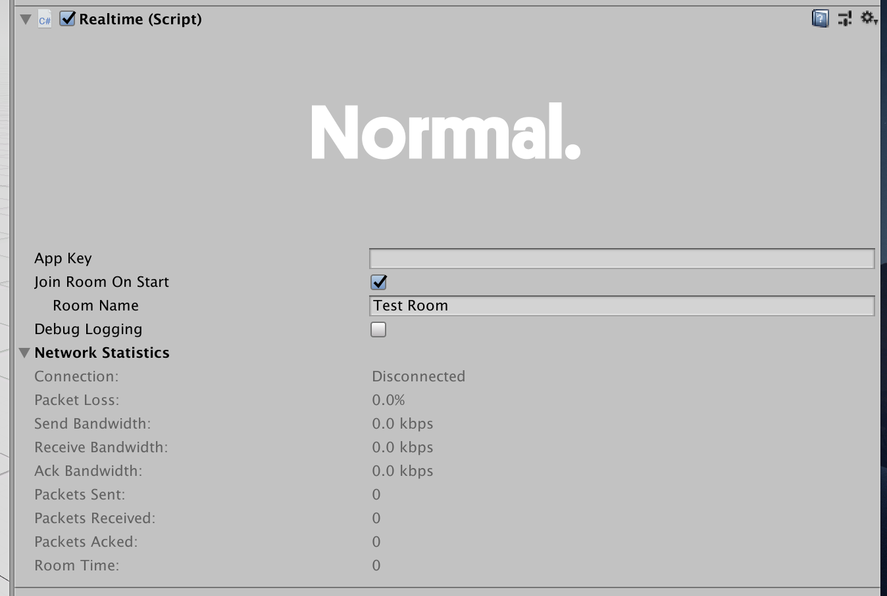

# Realtime

As mentioned in the [Realtime API Overview](./), Realtime is the component that manages your connection to a [Room](../room/room), as well as any [RealtimeViews](./realtimeview) that should be connected to the room’s datastore. Use the Realtime component to connect to a room, instantiate Realtime prefabs, and query any state about the room.

It's generally a good idea to think of a Realtime instance as a connection to a single room. If you would like to use multiple rooms in your multiplayer project, you can do so by adding an extra Realtime instance to your scene.

## Editor interface

This is what the Realtime component looks like in Unity. (TODO: Update this screenshot)

**App Settings:** This points to a [NormcoreAppSettings](../reference/classes/Normal.NormcoreAppSettings) asset that stores the relevant metadata needed for your application to connect to Normcore servers.
**App Key:** This is a unique key used to track your apps usage. You can create one over on your [account dashboard](https://normcore.io/dashboard). This field will update the asset for all instances that use this NormcoreAppSettings asset.

**Join Room On Start + Room Name:** If you would like Realtime to automatically connect to a room on Start, you can check this box and enter the room name here.

Note: Room names are namespaced to your App Key. Any room name used with a different App Key is considered a different room by the server.

**Network Statistics:** This section displays information about the current running connection such as the current time on the room server, and the connection state.

## Programming interface

Most of the time that you're working with Realtime, you'll work with it's programming interface. More information is available on using this API in the [Realtime API Overview](./), and individual methods are documented on the [Realtime](../reference/classes/Normal.Realtime.Realtime) reference page.
