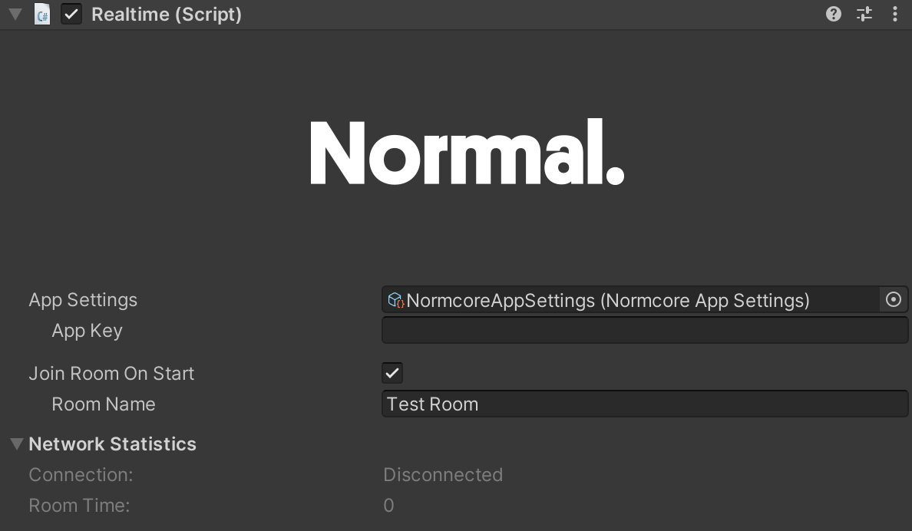

# Realtime

As mentioned in the [Realtime API Overview](./), Realtime is the component that manages your connection to a [Room](../room/room), as well as any [RealtimeViews](./realtimeview.md) that should be connected to the room’s datastore. Use the Realtime component to connect to a room, instantiate Realtime prefabs, and query any state about the room.

It's generally a good idea to think of a Realtime instance as a connection to a single room. If you would like to use multiple rooms in your multiplayer project, you can do so by adding an extra Realtime instance to your scene.

What else should go on this page? Is there anything that's not covered in the overview? Maybe the overview should be moved here?
- Show the editor interface and outline what each piece does.

# TODO: Where to put this stuff?

// TODO: Move this to the Room documentation?
Under the hood, Realtime connects to the [Normcore Matcher](../servers/matcher.md) service to reserve a room server, and then once it receives the room server credentials, it connects directly to the room server.

## Editor Interface

// TODO: Take an updated screenshot, and make sure it's on the latest Unity so it ages well

**App Key:** This is a unique key used to track your apps usage. You can create one over on your [account dashboard](https://normcore.io/dashboard).

**Join Room On Start + Room Name:** If you would like Realtime to automatically connect to a room on Start, you can check this box and enter the room name here.

Note: Room names are namespaced to your App Key. Any room name used with a different App Key is considered a different room by the server.

TODO: Link to the class Reference docs
