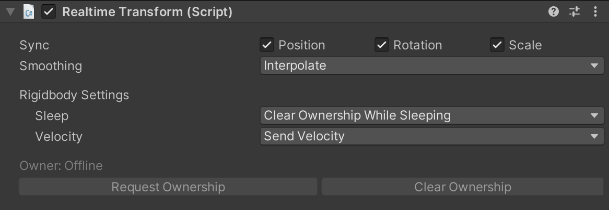

# RealtimeTransform

RealtimeTransform is a built-in [RealtimeComponent](./realtimecomponent) that can be used to synchronize the transform or rigidbody of a GameObject.

## Editor Interface

**Sync Position, Rotation, and Scale:** Each toggle will determine whether RealtimeTransform should synchronize the position, rotation, and scale of the game object.

**Smoothing:** A setting that indicates whether Normcore should smooth transform data that's received from remote players.

## How it works
To use RealtimeTransform, all you need to do is add it to a GameObject and make sure one client owns it.

RealtimeTransform will monitor the GameObject and synchronize the transform or rigidbody state to a model in the datastore.

### Ownership
**In order to move an object with a RealtimeTransform component, your client needs to be the owner of the *RealtimeTransform* component.**

In a multiplayer environment, a game object and its transform can exist on multiple clients. This means that there are multiple copies that all claim to know the position of this object, but only one of them can be considered the source of truth. This is where ownership comes in.

RealtimeTransform treats the client that owns the object as the source of truth. All other clients follow along with the owner's copy of the transform or rigidbody. This means that in order to move an object with a RealtimeTransform component on it, you must be the owner of the RealtimeTransform component.

You can request ownership of a RealtimeTransform component by calling `RequestOwnership()` or by using the Request Ownership button in the editor inspector.

A RealtimeTransform is available for immediate use after `RequestOwnership()` is called. Normcore will assume the call is going to succeed, and will roll back any state changes automatically if the call is rejected by the server.

A `RequestOwnership()` call is only rejected if the RealtimeView or a parent RealtimeView is owned by a different client.

## Transform mode vs. Rigidbody mode
RealtimeTransform works differently when a Rigidbody is present, and it's important to understand how it differs and *why* it differs.

If RealtimeTransform detects a **Rigidbody** component, it is created in Rigidbody mode; otherwise, it runs in Transform mode.

### Transform mode
When operating in **Transform mode**, RealtimeTransform synchronizes the **localPosition**, **localRotation**, and **localScale** of a GameObject. 

Transform mode does not synchronize the world values for two reasons: **precision** and **transform hierarchy**.

1. **Precision.** The world position, rotation, and scale values used by Unity are lossy. The local position, rotation, and scale variants are the true values, while the world variants are calculated using the transform of the object and its parents. Synchronizing the world values will introduce error over time.

2. **Transform hierarchy.** If you have a parent transform and a child transform, each RealtimeTransform will update the position to match the value in the datastore in `Update()`. Unfortunately, Normcore has no control over the execution order of `Update()` calls (*Script Execution Order only applies to different class types*). If Normcore used world-space values, setting the child before the parent would result in an incorrect transform position for the child. However, **localPosition**, **localRotation**, and **localScale** can be set in any order without issue.

### Rigidbody mode
When operating in **Rigidbody mode**, RealtimeTransform synchronizes the world position and rotation values in addition to all Rigidbody settings. This is because Unity's physics engine (PhysX) works entirely in world space. For this reason, Unity recommends you do not add parents to Rigidbody components; we recommend the same. This way, you can avoid the transform hierarchy issues mentioned above.

#### Ownership
Rigidbody mode also handles ownership differently. When a Rigidbody RealtimeTransform collides with a second Rigidbody RealtimeTransform, it will attempt to request ownership of this second object as well, so the same client can simulate both of the objects in the collision. (It will only do so if the other object has no owner.) When the same client simulates both objects, it prevents the appearance of delays during those objects’ interactions.

In order to allow objects at rest to be automatically owned by colliding objects, RealtimeTransform will automatically clear ownership when the Rigidbody goes to sleep. If you would like to avoid this behavior, use the inspector to switch the sleep option to "Maintain Ownership While Sleeping.”

*Note: When implementing logic like picking up an object, we recommend marking the rigidbody kinematic. While a rigidbody is kinematic, ownership will not be cleared automatically, and the default sleep settings can be used.*

*Tip: Check out the [Networked Physics](./networked-physics) guide for more detailed info on how RealtimeTransform works in Rigidbody mode.*

## Extra notes

RealtimeTransform is a complex piece of machinery. There are a few gotchas that are worth noting when you start using this component.

#### You cannot add a RealtimeTransform component at runtime.
This is true of all [RealtimeComponents](./realtimecomponent), in fact. There is no easy method for Normcore to detect the component and recreate it on all other clients. If you need functionality like this, we recommend creating an empty prefab with a RealtimeTransform component on it. When you need to temporarily track the position of an object, instantiate the prefab and synchronize the position between it and the object you're trying to move dynamically. Once you're done moving the object, destroy the prefab, and you're done!

#### You can't add or remove a Rigidbody component at Runtime.
Transform mode and Rigidbody mode work very differently under the hood. They synchronize different values and apply interpolation differently based on the information available.

It is not easy to smoothly transition between both modes, so it's a feature that is not supported in Normcore.

If you need this functionality, we recommend using the technique above. Create an empty prefab with a RealtimeTransform and Rigidbody component on it that you can instantiate and destroy at runtime. This will act as a vehicle for adding Rigidbody functionality.

#### Don't reparent game objects with RealtimeTransform on them!
RealtimeTransform does not track the parent of a RealtimeTransform and cannot synchronize it at runtime.

Additionally, if a RealtimeTransform is reparented under another game object, and that game object is destroyed, it will take the RealtimeTransform with it, leading to inconsistent state between clients.

A common case where folks want this functionality is in order to pick up an object. Instead of reparenting, create an empty game object on your player character at the pick-up point. Then use a script that synchronizes the world position of the pick-up point object and the RealtimeTransform object that you would like to pick up.

Visually, this gives you the same result and will avoid bugs related to reparenting.

*Tip: If the RealtimeTransform object has a Rigidbody on it, make sure to use the `MovePosition()` and `MoveRotation()` methods in `FixedUpdate()`*
