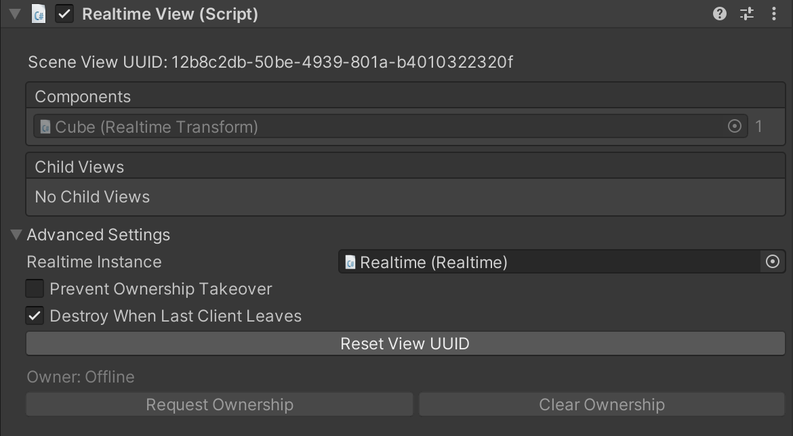

# RealtimeView

// TODO: Do a pass on this. Add links to relevant documentation. Talk about how the scene view UUID isn't public and shouldn't be used directly. It's only displayed so you can compare it between projects. Link to ownership document. Make sure the settings outlined here are up to date.

RealtimeViews are used to link a RealtimeComponent and its model to the datastore. When a prefab is instantiated, RealtimeView creates a model for each RealtimeComponent on the prefab and puts it into the datastore. Then when the prefab is instantiated on other clients, RealtimeView will connect the model in the datastore with its respective RealtimeComponent on the prefab.

## Editor Interface

The Inspector in Unity looks something like this:

### Components

The components section lists all RealtimeComponents on this game object and their component ID. If you’ve made a custom model, you’ll recognize this as the property ID on a model. Each component is assigned a unique ID by RealtimeView. That ID is used to identify this component when communicating with other clients. It’s also used when restoring prefabs that have been marked persistent. It’s very important that these IDs are unique and that they do not get re-used by different components.

### Child Views

The child views section works similarly to the Components section. Any RealtimeViews that are children of this view will show up here. All data that’s stored in RealtimeComponents on child views will be added to this view when it’s put in the datastore.

In general you should never need to manually assign unique view IDs. Normcore will automatically assign them, and will deprecate them when you remove a child view. If you move a child view back, it will auto-detect and re-assign the old ID to prevent bugs with loading persistent data from the datastore.

### Scene View UUID

The Scene View UUID property will only appear on RealtimeViews that are in the scene. This is a globally unique identifier that is used to synchronize this view’s model in the datastore. When two clients first connect to a room, they use this identifier to ensure that both instances of the same RealtimeView share the same model.

### Ownership

Every RealtimeView has a permissions model that’s enforced by the server. If this view is owned by a particular client, other clients are unable to change any permissions on the view, its components, or child views and their components.

There are two buttons for Requesting and Clearing ownership that will enable in play mode. There is also an API (described below) that offers more control over taking over ownership and when other clients are allowed to steal ownership at runtime.

### Advanced Settings

#### Realtime Instance

This property references the instance of Realtime that this RealtimeView should use to synchronize its model. Most apps will only have a single instance of Realtime in the scene, and RealtimeView will automatically populate this variable using that instance. However, if you plan to have multiple instances in the same scene, you may manually wire up which instance this RealtimeView should use here.

#### Ownership + Lifetime Flags

There are three properties here that are only applicable to RealtimeViews that exist in the scene (as opposed to RealtimeViews that are instantiated via a prefab).

**Owned by Creating Client:** A boolean that specifies whether Realtime should request ownership when this view is created, which can be useful for establishing a master client if needed.

**Prevent Ownership Takeover:** At runtime, clients can call RequestOwnership() on the RealtimeView to take over ownership of the model. You can use this checkbox to prevent that. When checked, only models that have no owner can be taken over. This is also a setting that you can change at runtime.

**Destroy When Owner Or Last Client Leaves:** A boolean that specifies whether to destroy this RealtimeView when its owner leaves the room, or if there is no owner, to destroy when the last client leaves.

The former case is great for things like avatars. If a player’s connection is lost, the server will take care of destroying this RealtimeView when the owner disconnects.

The latter case is great for resetting singleton state. If you have a RealtimeView that manages the state of your multiplayer game, such as who’s turn it is, and what level you’re on, you can choose to clear the model when the last client leaves. It will then be recreated by the first client to join in a new session.

Last, if you leave this unchecked, the object will persist between sessions. Let’s say you’re building a collaboration space with a whiteboard. You can leave this unchecked so that the state of your whiteboard is saved between sessions.

#### Reset View UUID

This button is only applicable to RealtimeViews that exist in the scene (as opposed to being created by instantiating a prefab).

Normcore is pretty good at automatically assigning Scene View UUIDs to each RealtimeView. However, it is possible to end up with a duplicate (for example if you save a copy of a scene and expect to additively load it at runtime).

If you end up in a scenario where there is a duplicate scene view UUID, you can use this button to tell Normcore to reset it. However, be careful! Once reset, this view will not be able to communicate with scene views that had the old ID. It will also not be able to retrieve persistent data stored under the previous scene view UUID.

#### Update Component & View IDs

Normcore will try to manage component and view IDs for you automatically. It does this to prevent using duplicate IDs and to prevent re-using an old ID. However, if you’ve deleted a RealtimeComponent or child view, saved your application, reopened and readded the component or child view, it will be unable to detect and re-assign the old ID.

Therefore, there are rare circumstances where you will need to manually set a component or view’s ID. To do that, click the Update Component & View IDs button. This will enable you to manually manage component and view IDs above.

Please note!: If you reuse a component ID with a different component, or you mix up a child view ID, your application may be unable to read persistent data stored by previous clients. Normcore will detect this at runtime and will automatically disconnect before it corrupts the datastore. Please use this feature at your own risk!
