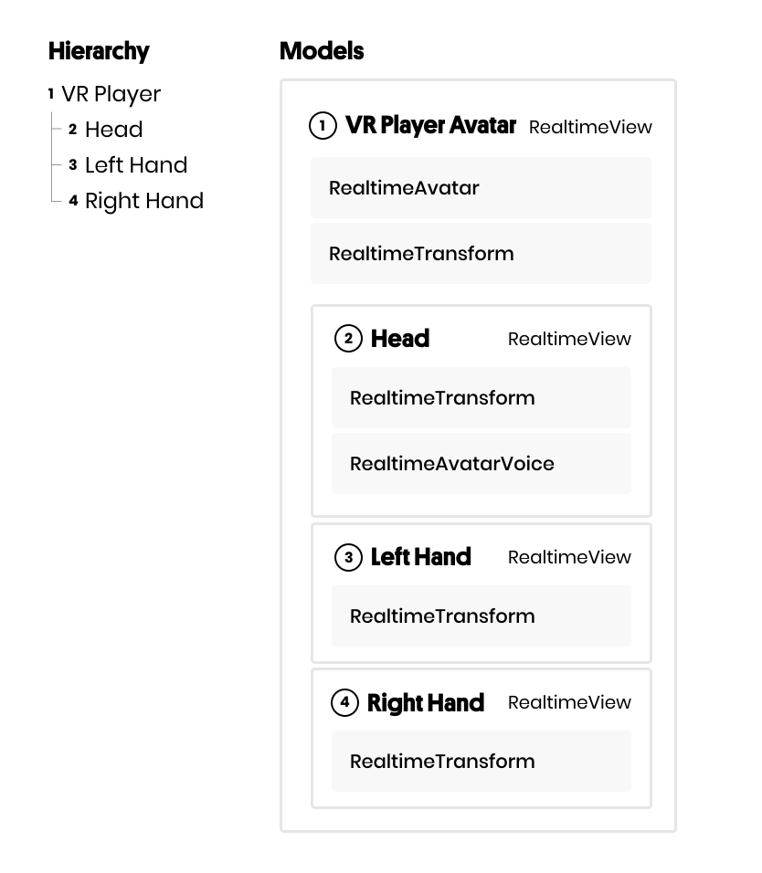
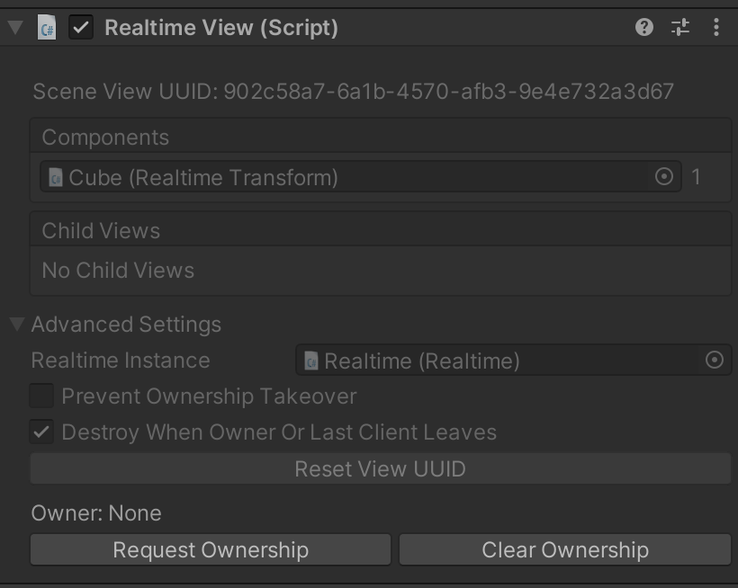

# Server Authority + Ownership + Lifetime Flags
At some point, every multiplayer application requires the server to act as an authority on the state of a room. You may have objects that only specific users can access, a physics state that you would like to enforce, or data that should be reset when a user disconnects from a room.

Traditionally this is done by writing custom, server-side logic that needs to be deployed alongside the server. However, this slows iteration time significantly and requires you to redeploy your server with each update. Normcore instead provides an API that makes the most common server-authoritative operations possible without deploying a custom server.

The two most useful tools regarding server authority are ownership and lifetime flags. Ownership lets you control who has the ability to modify a model, and lifetime flags tell the server when a model should be automatically deleted and when it should persist between sessions.

## Ownership

Normcore uses a [datastore](../architecture/client.html#datastore) to track all state in a room. The datastore itself is made up of model objects. Every model in the datastore, including child models, can have an owner with which it is associated.

By default, a model has an `ownerID` of `-1`, which denotes that it has no owner. When a model is unowned, it can be modified by anyone in the room. However, when a model is owned by a client, the server only lets the owning client make changes to it or to any of its child models.


### How ownership is enforced

Models can have other models as children, and the ownership settings of a parent are enforced on all children. If a model is owned by one client, all other clients are blocked from making changes to the model or any of its child models.

You can see this behavior in action with RealtimeViews and RealtimeComponents as they both use models. The RealtimeView's model contains the models for all child RealtimeViews and all RealtimeComponents, so any ownership settings on the RealtimeView apply to child views and to components as well.

The most common RealtimeView prefab is a player prefab. A player prefab is also a prime example of when to use ownership. Generally, we want to ensure that each player prefab can only be modified by the player that owns it. Rather than setting ownership of every component on the player, we can set ownership of the root RealtimeView, and the server will block all other clients from making modifications to any RealtimeView or RealtimeComponent model.

Let's take a look at the hierarchy here:



Starting with the hierarchy, we have a VR Player game object at the root, and it has a child game object for the head and hands. Each game object has a `RealtimeView` and a `RealtimeTransform` and potentially another `RealtimeComponent` or two.

Now let's look at the models that get added to the datastore. At the root level, the VR Player's `RealtimeView` model is added. It contains a `RealtimeAvatar` model and `RealtimeTransform` model as children. If the `RealtimeView` is owned by the local player, only the local player will be able to make changes to the `RealtimeAvatar` or `RealtimeTransform` components. Additionally, the `RealtimeView` models for the head + hands game objects are also children of the VR Player `RealtimeView`, and so they fall under the same rules.

### Requesting ownership of a RealtimeView

#### RequestOwnership() + ClearOwnership()

Let's dive into some code examples. The most straightforward methods for changing ownership are `RequestOwnership()` and `ClearOwnership()`:

``` csharp
GameObject myObject = Realtime.Instantiate("My Object");

// Get the RealtimeView component
RealtimeView myObjectView = myObject.GetComponent<RealtimeView>();

// Mark the RealtimeView owned by the local client
myObjectView.RequestOwnership();

// Only the local client can make changes to the RealtimeView and any child views or components on myObject.

// Clear ownership of the RealtimeView
myObjectView.ClearOwnership();

// Now anyone can make changes to the RealtimeView or any child components.
```

It's worth noting that `RequestOwnership()` and `ClearOwnership()` take effect immediately, but if the server blocks the request—say, because `preventOwnershipTakeover` is `true` or because the view's parent is owned by another client—then ownership and all changes that required ownership will be rolled back.

#### Realtime.Instantiate() + ownedByClient

It is also possible to request ownership immediately using the `ownedByClient` field of `Realtime.Instantiate()`:

``` csharp
GameObject myObject = Realtime.Instantiate("My Object",
                                           ownedByClient: true);
```

This ensures the `RealtimeView` on the root of the prefab is owned by the local client when instantiated. It's worth noting that this is equivalent:

``` csharp
GameObject myObject = Realtime.Instantiate("My Object",
                                           ownedByClient: false);
myObject.GetComponent<RealtimeView>().RequestOwnership();
```

Even though this example calls `RequestOwnership()` after the object is instantiated, Normcore will combine it with the instantiate call before sending. On remote clients, the RealtimeView will be instantiated with this client as the owner.

#### At runtime with the Unity inspector

If you're trying to debug ownership settings at runtime, the `RealtimeView` inspector includes Request Ownership and Clear Ownership buttons that function like calling `RequestOwnership()` or `ClearOwnership()` in code.




### Prevent ownership takeover of a RealtimeView
By default, anyone can request ownership of a RealtimeView at runtime. The server will approve this request unless a parent RealtimeView is already owned by another client. However, this can be controlled with the `preventOwnershipTakeover` flag.

When this flag is true on any model, the server will deny any client’s attempt to change the ownership of an object in that model unless it has no owner.

### Requesting ownership of any RealtimeComponent or RealtimeModel

In addition to being able to control ownership of `RealtimeView` components, you can request ownership on any `RealtimeComponent` or `RealtimeModel` in order to provide additional granularity. A single object can have more than one `RealtimeComponent`, all of them owned by different clients. Requesting ownership works just like it does for `RealtimeView`. Here's an example of requesting ownership on a `RealtimeTransform`, which is itself a `RealtimeComponent` subclass:

``` csharp
public void CreateObjectAndRequestOwnershipOfRealtimeTransform() {
    // Instantiate the My Object prefab, leave the view unowned.
    GameObject myObject = Realtime.Instantiate("My Object", ownedByClient: false);

    // Get the RealtimeTransform component
    RealtimeTransform realtimeTransform = myObject.GetComponent<RealtimeTransform>();

    // Request Ownership
    realtimeTransform.RequestOwnership();
}
```

However, before you can use this on a custom `RealtimeComponent`, you'll need to make sure your `RealtimeModel` includes a meta-model.

If you haven't done so already, it's worth reading our [realtime component](../realtime/realtimecomponent) page. The page fully explains the relationship between `RealtimeComponent` and `RealtimeModel`. In Normcore, all state is stored on the `RealtimeModel`—ownership + lifetime flags are no different. All ownership calls to `RealtimeComponent` just update the state of the model to reflect the new owner. However, for ownership to work, you need to compile your model with a meta-model:

``` csharp {1}
[RealtimeModel(createMetaModel: true)]
public partial class MyModel {
    [RealtimeProperty(1, true)]
    private float _myNumber;
}
```

The only change needed is the addition of `createMetaModel:` true in the `RealtimeModel` attribute constructor. This tells Normcore to compile your model with a meta-model, which is where all ownership state will be stored so it may be sent to the server.

## Lifetime flags
Lifetime flags tell the server how long the state for a model should be retained. Models can be set to persist between sessions, or they can be automatically deleted when the owner or the last client leaves the room.

If you're writing a collaborative application, you may want things like objects or brush strokes to persist between sessions. However, you might want a model that represents game state like the current score to reset to zero after everyone leaves. If you have prefabs that represent players, you may want them to be destroyed when a player disconnects. Lifetime flags are used to denote how the server should treat each model in the datastore.

We always recommend you use lifetime flags instead of trying to write this logic yourself. If you write logic that tries to make datastore changes when a player gets disconnected, there's no guarantee they will run successfully, especially if a user's connection is improperly terminated. However, the server will always ensure lifetime flags are honored, regardless of whether or not a client's connection was closed properly.

### Instantiate a prefab that persists between sessions

Whether you're building a collaboration tool or an MMORPG, you'll likely have objects that should stick around between sessions. In Normcore, all you have to do is use the `destroyWhenOwnerOrLastClientLeaves` flag to denote that the object should persist. Let's take a look at an example:

``` csharp
public void CreatePersistentObject() {
    // Instantiate the My Object prefab and tell Normcore to let it persist even after everyone leaves the room
    GameObject myPersistentObject = Realtime.Instantiate("My Object", destroyWhenOwnerOrLastClientLeaves: false);
}
```

Overall, then, this is pretty simple! And the same applies to `RealtimeView` components in the scene. If you'd like their state to persist between sessions, just flip the "Destroy When Owner Or Last Client Leaves" option to false under Advanced Settings.

### Destroy a prefab when a client disconnects

Let's say we're going to instantiate a prefab to represent our player. In this scenario, we'll want the server to destroy it automatically if we get disconnected. We can accomplish this entirely using the optional flags in `Realtime.Instantiate()`:

``` csharp
using UnityEngine;

public class MyPlayerManager : MonoBehaviour {
    private Realtime _realtime;

    private void Awake() {
        // Get the Realtime component on this game object
        _realtime = GetComponent<Realtime>();

        // Notify us when Realtime successfully connects to the room
        _realtime.didConnectToRoom += DidConnectToRoom;
    }

    private void DidConnectToRoom(Realtime realtime) {
        // Instantiate the My Player prefab for this client once we've successfully connected to the room
        Realtime.Instantiate(            "My Player",      // Prefab name
                                 ownedByClient: true,      // Make sure the RealtimeView on this prefab is owned by this client
                      preventOwnershipTakeover: true,      // Prevent other clients from calling RequestOwnership() on the root RealtimeView or any children.
            destroyWhenOwnerOrLastClientLeaves: true,      // Instruct the server to destroy this prefab when the owner (this client) disconnects. (This is true by default, but added to the example for clarity)
                                   useInstance: realtime); // Use the instance of Realtime that fired the didConnectToRoom event.
    }
}
```

This example gets a reference to the `Realtime` component and registers for the `didConnectToRoom` event. When we successfully connect to the room, we instantiate the "My Player" prefab to represent our local player. The prefab is set to be owned by this client and to be destroyed when the owner—the local client, in this case—is disconnected. For extra safety, we've also set `preventOwnershipTakeover` to `true` to prevent other clients from accidentally taking over ownership of this prefab or any of its child components or models.

And that's it. No custom logic is needed to destroy the prefab; the server takes care of that for us and notifies the remaining clients.

## What is a meta-model?
I am so glad you asked. We at Normal work hard on this stuff, and if we do our jobs perfectly, no one will even notice all of our effort. This isn't the coolest hidden gem of Normcore, but it is a neat implementation detail. (Yes, I am encouraging you to ask me more questions about how the internals of Normcore work if you ever see me on the street. There are a lot of cool details hidden in Normcore!)

Models in Normcore store state, and as far as the server is concerned, it doesn't really matter what that state represents. The server just needs to ensure that the state is in sync with all other clients. However, there comes a time in every model's life when it has some state that the server does care about. Maybe it's instructions on how to add an item to a collection or on which client can make changes to a model. This is where the meta-model comes in.

A meta-model is a child model that the server is designed to parse and use to apply custom properties to the model. In the case of ownership and lifetime flags, these properties exist on the meta-model and the server loads them into memory and uses them to accept or reject changes to the datastore.

Collections such as `RealtimeDictionary`, `RealtimeSet`, `RealtimeArray`, and `StringKeyDictionary` also use the meta-model to signal to the server that they are special models that behave more like collections.

That's all folks! We hope you enjoyed this page on ownership and lifetime flags in Normcore.
